# Call Microsoft Purview APIs with API Client Tool Insomnium

## Download
Download and install insomnium from [here](https://github.com/ArchGPT/insomnium?tab=readme-ov-file)

## Setup Plugin
insomnia is super extensible and has a lot of powerful plugins to enhance its functionality. Below are some required plugins to use before importing collection into insomnia. For install, you just need copy & paste the plugin name in Preferences -> Plugins -> npm-package-name and then click Install Plugin and then Reload Plugins to refresh.

- Required
    - insomnia-plugin-azure-ad-authentication [Azure AD Token](https://insomnia.rest/plugins/insomnia-plugin-azure-ad-authentication)
    - insomnia-plugin-azure-keyvault-secrets [Azure Keyvault Secrets](https://insomnia.rest/plugins/insomnia-plugin-azure-keyvault-secrets)
      
    - insomnia-plugin-global-headers [Global Headers](https://insomnia.rest/plugins/insomnia-plugin-global-headers)
    - insomnia-plugin-save-variables [Save Variables](https://insomnia.rest/plugins/insomnia-plugin-save-variables)
- Recommended
    - insomnia-plugin-request-navigator-forked [Tabs](https://insomnia.rest/plugins/insomnia-plugin-request-navigator-forked)
    - You can find more plugins in this [Plugin Hub](https://insomnia.rest/plugins)

## endpoint
1. endpoint generally looks like "https://{catalogAccountName}.purview.azure.com/datamap"
2. You can check your catalogAccountName in azure portal 
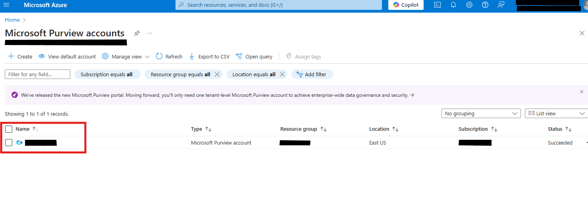

## Get Bearer token

### Get Bearer token from purview UI
1. Open purview navigate Data catalog --> Business assets (preview)
2. Click on any asset
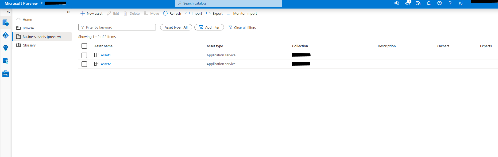
3. Open inspect element and reload the page
4. Look for GET API request with url "/api/atlas/v2/entity/bulk?guid={guid}"
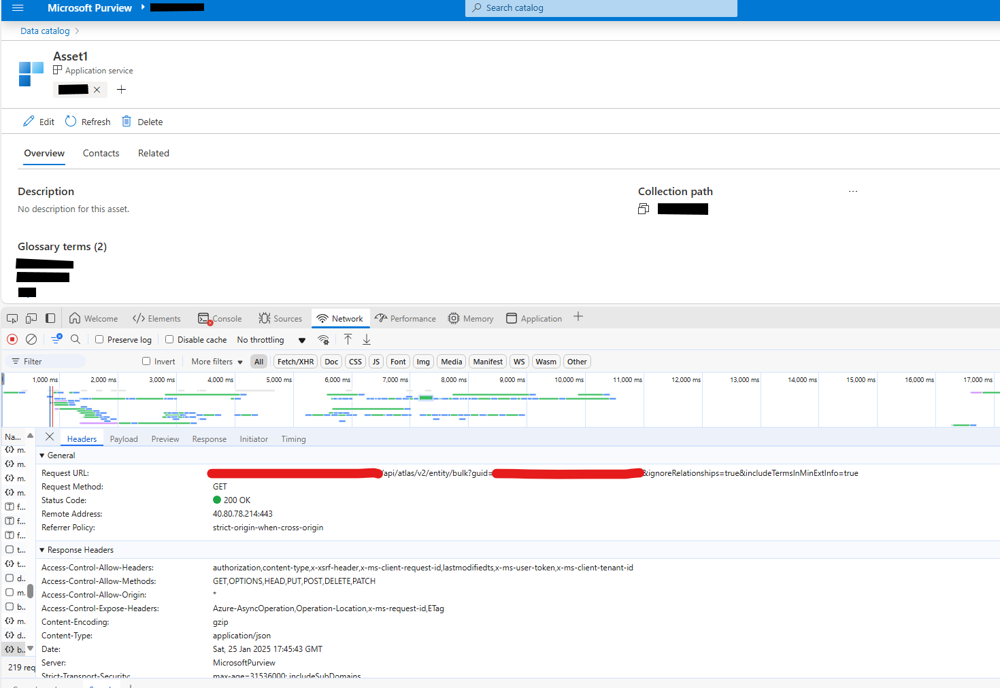
5. In the authorization header you can see bearer token ("Bearer aadToken")
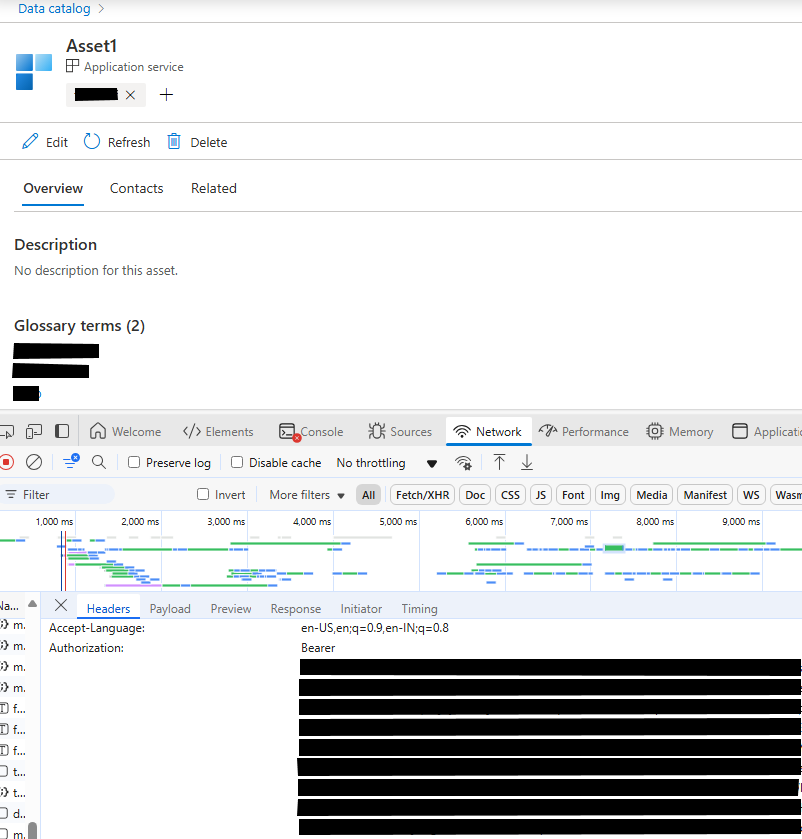

### Get bearer token from following C# [Script](./src/BearerTokenGenerator.cs)
1. You will need servicePrincipalId, servicePrincipalKey and tenantDomain to run this script
    #### Steps to get servicePrincipalId, servicePrincipalKey
    1. Go to Azure portal and navigate to Microsoft Entra ID (previously known as Azure Active Directory)
   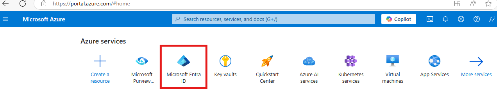
   2. Under Manage pane, choose App registration, then press New registration
   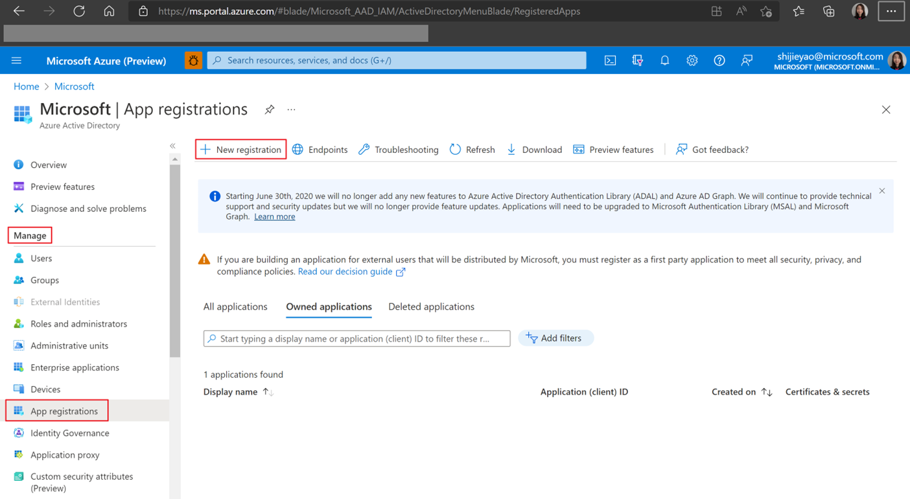
   3. Input a name (can be changed later) and go on with Register
   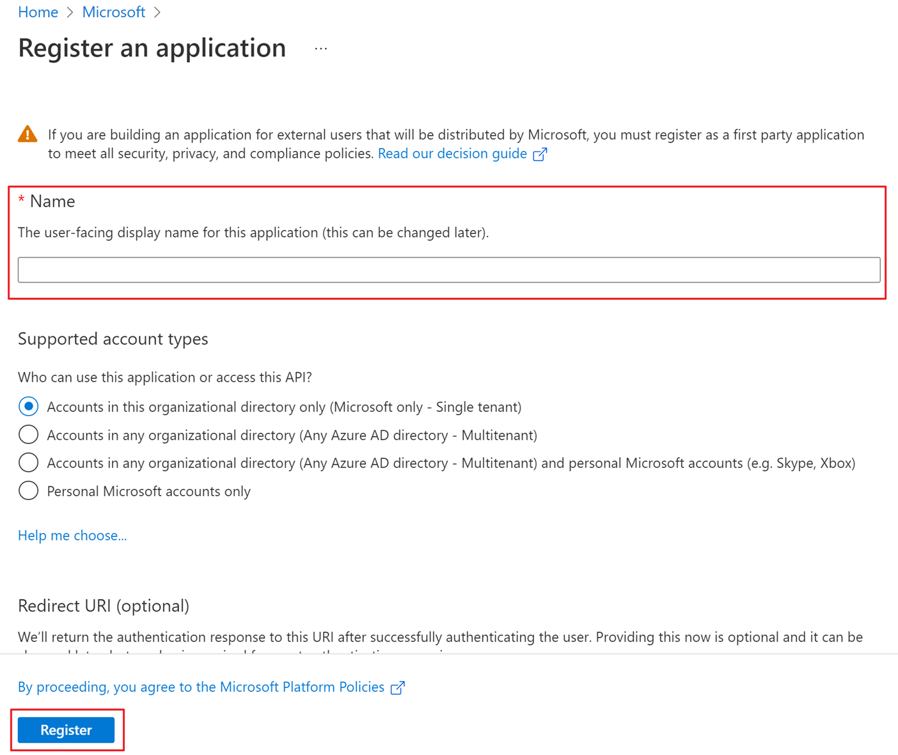
   4. When you go back to the last page, you will see the newly registered app
   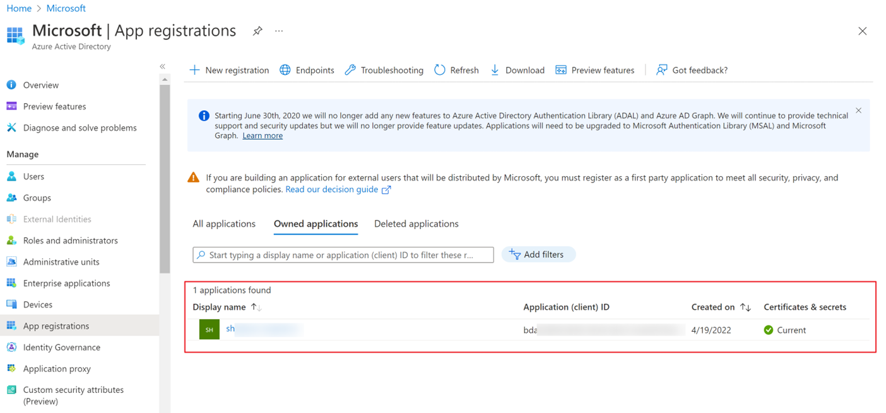
   5. Click the new app and enter the overview page; under Manage choose Certificates & secrets
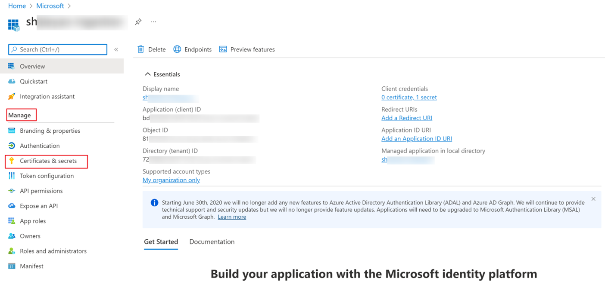
   6. Choose New client secret
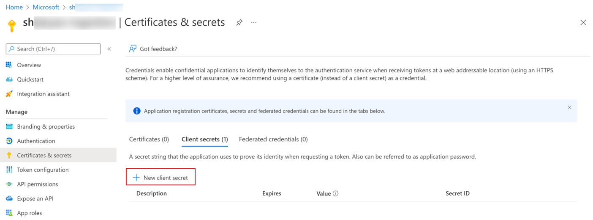
   7. In the pop-up window, enter a concise description for this secret and choose an expiration time period then Add
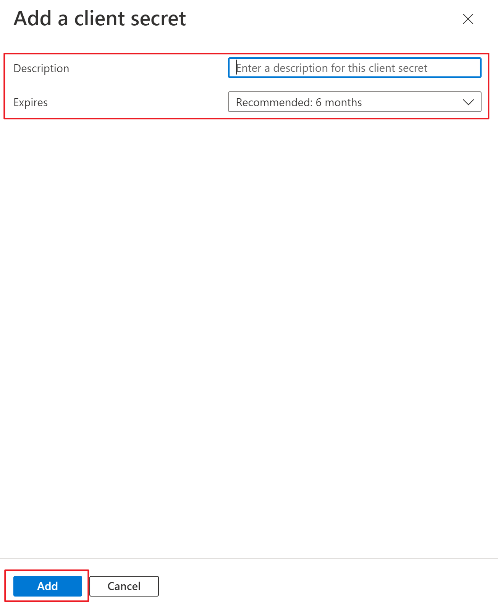
   8. You will see the new client secret you just created under Client secrets, Copy the value this is your 
   servicePrincipalKey. Notice that Value only appears once at creation, so **make sure of noting it down before leaving the webpage!**
   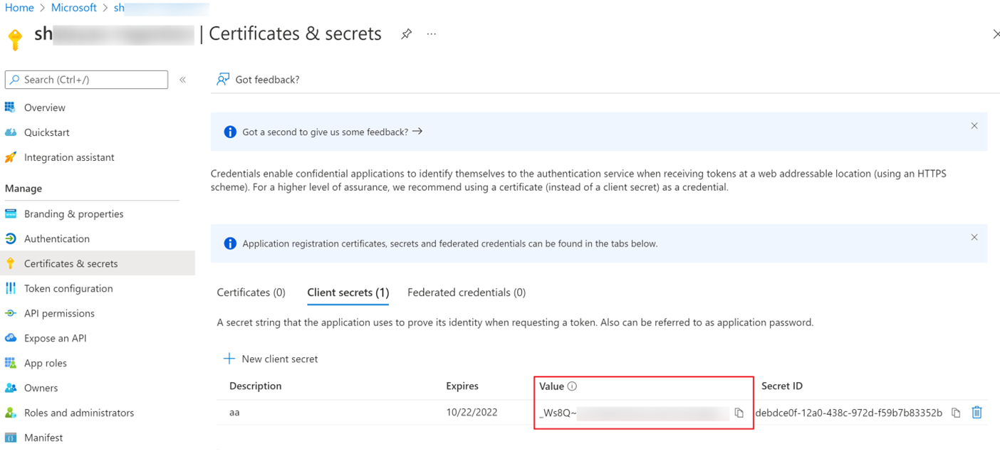
   9. Go back to the Overview page, you can find the Application ID of the created SP, Copy it this is your servicePrincipalId
   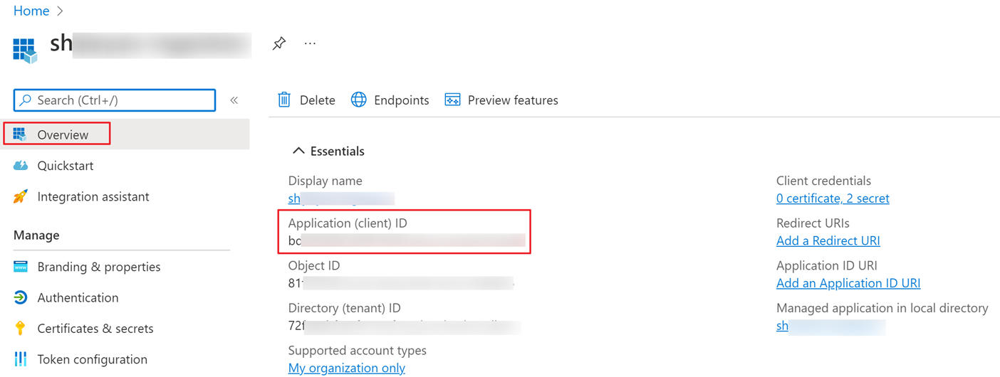
   
    #### Steps to get tenantDomain
    1. Go to Azure portal and click on your account on top right corner
   2. Click on view account
   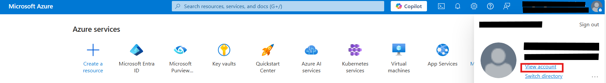
   3. On the My Account page Overview section everything after the @ in your email is your tenantDomain
   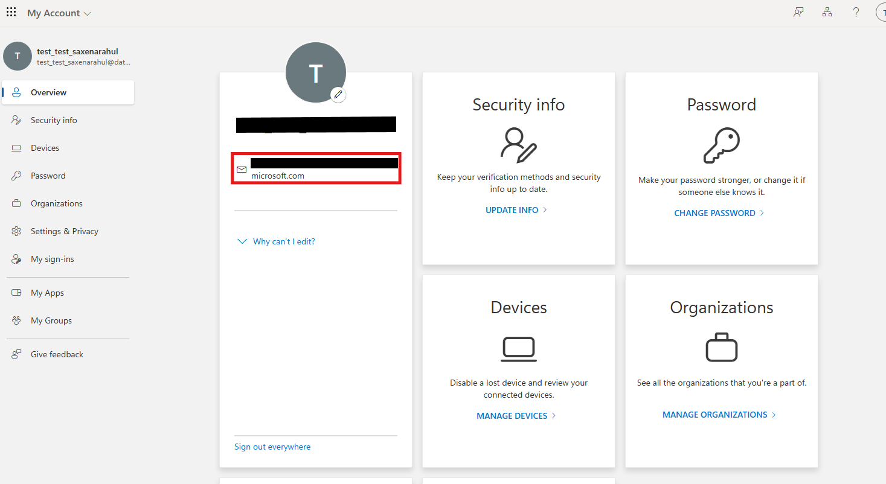

## Use Bearer token in Insomnium

### Include bearer token in Authorization header of each request (Not recommended)
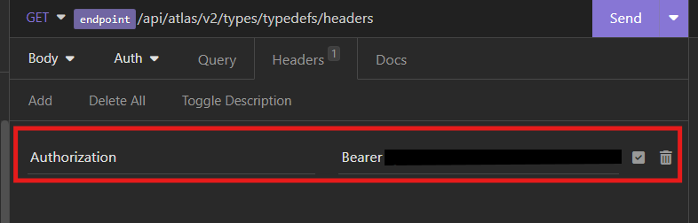

### Include bearer token in Global Headers (Recommended)
0. This Assumes you have already installed insomnia-plugin-global-headers mentioned [above](#insomnia-plugin-global-headers-reference)
1. Click on settings icon on top left corner go to your managed environment
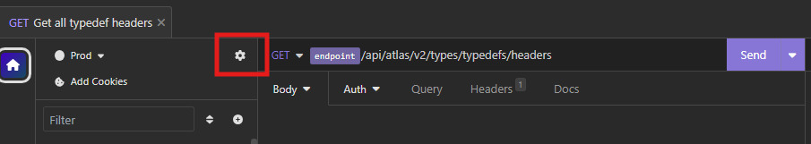
2. select your environment and add a new header with key as Authorization and value as Bearer <your bearer token> under GLOBAL_HEADERS
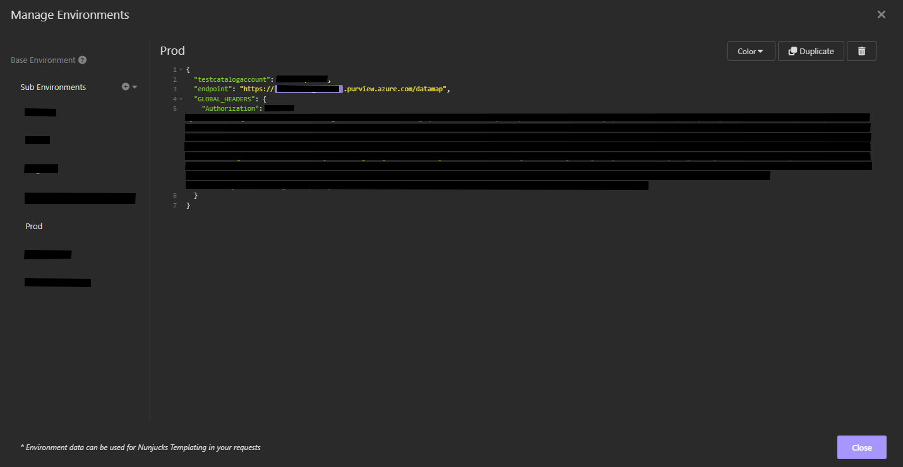

