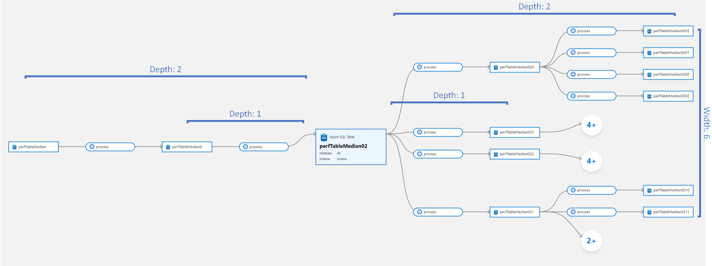
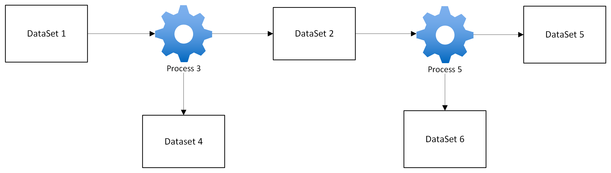
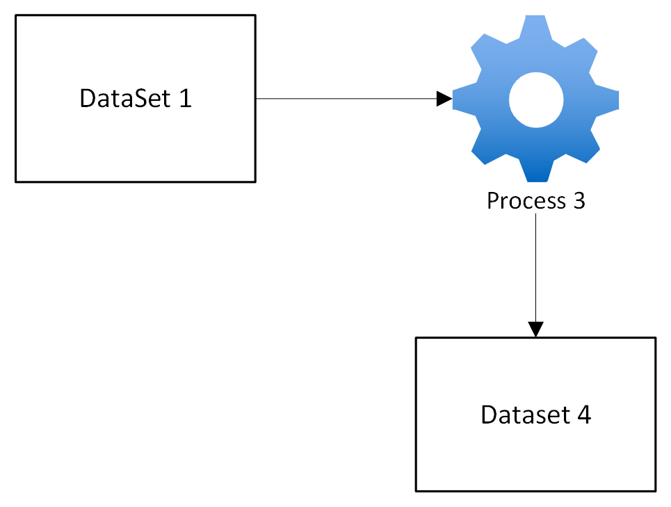
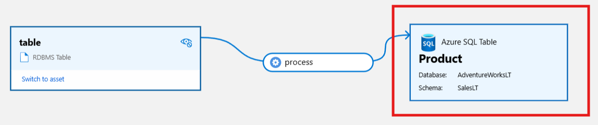

# GetLineageByGuid

## EndPoint
```
{{endpoint}}/api/atlas/v2/lineage/{guid}
```
## HTTP Method
GET

## PathParams
### GUID
Unique identifier of the entity

## QueryParams

## forceNewApi

| Type    | default value |
|---------|---------------|
| boolean | false         |

This setting applies for Microsoft custom implementation

**Recommended to set this always true, All the lineage requests mentioned in this article are made with forceNewApi=true**

## depth

| Type | default value | maxDepthSupported                |
|------|---------------|----------------------------------|
| int  | 3             | 31 on both INPUT and OUTPUT side |

Refers to how far the lineage query traverses in the graph. It determines how many levels of upstream (inputs) and downstream (outputs) entities are fetched.

## width

| Type | default value |
|------|---------------|
| int  | 10            |

Refers to how many entities are connected at each level. It determines the breadth of the graph at a specific depth




## Example of depth and width queryParams

Consider the following lineage graph:



### Example with depth = 1 and width = 1
Query result if we call getLineageByGuid API on DataSet1



1. Depth = 1: Only the immediate relationships from Dataset1 are included.
2. Width = 1: At each level, only one connected entity is considered.
3. Since Process3 is the immediate next node, the traversal moves to Process3.
4. At Width = 1, the query considers only one output from Process3, which in this case is Dataset4
5. If Process3 has multiple outgoing edges (Process3 → Dataset2 and Process3 → Dataset4), the order in which edges are retrieved determines which one is selected.
6. Gremlin queries do not guarantee order unless explicitly specified, so Dataset4 may be returned first if it appears first in the storage or indexing

### Example with depth = 2 and width = 1
Query result if we call getLineageByGuid API on DataSet1


1. Depth = 2: The query expands to include the second level of relationships, but only one entity is considered downstream at each level
2. Width = 1: At each level, only one connected entity (Dataset4) is included.
3. At Depth 1, the traversal reached Process3 and picked Dataset 4 because Width = 1
4. At Depth 2, the traversal tries to move further downstream from Dataset4, but since Dataset4 has no additional connections, the traversal ceases. Consequently, the outcome is equivalent to Depth = 1
5. if lineage had chosen to include Dataset2 at step 3 the response would have been different accordingly

### Example with depth = 2 and width = 2

Query result if we call getLineageByGuid API on DataSet1


1. Depth = 2: The query expands to two levels of relationships.
2. Since Width = 2 both downstream entities are included at each depth level

## includeParent

| Type    | default value |
|---------|---------------|
| boolean | false         |

When the lineage query parameter "includeParent" is true, the API response will also include parent relationships Related entity information

The lineage query will fetch all parents of a specific DataSet/Process recursively

The response will contain non-empty parentRelations array if includeParent=true and the entity for which lineage is 
queried has parent entities

### Examples are covered in [Dissecting lineage output](#dissecting-lineage-output) and [direction](#direction) section

## Dissecting lineage output


**Let's first prepare all the entities for lineage**

<details>
<summary>
Source table and it's DB payload for bulkEntityCreateOrUpdate API
</summary>

```json
{ 

    "referredEntities": { 

        "-999": { 

            "typeName": "rdbms_table", 

            "attributes": { 

                "name": "table", 

                "qualifiedName": "rdbms://table-1118ce87-4322-4241-a0ba-1b76c2685f74" 

            }, 

            "guid": "-999", 

            "isIncomplete": false, 

            "provenanceType": 0, 

            "version": 0, 

            "proxy": false 

        } 

    }, 

    "entities": [ 

        { 

            "typeName": "rdbms_db", 

            "attributes": { 

                "name": "db", 

                "qualifiedName": "rdbms://db-1118ce87-4322-4241-a0ba-1b76c2685f74", 

                "tables": [ 

                    { 

                        "guid": "-999", 

                        "typeName": "rdbms_table" 

                    } 

                ] 

            }, 

            "guid": "-1", 

            "isIncomplete": false, 

            "provenanceType": 0, 

            "version": 0, 

            "proxy": false 

        } 

    ] 

} 

 
```

</details>

<details>
<summary>
Target table, and it's column, DB, schema payload for bulkEntityCreateOrUpdate API
</summary>

```json
{ 

    "referredEntities": {}, 

    "entities": [ 

        { 

            "typeName": "azure_sql_table", 

            "attributes": { 

                "qualifiedName": "mssql://1118ce87-4322-4241-a0ba-1b76c2685f74.database.windows.net/AdventureWorksLT/SalesLT/Product", 

                "name": "Product" 

            }, 

            "guid": "-999", 

            "isIncomplete": false, 

            "provenanceType": 0, 

            "version": 0, 

            "relationshipAttributes": { 

                "dbSchema": { 

                    "guid": "-3", 

                    "typeName": "azure_sql_schema" 

                }, 

                "columns": [ 

                    { 

                        "guid": "-5", 

                        "typeName": "azure_sql_column" 

                    } 

                ] 

            }, 

            "proxy": false 

        }, 

        { 

            "typeName": "azure_sql_column", 

            "attributes": { 

                "qualifiedName": "mssql://1118ce87-4322-4241-a0ba-1b76c2685f74.database.windows.net/AdventureWorksLT/SalesLT/Product#ProductCategoryID1118ce87-4322-4241-a0ba-1b76c2685f74", 

                "name": "ProductCategoryID1118ce87-4322-4241-a0ba-1b76c2685f74", 

                "data_type": "int" 

            }, 

            "guid": "-5", 

            "isIncomplete": false, 

            "provenanceType": 0, 

            "version": 0, 

            "relationshipAttributes": { 

                "table": { 

                    "guid": "-999", 

                    "typeName": "azure_sql_table" 

                } 

            }, 

            "proxy": false 

        }, 

        { 

            "typeName": "azure_sql_schema", 

            "attributes": { 

                "qualifiedName": "mssql://1118ce87-4322-4241-a0ba-1b76c2685f74.database.windows.net/AdventureWorksLT/SalesLT", 

                "name": "SalesLT" 

            }, 

            "guid": "-3", 

            "isIncomplete": false, 

            "provenanceType": 0, 

            "version": 0, 

            "relationshipAttributes": { 

                "db": { 

                    "guid": "-2", 

                    "typeName": "azure_sql_db" 

                } 

            }, 

            "proxy": false 

        }, 

        { 

            "typeName": "azure_sql_db", 

            "attributes": { 

                "qualifiedName": "mssql://1118ce87-4322-4241-a0ba-1b76c2685f74.database.windows.net/AdventureWorksLT", 

                "name": "AdventureWorksLT" 

            }, 

            "guid": "-2", 

            "isIncomplete": false, 

            "provenanceType": 0, 

            "version": 0, 

            "proxy": false 

        } 

    ] 

} 
```
</details>

<details>
<summary>
Process payload for bulkEntityCreateOrUpdate API
</summary>

```json
{ 

    "entities": [ 

        { 

            "typeName": "Process", 

            "attributes": { 

                "qualifiedName": "Process_1118ce87-4322-4241-a0ba-1b76c2685f74", 

                "name": "process" 

            }, 

            "guid": "-1", 

            "isIncomplete": false, 

            "provenanceType": 0, 

            "version": 0, 

            "proxy": false 

        } 

    ] 

} 
```
</details>

<details>
<summary>
Payload to create relationship between process and target table
</summary>

```json
{ 

    "typeName": "process_dataset_outputs", 

    "guid": "-1", 

    "provenanceType": 0, 

    "end1": { 

        "typeName": "Process", 

        "uniqueAttributes": { 

            "qualifiedName": "Process_1118ce87-4322-4241-a0ba-1b76c2685f74" 

        } 

    }, 

    "end2": { 

        "typeName": "DataSet", 

        "uniqueAttributes": { 

            "qualifiedName": "mssql://1118ce87-4322-4241-a0ba-1b76c2685f74.database.windows.net/AdventureWorksLT/SalesLT/Product" 

        } 

    }, 

    "version": 0 

} 
```

</details>

<details>
<summary>
Payload to create relationship between source table and process
</summary>

```json
{ 

    "typeName": "dataset_process_inputs", 

    "guid": "-1", 

    "provenanceType": 0, 

    "end1": { 

        "typeName": "Process", 

        "uniqueAttributes": { 

            "qualifiedName": "Process_1118ce87-4322-4241-a0ba-1b76c2685f74" 

        } 

    }, 

    "end2": { 

        "typeName": "DataSet", 

        "uniqueAttributes": { 

            "qualifiedName": "rdbms://table-1118ce87-4322-4241-a0ba-1b76c2685f74" 

        } 

    }, 

    "version": 0 

} 
```

</details>

**Our Lineage now looks like below**



<details>

<summary>
Details of all assets created above
</summary>

1. Product Table (Target Azure SQL Table)
   * guid: "6a488c4a-be00-4bb7-abe0-a6f6f6f60000"
   * Type: "azure_sql_table"
   * Fully qualified name (FQN): "mssql://.../AdventureWorksLT/SalesLT/Product"
   * This is the main table receiving inputs.

2. rdbms_table (Upstream Source)
   * guid: "792c4c90-29d0-4540-a72b-a337ae6fa5c8"
   * Type: "rdbms_table"
   * FQN: "rdbms://table-1118ce87-4322-4241-a0ba-1b76c2685f74"
   * This is an upstream table that feeds data into a process

3.  Process (Data Processing Step)
   * guid: "fbd2760a-880c-4bd1-b1aa-5387c80f1b30"
   * Type: "Process"
   * FQN: "Process_1118ce87-4322-4241-a0ba-1b76c2685f74"
   * Represents a data transformation or ETL process
4. SalesLT Schema
   * guid: "cd9cbfcb-6b3d-494c-a2c4-d135c26026f5"
   * Type: "azure_sql_schema"
   * FQN: "mssql://.../AdventureWorksLT/SalesLT"
   * This is the schema that owns the "Product" table
5. AdventureWorksLT Database
   * guid: "a6fe2f6b-90c5-4fb8-9da7-23c7c398416d"
   * Type: "azure_sql_db"
   * FQN: "mssql://.../AdventureWorksLT"
   * This is the database that owns the "SalesLT" schema
6. Column in product Table
   * guid: "6a488c4a-be00-4bb7-abe0-a6f6f6f60001"
   * Type: "azure_sql_column"
   * FQN: "mssql://.../Product#ProductCategoryID1118ce87-4322-4241-a0ba-1b76c2685f74"
7. SourceDB
   * guid: "cdba0d81-5e78-48aa-944d-5e67c764712d"
   * Type: "rdbms_db"
   * FQN: "rdbms://db-1118ce87-4322-4241-a0ba-1b76c2685f74"
</details>

<details>
<summary>
call getLineageAPI on Product table with direction=BOTH and includeParent=true
</summary>

```json
{
	"baseEntityGuid": "6a488c4a-be00-4bb7-abe0-a6f6f6f60000",
	"lineageDirection": "BOTH",
	"lineageDepth": 3,
	"lineageWidth": 10,
	"childrenCount": -1,
	"guidEntityMap": {
		"cd9cbfcb-6b3d-494c-a2c4-d135c26026f5": {
			"typeName": "azure_sql_schema",
			"attributes": {
				"qualifiedName": "mssql://1118ce87-4322-4241-a0ba-1b76c2685f74.database.windows.net/AdventureWorksLT/SalesLT",
				"schemaId": 0,
				"name": "SalesLT"
			},
			"lastModifiedTS": "1",
			"guid": "cd9cbfcb-6b3d-494c-a2c4-d135c26026f5",
			"status": "ACTIVE",
			"displayText": "SalesLT",
			"classificationNames": [],
			"meaningNames": [],
			"meanings": [],
			"isIncomplete": false,
			"labels": [],
			"isIndexed": true
		},
		"6a488c4a-be00-4bb7-abe0-a6f6f6f60000": {
			"typeName": "azure_sql_table",
			"attributes": {
				"modifiedTime": 0,
				"createTime": 0,
				"qualifiedName": "mssql://1118ce87-4322-4241-a0ba-1b76c2685f74.database.windows.net/AdventureWorksLT/SalesLT/Product",
				"name": "Product",
				"principalId": 0
			},
			"lastModifiedTS": "1",
			"guid": "6a488c4a-be00-4bb7-abe0-a6f6f6f60000",
			"status": "ACTIVE",
			"displayText": "Product",
			"classificationNames": [],
			"meaningNames": [],
			"meanings": [],
			"isIncomplete": false,
			"labels": [],
			"isIndexed": true
		},
		"fbd2760a-880c-4bd1-b1aa-5387c80f1b30": {
			"typeName": "Process",
			"attributes": {
				"qualifiedName": "Process_1118ce87-4322-4241-a0ba-1b76c2685f74",
				"name": "process"
			},
			"lastModifiedTS": "1",
			"guid": "fbd2760a-880c-4bd1-b1aa-5387c80f1b30",
			"status": "ACTIVE",
			"displayText": "process",
			"classificationNames": [],
			"meaningNames": [],
			"meanings": [],
			"isIncomplete": false,
			"labels": [],
			"isIndexed": true
		},
		"792c4c90-29d0-4540-a72b-a337ae6fa5c8": {
			"typeName": "rdbms_table",
			"attributes": {
				"createTime": 0,
				"qualifiedName": "rdbms://table-1118ce87-4322-4241-a0ba-1b76c2685f74",
				"name": "table"
			},
			"lastModifiedTS": "1",
			"guid": "792c4c90-29d0-4540-a72b-a337ae6fa5c8",
			"status": "ACTIVE",
			"displayText": "table",
			"classificationNames": [],
			"meaningNames": [],
			"meanings": [],
			"isIncomplete": false,
			"labels": [],
			"isIndexed": true
		},
		"a6fe2f6b-90c5-4fb8-9da7-23c7c398416d": {
			"typeName": "azure_sql_db",
			"attributes": {
				"createTime": 0,
				"qualifiedName": "mssql://1118ce87-4322-4241-a0ba-1b76c2685f74.database.windows.net/AdventureWorksLT",
				"compatibilityLevel": 0,
				"name": "AdventureWorksLT"
			},
			"lastModifiedTS": "1",
			"guid": "a6fe2f6b-90c5-4fb8-9da7-23c7c398416d",
			"status": "ACTIVE",
			"displayText": "AdventureWorksLT",
			"classificationNames": [],
			"meaningNames": [],
			"meanings": [],
			"isIncomplete": false,
			"labels": [],
			"isIndexed": true
		}
	},
	"includeParent": true,
	"relations": [
		{
			"fromEntityId": "792c4c90-29d0-4540-a72b-a337ae6fa5c8",
			"toEntityId": "fbd2760a-880c-4bd1-b1aa-5387c80f1b30",
			"relationshipId": "44489d80-25d1-43b4-9c91-9512c61dd55d"
		},
		{
			"fromEntityId": "fbd2760a-880c-4bd1-b1aa-5387c80f1b30",
			"toEntityId": "6a488c4a-be00-4bb7-abe0-a6f6f6f60000",
			"relationshipId": "61ac7129-16e3-4f41-b923-dac92101fcbd"
		}
	],
	"parentRelations": [
		{
			"childEntityId": "cd9cbfcb-6b3d-494c-a2c4-d135c26026f5",
			"parentEntityId": "a6fe2f6b-90c5-4fb8-9da7-23c7c398416d",
			"relationshipId": "60db6ae3-e24f-4d56-b6af-84693aaaa7bf"
		},
		{
			"childEntityId": "6a488c4a-be00-4bb7-abe0-a6f6f6f60000",
			"parentEntityId": "cd9cbfcb-6b3d-494c-a2c4-d135c26026f5",
			"relationshipId": "a12a495c-71c9-4a7f-bf7b-2542076fee10"
		}
	],
	"widthCounts": {
		"OUTPUT": {
			"6a488c4a-be00-4bb7-abe0-a6f6f6f60000": 0
		},
		"INPUT": {
			"6a488c4a-be00-4bb7-abe0-a6f6f6f60000": 1,
			"fbd2760a-880c-4bd1-b1aa-5387c80f1b30": 1,
			"792c4c90-29d0-4540-a72b-a337ae6fa5c8": 0
		}
	}
}
```

</details>

1. "relations" array in output contains information of data flow
   * The first element of array shows data moved from table (rdbms_table) to process
   * The second element of array shows data moved from process to Product (azure_sql_table)
2. "parentRelations" array in output contains information of parent child relations b/w entities
   * This is only present when query param includeParent=true
   * This does not represent data flow rather represent how entities involved in lineage are structured
   * The first element of array shows AdventureWorksLT (azure_sql_db) is parent of SalesLT (azure_sql_schema)
   * The second element of array shows SalesLT (azure_sql_schema) is parent of Product (azure_sql_table)
3. WidthCounts INPUT
   * Represents the number of upstream dependencies (how many entities contribute to a given entity)
   * Product (azure_sql_table) has 1 input (the process entity)
   * Process has 1 input (the rdbms_table entity)
   * rdbms_table has 0 input (it does not depend on any other entity
4. WidthCounts OUTPUT
   * Represents the number of downstream dependencies (how many entities are affected by a given entity)
   * Product (azure_sql_table) has 0 output meaning no other entity depends on it
5. guidEntityMap
   * This gives the details of all entities involved in lineage


## direction

| Type | default value |
|------|---------------|
| Enum | BOTH         |

The direction of the lineage. It can be either INPUT, OUTPUT, or BOTH.

### Examples

Let's retrieve the Product table along with its parent schema and database and examine various directions

<details>
<summary>
API response with direction=INPUT and includeParent=true
</summary>

```json
{
	"baseEntityGuid": "6a488c4a-be00-4bb7-abe0-a6f6f6f60000",
	"lineageDirection": "INPUT",
	"lineageDepth": 3,
	"lineageWidth": 10,
	"childrenCount": -1,
	"guidEntityMap": {
		"cd9cbfcb-6b3d-494c-a2c4-d135c26026f5": {
			"typeName": "azure_sql_schema",
			"attributes": {
				"qualifiedName": "mssql://1118ce87-4322-4241-a0ba-1b76c2685f74.database.windows.net/AdventureWorksLT/SalesLT",
				"schemaId": 0,
				"name": "SalesLT"
			},
			"lastModifiedTS": "1",
			"guid": "cd9cbfcb-6b3d-494c-a2c4-d135c26026f5",
			"status": "ACTIVE",
			"displayText": "SalesLT",
			"classificationNames": [],
			"meaningNames": [],
			"meanings": [],
			"isIncomplete": false,
			"labels": [],
			"isIndexed": true
		},
		"6a488c4a-be00-4bb7-abe0-a6f6f6f60000": {
			"typeName": "azure_sql_table",
			"attributes": {
				"modifiedTime": 0,
				"createTime": 0,
				"qualifiedName": "mssql://1118ce87-4322-4241-a0ba-1b76c2685f74.database.windows.net/AdventureWorksLT/SalesLT/Product",
				"name": "Product",
				"principalId": 0
			},
			"lastModifiedTS": "1",
			"guid": "6a488c4a-be00-4bb7-abe0-a6f6f6f60000",
			"status": "ACTIVE",
			"displayText": "Product",
			"classificationNames": [],
			"meaningNames": [],
			"meanings": [],
			"isIncomplete": false,
			"labels": [],
			"isIndexed": true
		},
		"fbd2760a-880c-4bd1-b1aa-5387c80f1b30": {
			"typeName": "Process",
			"attributes": {
				"qualifiedName": "Process_1118ce87-4322-4241-a0ba-1b76c2685f74",
				"name": "process"
			},
			"lastModifiedTS": "1",
			"guid": "fbd2760a-880c-4bd1-b1aa-5387c80f1b30",
			"status": "ACTIVE",
			"displayText": "process",
			"classificationNames": [],
			"meaningNames": [],
			"meanings": [],
			"isIncomplete": false,
			"labels": [],
			"isIndexed": true
		},
		"792c4c90-29d0-4540-a72b-a337ae6fa5c8": {
			"typeName": "rdbms_table",
			"attributes": {
				"createTime": 0,
				"qualifiedName": "rdbms://table-1118ce87-4322-4241-a0ba-1b76c2685f74",
				"name": "table"
			},
			"lastModifiedTS": "1",
			"guid": "792c4c90-29d0-4540-a72b-a337ae6fa5c8",
			"status": "ACTIVE",
			"displayText": "table",
			"classificationNames": [],
			"meaningNames": [],
			"meanings": [],
			"isIncomplete": false,
			"labels": [],
			"isIndexed": true
		},
		"a6fe2f6b-90c5-4fb8-9da7-23c7c398416d": {
			"typeName": "azure_sql_db",
			"attributes": {
				"createTime": 0,
				"qualifiedName": "mssql://1118ce87-4322-4241-a0ba-1b76c2685f74.database.windows.net/AdventureWorksLT",
				"compatibilityLevel": 0,
				"name": "AdventureWorksLT"
			},
			"lastModifiedTS": "1",
			"guid": "a6fe2f6b-90c5-4fb8-9da7-23c7c398416d",
			"status": "ACTIVE",
			"displayText": "AdventureWorksLT",
			"classificationNames": [],
			"meaningNames": [],
			"meanings": [],
			"isIncomplete": false,
			"labels": [],
			"isIndexed": true
		}
	},
	"includeParent": true,
	"relations": [
		{
			"fromEntityId": "792c4c90-29d0-4540-a72b-a337ae6fa5c8",
			"toEntityId": "fbd2760a-880c-4bd1-b1aa-5387c80f1b30",
			"relationshipId": "44489d80-25d1-43b4-9c91-9512c61dd55d"
		},
		{
			"fromEntityId": "fbd2760a-880c-4bd1-b1aa-5387c80f1b30",
			"toEntityId": "6a488c4a-be00-4bb7-abe0-a6f6f6f60000",
			"relationshipId": "61ac7129-16e3-4f41-b923-dac92101fcbd"
		}
	],
	"parentRelations": [
		{
			"childEntityId": "cd9cbfcb-6b3d-494c-a2c4-d135c26026f5",
			"parentEntityId": "a6fe2f6b-90c5-4fb8-9da7-23c7c398416d",
			"relationshipId": "60db6ae3-e24f-4d56-b6af-84693aaaa7bf"
		},
		{
			"childEntityId": "6a488c4a-be00-4bb7-abe0-a6f6f6f60000",
			"parentEntityId": "cd9cbfcb-6b3d-494c-a2c4-d135c26026f5",
			"relationshipId": "a12a495c-71c9-4a7f-bf7b-2542076fee10"
		}
	],
	"widthCounts": {
		"INPUT": {
			"6a488c4a-be00-4bb7-abe0-a6f6f6f60000": 1,
			"fbd2760a-880c-4bd1-b1aa-5387c80f1b30": 1,
			"792c4c90-29d0-4540-a72b-a337ae6fa5c8": 0
		}
	}
}
```
</details>

* Here, "Product" (azure_sql_table) is being derived from another process, which in turn is getting data from rdbms_table.
* The "INPUT" lineage direction means we are tracing the data backwards looking at what contributes to the final dataset.

<details>

<summary>
API response with direction=OUTPUT and includeParent=true
</summary>

```json
{
	"baseEntityGuid": "6a488c4a-be00-4bb7-abe0-a6f6f6f60000",
	"lineageDirection": "OUTPUT",
	"lineageDepth": 3,
	"lineageWidth": 10,
	"childrenCount": -1,
	"guidEntityMap": {
		"cd9cbfcb-6b3d-494c-a2c4-d135c26026f5": {
			"typeName": "azure_sql_schema",
			"attributes": {
				"qualifiedName": "mssql://1118ce87-4322-4241-a0ba-1b76c2685f74.database.windows.net/AdventureWorksLT/SalesLT",
				"schemaId": 0,
				"name": "SalesLT"
			},
			"lastModifiedTS": "1",
			"guid": "cd9cbfcb-6b3d-494c-a2c4-d135c26026f5",
			"status": "ACTIVE",
			"displayText": "SalesLT",
			"classificationNames": [],
			"meaningNames": [],
			"meanings": [],
			"isIncomplete": false,
			"labels": [],
			"isIndexed": true
		},
		"6a488c4a-be00-4bb7-abe0-a6f6f6f60000": {
			"typeName": "azure_sql_table",
			"attributes": {
				"modifiedTime": 0,
				"createTime": 0,
				"qualifiedName": "mssql://1118ce87-4322-4241-a0ba-1b76c2685f74.database.windows.net/AdventureWorksLT/SalesLT/Product",
				"name": "Product",
				"principalId": 0
			},
			"lastModifiedTS": "1",
			"guid": "6a488c4a-be00-4bb7-abe0-a6f6f6f60000",
			"status": "ACTIVE",
			"displayText": "Product",
			"classificationNames": [],
			"meaningNames": [],
			"meanings": [],
			"isIncomplete": false,
			"labels": [],
			"isIndexed": true
		},
		"a6fe2f6b-90c5-4fb8-9da7-23c7c398416d": {
			"typeName": "azure_sql_db",
			"attributes": {
				"createTime": 0,
				"qualifiedName": "mssql://1118ce87-4322-4241-a0ba-1b76c2685f74.database.windows.net/AdventureWorksLT",
				"compatibilityLevel": 0,
				"name": "AdventureWorksLT"
			},
			"lastModifiedTS": "1",
			"guid": "a6fe2f6b-90c5-4fb8-9da7-23c7c398416d",
			"status": "ACTIVE",
			"displayText": "AdventureWorksLT",
			"classificationNames": [],
			"meaningNames": [],
			"meanings": [],
			"isIncomplete": false,
			"labels": [],
			"isIndexed": true
		}
	},
	"includeParent": true,
	"relations": [],
	"parentRelations": [
		{
			"childEntityId": "cd9cbfcb-6b3d-494c-a2c4-d135c26026f5",
			"parentEntityId": "a6fe2f6b-90c5-4fb8-9da7-23c7c398416d",
			"relationshipId": "60db6ae3-e24f-4d56-b6af-84693aaaa7bf"
		},
		{
			"childEntityId": "6a488c4a-be00-4bb7-abe0-a6f6f6f60000",
			"parentEntityId": "cd9cbfcb-6b3d-494c-a2c4-d135c26026f5",
			"relationshipId": "a12a495c-71c9-4a7f-bf7b-2542076fee10"
		}
	],
	"widthCounts": {
		"OUTPUT": {
			"6a488c4a-be00-4bb7-abe0-a6f6f6f60000": 0
		}
	}
}
```

</details>

* In the lineage response, the relations array is empty for the OUTPUT direction because the baseEntityGuid  provided (6a488c4a-be00-4bb7-abe0-a6f6f6f60000, which corresponds to the Product table) does not have any outgoing lineage edges—meaning, it does not produce or propagate data to any other entities

**direction=BOTH example is covered in [Dissecting lineage output](#dissecting-lineage-output) section**

## getDerivedLineage

| Type    | default value |
|---------|---------------|
| boolean | false         |

True to include derived lineage in the response(Valid lineage entity type for derived lineage is only for parent process)

### Example of getDerivedLineage

**Let's first prepare all the entities and types for lineage**

<details>
<summary>
Create test_sub_process and test_main_process types with composition relation b/w them using typeDef APIs
</summary>

```json
{
  "enumDefs": [],
  "structDefs": [],
  "classificationDefs": [],
  "entityDefs": [
    {
      "name": "test_sub_process",
      "superTypes": [
        "Process"
      ],
      "serviceType": "Test",
      "typeVersion": "1.0",
      "options": {
        "defaultRenderedLineage": "parent"
      }
    },
    {
      "name": "test_main_process",
      "superTypes": [
        "Process"
      ],
      "serviceType": "Test",
      "typeVersion": "1.0",
      "options":{
        "derivedLineageSources":"[\"subProcesses\"]"
      }
    }
  ],
  "relationshipDefs": [
    {
      "name": "test_process_main_sub",
      "serviceType": "Test",
      "typeVersion": "1.0",
      "relationshipCategory": "COMPOSITION",
      "relationshipLabel": "r:test_process_main_sub",
      "endDef1": {
        "type": "test_sub_process",
        "name": "parent",
        "isContainer": false,
        "cardinality": "SINGLE"
      },
      "endDef2": {
        "type": "test_main_process",
        "name": "subProcesses",
        "isContainer": true,
        "cardinality": "SET"
      },
      "propagateTags": "NONE"
    }
  ]
}

```

</details>

<details>
<summary>
Create four azure_sql_table as test DataSets using bulk entity CreateOrUpdate API
</summary>

```json

{
  "entities": [
    {
      "typeName": "azure_sql_table",
      "attributes": {
        "qualifiedName": "mssql://yourmssql.database.windows.net/db/schema/SourceTableDerived1",
        "name": "SourceTable1"
      },
      "guid": "-1"
    },
    {
      "typeName": "azure_sql_table",
      "attributes": {
        "qualifiedName": "mssql://yourmssql.database.windows.net/db/schema/TargetTableDerived1",
        "name": "TargetTable1"
      },
      "guid": "-2"
    },
    {
      "typeName": "azure_sql_table",
      "attributes": {
        "qualifiedName": "mssql://yourmssql.database.windows.net/db/schema/SourceTableDerived2",
        "name": "SourceTable2"
      },
      "guid": "-3"
    },
    {
      "typeName": "azure_sql_table",
      "attributes": {
        "qualifiedName": "mssql://yourmssql.database.windows.net/db/schema/TargetTableDerived2",
        "name": "TargetTable2"
      },
      "guid": "-4"
    }
  ]
}
```

</details>

<details>
<summary>
Create one main-process and two sub-processes using bulk entity CreateOrUpdate API
</summary>

```json
{
   "entities": [
     {
       "typeName": "test_sub_process",
       "attributes": {
         "qualifiedName": "SubCopyProcess1",
         "name": "SubCopyProcess1"
       },
       "guid": "-1"
     },
     {
       "typeName": "test_sub_process",
       "attributes": {
         "qualifiedName": "SubCopyProcess2",
         "name": "SubCopyProcess2"
       },
       "guid": "-2"
     },
     {
       "typeName": "test_main_process",
       "attributes": {
         "qualifiedName": "MainCopyProcess",
         "name": "MainCopyProcess"
       },
       "guid": "-32"
     }
   ]
 }
```

</details>

<details>
<summary>
Create relationship between main-process and sub-processes using bulk relationship API
</summary>

```json
[
   {
    "typeName": "test_process_main_sub",
    "guid": "-1",
    "end1": {
      "typeName": "test_sub_process",
      "uniqueAttributes": {
        "qualifiedName": "SubCopyProcess1"
      }
    },
    "end2": {
      "typeName": "test_main_process",
      "uniqueAttributes": {
        "qualifiedName": "MainCopyProcess"
      }
    }
  },
  {
        "typeName": "test_process_main_sub",
        "guid": "-1",
        "end1": {
          "typeName": "test_sub_process",
          "uniqueAttributes": {
            "qualifiedName": "SubCopyProcess2"
          }
        },
        "end2": {
          "typeName": "test_main_process",
          "uniqueAttributes": {
            "qualifiedName": "MainCopyProcess"
          }
        }
  }
]

```
</details>

<details>
<summary>
Create lineage relationships b/w SourceTableDerived1, SubCopyProcess1, TargetTableDerived1 and SourceTableDerived2,
SubCopyProcess2, TargetTableDerived2 using relationship API, Call relationship API for each element (json) in array
</summary>

```json
[
   {
    "typeName": "dataset_process_inputs",
    "guid": "-1",
    "end1": {
      "typeName": "test_sub_process",
      "uniqueAttributes": {
        "qualifiedName": "SubCopyProcess1"
      }
    },
    "end2": {
      "typeName": "azure_sql_table",
      "uniqueAttributes": {
        "qualifiedName": "mssql://yourmssql.database.windows.net/db/schema/SourceTableDerived1"
      }
    }
  },
  {
    "typeName": "process_dataset_outputs",
    "guid": "-2",
    "end1": {
      "typeName": "test_sub_process",
      "uniqueAttributes": {
        "qualifiedName": "SubCopyProcess1"
      }
    },
    "end2": {
      "typeName": "azure_sql_table",
      "uniqueAttributes": {
        "qualifiedName": "mssql://yourmssql.database.windows.net/db/schema/TargetTableDerived1"
      }
    }
  },
   {
    "typeName": "dataset_process_inputs",
    "guid": "-3",
    "end1": {
      "typeName": "test_sub_process",
      "uniqueAttributes": {
        "qualifiedName": "SubCopyProcess2"
      }
    },
    "end2": {
      "typeName": "azure_sql_table",
      "uniqueAttributes": {
        "qualifiedName": "mssql://yourmssql.database.windows.net/db/schema/SourceTableDerived2"
      }
    }
  },
  {
    "typeName": "process_dataset_outputs",
    "guid": "-4",
    "end1": {
      "typeName": "test_sub_process",
      "uniqueAttributes": {
        "qualifiedName": "SubCopyProcess2"
      }
    },
    "end2": {
      "typeName": "azure_sql_table",
      "uniqueAttributes": {
        "qualifiedName": "mssql://yourmssql.database.windows.net/db/schema/TargetTableDerived2"
      }
    }
  }
]
```
</details>

**Let's call getLineageAPI on MainCopyProcess with getDerivedLineage=false and direction="BOTH"**

<details>
<summary>
API response
</summary>

```json
{
	"baseEntityGuid": "1ed22a11-6201-4245-a804-d34a923a2366",
	"lineageDirection": "BOTH",
	"lineageDepth": 3,
	"lineageWidth": 10,
	"childrenCount": -1,
	"guidEntityMap": {
		"1ed22a11-6201-4245-a804-d34a923a2366": {
			"typeName": "test_main_process",
			"attributes": {
				"qualifiedName": "MainCopyProcess",
				"name": "MainCopyProcess"
			},
			"lastModifiedTS": "1",
			"guid": "1ed22a11-6201-4245-a804-d34a923a2366",
			"status": "ACTIVE",
			"displayText": "MainCopyProcess",
			"classificationNames": [],
			"meaningNames": [],
			"meanings": [],
			"isIncomplete": false,
			"labels": [],
			"isIndexed": true
		}
	},
	"includeParent": false,
	"relations": [],
	"parentRelations": [],
	"widthCounts": {
		"INPUT": {
			"1ed22a11-6201-4245-a804-d34a923a2366": 0
		},
		"OUTPUT": {
			"1ed22a11-6201-4245-a804-d34a923a2366": 0
		}
	}
}
```

</details>

If you see the response, there are no entities returned as we connected entities to only sub prcesses

**Let's call getLineageAPI on MainCopyProcess with getDerivedLineage=true and direction="BOTH"**

<details>
<summary>
API response
</summary>

```json
{
   "baseEntityGuid": "1ed22a11-6201-4245-a804-d34a923a2366",
   "lineageDirection": "BOTH",
   "lineageDepth": 3,
   "lineageWidth": 10,
   "childrenCount": 2,
   "guidEntityMap": {
      "1ed22a11-6201-4245-a804-d34a923a2366": {
         "typeName": "test_main_process",
         "attributes": {
            "qualifiedName": "MainCopyProcess",
            "name": "MainCopyProcess"
         },
         "lastModifiedTS": "1",
         "guid": "1ed22a11-6201-4245-a804-d34a923a2366",
         "status": "ACTIVE",
         "displayText": "MainCopyProcess",
         "classificationNames": [],
         "meaningNames": [],
         "meanings": [],
         "isIncomplete": false,
         "labels": [],
         "isIndexed": true
      },
      "d1ec1057-e8cc-4f7b-9f66-faf6f6f60000": {
         "typeName": "azure_sql_table",
         "attributes": {
            "modifiedTime": 0,
            "createTime": 0,
            "qualifiedName": "mssql://yourmssql.database.windows.net/db/schema/TargetTableDerived2",
            "name": "TargetTable2",
            "principalId": 0
         },
         "lastModifiedTS": "1",
         "guid": "d1ec1057-e8cc-4f7b-9f66-faf6f6f60000",
         "status": "ACTIVE",
         "displayText": "TargetTable2",
         "classificationNames": [],
         "meaningNames": [],
         "meanings": [],
         "isIncomplete": false,
         "labels": [],
         "isIndexed": true
      },
      "b600b0ce-4cc5-4f20-b3be-b455d82db4c3": {
         "typeName": "test_sub_process",
         "attributes": {
            "qualifiedName": "SubCopyProcess1",
            "name": "SubCopyProcess1"
         },
         "lastModifiedTS": "1",
         "guid": "b600b0ce-4cc5-4f20-b3be-b455d82db4c3",
         "status": "ACTIVE",
         "displayText": "SubCopyProcess1",
         "classificationNames": [],
         "meaningNames": [],
         "meanings": [],
         "isIncomplete": false,
         "labels": [],
         "isIndexed": true
      },
      "c833e189-ab07-4b8a-bf41-cbceb4400260": {
         "typeName": "test_sub_process",
         "attributes": {
            "qualifiedName": "SubCopyProcess2",
            "name": "SubCopyProcess2"
         },
         "lastModifiedTS": "1",
         "guid": "c833e189-ab07-4b8a-bf41-cbceb4400260",
         "status": "ACTIVE",
         "displayText": "SubCopyProcess2",
         "classificationNames": [],
         "meaningNames": [],
         "meanings": [],
         "isIncomplete": false,
         "labels": [],
         "isIndexed": true
      },
      "8ad512d3-f3b3-4a63-b9fb-fef6f6f60000": {
         "typeName": "azure_sql_table",
         "attributes": {
            "modifiedTime": 0,
            "createTime": 0,
            "qualifiedName": "mssql://yourmssql.database.windows.net/db/schema/SourceTableDerived2",
            "name": "SourceTable2",
            "principalId": 0
         },
         "lastModifiedTS": "1",
         "guid": "8ad512d3-f3b3-4a63-b9fb-fef6f6f60000",
         "status": "ACTIVE",
         "displayText": "SourceTable2",
         "classificationNames": [],
         "meaningNames": [],
         "meanings": [],
         "isIncomplete": false,
         "labels": [],
         "isIndexed": true
      },
      "63de1822-7980-40c6-acd4-d2f6f6f60000": {
         "typeName": "azure_sql_table",
         "attributes": {
            "modifiedTime": 0,
            "createTime": 0,
            "qualifiedName": "mssql://yourmssql.database.windows.net/db/schema/TargetTableDerived1",
            "name": "TargetTable1",
            "principalId": 0
         },
         "lastModifiedTS": "1",
         "guid": "63de1822-7980-40c6-acd4-d2f6f6f60000",
         "status": "ACTIVE",
         "displayText": "TargetTable1",
         "classificationNames": [],
         "meaningNames": [],
         "meanings": [],
         "isIncomplete": false,
         "labels": [],
         "isIndexed": true
      },
      "453c3ac0-3162-4c2e-b61d-51f6f6f60000": {
         "typeName": "azure_sql_table",
         "attributes": {
            "modifiedTime": 0,
            "createTime": 0,
            "qualifiedName": "mssql://yourmssql.database.windows.net/db/schema/SourceTableDerived1",
            "name": "SourceTable1",
            "principalId": 0
         },
         "lastModifiedTS": "1",
         "guid": "453c3ac0-3162-4c2e-b61d-51f6f6f60000",
         "status": "ACTIVE",
         "displayText": "SourceTable1",
         "classificationNames": [],
         "meaningNames": [],
         "meanings": [],
         "isIncomplete": false,
         "labels": [],
         "isIndexed": true
      }
   },
   "includeParent": false,
   "relations": [
      {
         "fromEntityId": "c833e189-ab07-4b8a-bf41-cbceb4400260",
         "toEntityId": "d1ec1057-e8cc-4f7b-9f66-faf6f6f60000",
         "relationshipId": "36c453e5-bea7-4860-8c03-456146a97b8e"
      },
      {
         "fromEntityId": "8ad512d3-f3b3-4a63-b9fb-fef6f6f60000",
         "toEntityId": "c833e189-ab07-4b8a-bf41-cbceb4400260",
         "relationshipId": "6099e537-2515-423f-b046-260d1510e3b4"
      },
      {
         "fromEntityId": "453c3ac0-3162-4c2e-b61d-51f6f6f60000",
         "toEntityId": "b600b0ce-4cc5-4f20-b3be-b455d82db4c3",
         "relationshipId": "598433b3-8e1c-4aa4-8aa3-8a6846d36233"
      },
      {
         "fromEntityId": "b600b0ce-4cc5-4f20-b3be-b455d82db4c3",
         "toEntityId": "63de1822-7980-40c6-acd4-d2f6f6f60000",
         "relationshipId": "ee636563-3e98-4cdc-aa18-ba56b20c4488"
      }
   ],
   "parentRelations": [
      {
         "childEntityId": "b600b0ce-4cc5-4f20-b3be-b455d82db4c3",
         "parentEntityId": "1ed22a11-6201-4245-a804-d34a923a2366",
         "relationshipId": "aa20250b-6917-44c2-9f8d-65b635f7614a"
      },
      {
         "childEntityId": "c833e189-ab07-4b8a-bf41-cbceb4400260",
         "parentEntityId": "1ed22a11-6201-4245-a804-d34a923a2366",
         "relationshipId": "be004ef6-7c4b-42e3-bd6b-b33cbe1da1f3"
      }
   ],
   "widthCounts": {
      "INPUT": {
         "1ed22a11-6201-4245-a804-d34a923a2366": 0,
         "b600b0ce-4cc5-4f20-b3be-b455d82db4c3": 1,
         "c833e189-ab07-4b8a-bf41-cbceb4400260": 1,
         "8ad512d3-f3b3-4a63-b9fb-fef6f6f60000": 0,
         "453c3ac0-3162-4c2e-b61d-51f6f6f60000": 0
      },
      "OUTPUT": {
         "1ed22a11-6201-4245-a804-d34a923a2366": 0,
         "d1ec1057-e8cc-4f7b-9f66-faf6f6f60000": 0,
         "b600b0ce-4cc5-4f20-b3be-b455d82db4c3": 1,
         "c833e189-ab07-4b8a-bf41-cbceb4400260": 1,
         "63de1822-7980-40c6-acd4-d2f6f6f60000": 0
      }
   }
}
```

</details>

1. If you see the response In guidEntityMap we are getting all sub-processes and their source and target entities
2. In relations, we are getting all lineage relation of sub processes
3. In ParentRelations, we are getting the relation between main-process and sub-processes

**Let's call getLineageAPI on derivedProcess/nonProcess entity with getDerivedLineage=true and direction="BOTH"**

<details>
<summary>
API response
</summary>

```json
{
   "requestId": "721121f2-622f-48ab-a714-acd404c573c2",
   "errorCode": "ATLAS-404-00-011",
   "errorMessage": "Given instance guid b600b0ce-4cc5-4f20-b3be-b455d82db4c3 with type test_sub_process is not a valid lineage entity type."
}
```

</details>

If you call getLineageByGuid API with getDerivedLineage=true on any entity other than mainProcess, you will get an error as shown above

## getChildLineage

| Type    | default value |
|---------|---------------|
| boolean | false         |

This can be used to change value of getDerivedLineage parameter

getDerivedLineage = getDerivedLineage or getChildLineage

Other than this, this parameter is not used in the code

## excludeProcessTypes

| Type           | default value |
|----------------|---------------|
| List<String>   | null          |

Excludes the process type while returning the lineage

### Example refer [this]() (Todo: In nextLineageAPI doc)

## References

1. [BulkEntityCreateOrUpdateAPI](https://learn.microsoft.com/en-us/rest/api/purview/datamapdataplane/entity/bulk-create-or-update?view=rest-purview-datamapdataplane-2023-09-01&tabs=HTTP)
2. [RelationshipCreteAPI](https://learn.microsoft.com/en-us/rest/api/purview/datamapdataplane/relationship/create?view=rest-purview-datamapdataplane-2023-09-01&tabs=HTTP)

