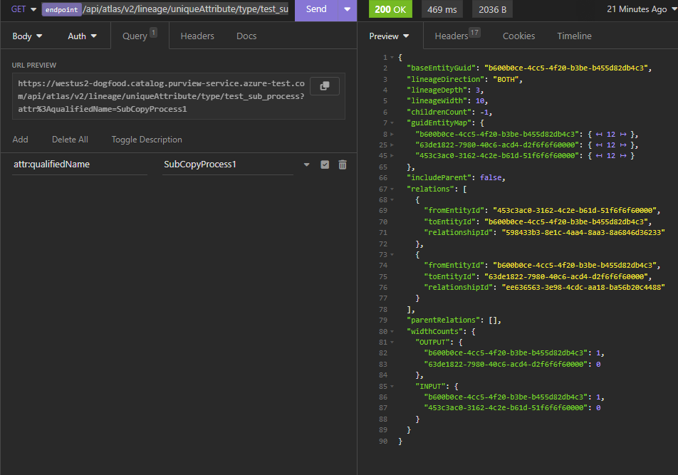
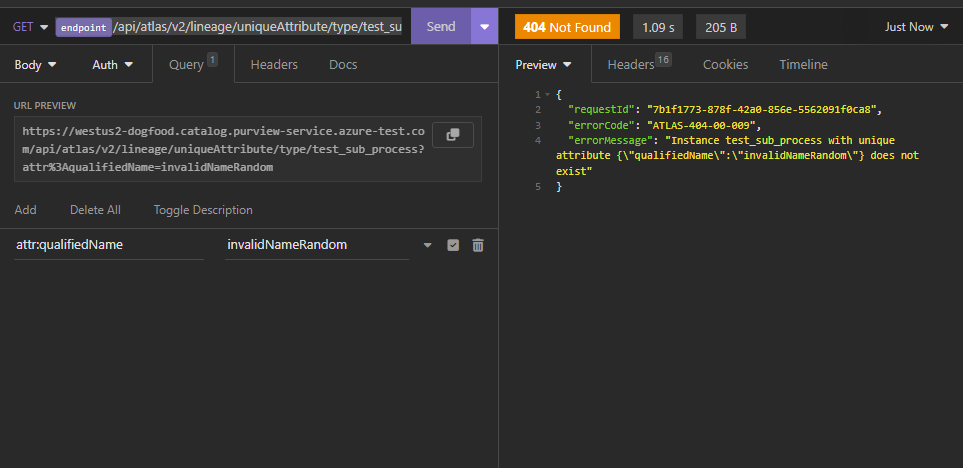

# GetLineageByUniqueAttributes

## EndPoint

```
{{endpoint}}/api/atlas/v2/lineage/uniqueAttribute/type/{typeName}
```

## HTTP Method
GET

## PathParams
### typeName

| Type   | Required | Description |
|--------|----------|------|
| String | true     | The name of the type     |

## QueryParam

## attr:<attrName>
Here attrName is the name of the unique attribute of the entity type

The value of this queryParam is the value of the unique attribute of the entity

Example attr:qualifiedName=abc

You can also pass multiple unique attributes in request URL query param like below.

```
{{endpoint}}/api/atlas/v2/lineage/uniqueAttribute/type/{typeName}?attr:qualifiedName=abc&attr:someAttributeName=xyz
```

Note: It's recommended to use qualified name as unique attribute for entity type while using this API

### Example of getEntityByUniqueAttribute API with qualifiedName as uniqueAttribute

We have created this entity in getLineageByGuid article [here](./getLineageByGuid.md#example-of-getDerivedLineage) under example-of-getDerivedLineage section

### Example of getEntityByUniqueAttribute API with invalid uniqueAttribute name


### Example of getEntityByUniqueAttribute API with no uniqueAttribute name


## Diff in queryParams as compared to [getLineageByGuid](./GetEntityByGuid.md) API

1. This API doesn't have forceNewAPi query param, It's considered as always true for this API
2. This API doesn't have getChildLineage query param
3. This API doesn't have excludeProcessTypes query param support

### Note: Rest all queryParams are same as [getLineageByGuid API](./getLineageByGuid.md)


