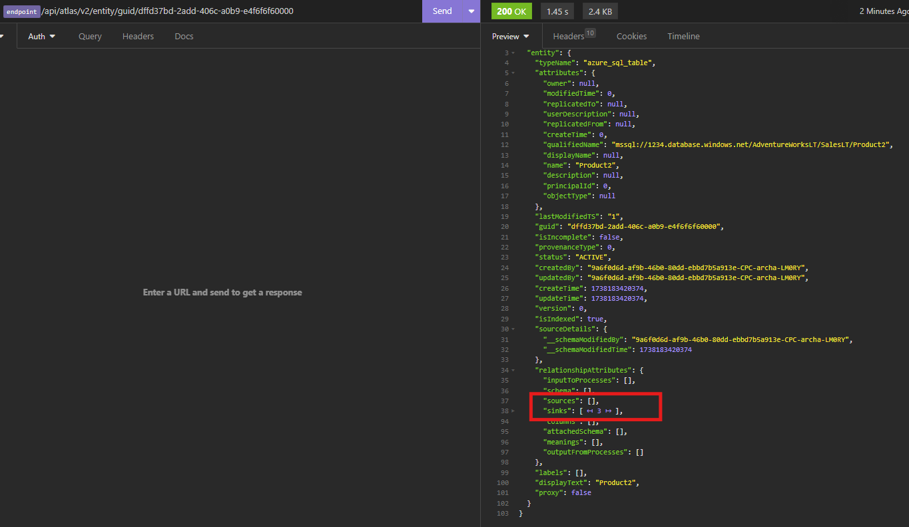
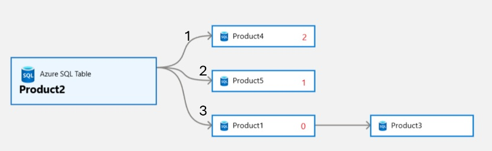
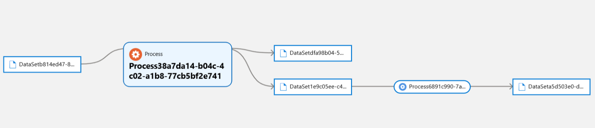
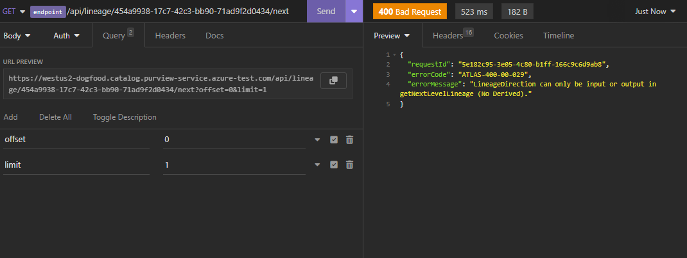

# getNextLevelLineage

This API is for getting the lineage in pagination

This API won't work for entities which have `Process` in its type or superType chain

Note: [getTypeByName API](https://learn.microsoft.com/en-us/rest/api/purview/datamapdataplane/type/get-by-name?view=rest-purview-datamapdataplane-2023-09-01&tabs=HTTP) gives type name and immediate superType of a type. Use this API recursively to find if superType chain contains `Process` type 

## EndPoint
```
{{endpoint}}/api/lineage/:guid/next
```
## HTTP Method
GET

## PathParams

### GUID
Unique identifier of the entity

## QueryParams

## offset

| Type | default value |
|------|---------------|
| int  | 0             |

Start position (Default: 0)
This is numbering for entities having relationship edge with the main entity on which lineage is being fetched

## limit

| Type | default value |
|------|---------------|
| int  | 10            |

Number of max expanding width in lineage 


**Note: Let's call entity on which getNextLineageAPI being called as mainEntity. The max limit is equal to number of vertices that are directly connected to mainEntity. To find this value call the getEntity API on mainEntity and see relationshipAttributes in response** 

For example, The response of getEntity API on Product2 in [Example 1](#example-1-of-limit-and-offset) has 3 sinks and 0 sources in relationshipAttributes means the max limit can be 3 for direction=OUTPUT and 0 for direction=INPUT




## excludeProcessTypes

| Type           | default value |
|----------------|---------------|
| List<String>   | null          |

If lineage chain is entity of type specified in this list, then in the response lineage chain will stop before that entity

### for example refer section [Example of excludeProcessTypes](#example-of-excludeprocesstypes)

### Note: Rest all queryParams are same as [GetEntityByGuid API](./GetEntityByGuid.md)


## Example 1 of limit and offset

### preparation 
Let's create the following lineage chain


1. Use following payload in bulk entityCreateOrUpdate API to create product 1, 2, 3,4 and 5
    <details>
    
    <summary>
    Payload to create all tables in image above
    </summary>
    
    ```json
    {
      "entities":
      [
        {
          "typeName": "azure_sql_table",
          "attributes":
          {
            "qualifiedName": "mssql://1234.database.windows.net/AdventureWorksLT/SalesLT/Product1",
            "name": "Product1"
          },
          "guid": "-9499"
        },
        {
          "typeName": "azure_sql_table",
          "attributes":
          {
            "qualifiedName": "mssql://1234.database.windows.net/AdventureWorksLT/SalesLT/Product2",
            "name": "Product2"
          },
          "guid": "-9959"
        },
        {
          "typeName": "azure_sql_table",
          "attributes":
          {
            "qualifiedName": "mssql://1234.database.windows.net/AdventureWorksLT/SalesLT/Product3",
            "name": "Product3"
          },
          "guid": "-9996"
        },
        {
          "typeName": "azure_sql_table",
          "attributes":
          {
            "qualifiedName": "mssql://1234.database.windows.net/AdventureWorksLT/SalesLT/Product4",
            "name": "Product4"
          },
          "guid": "-949439"
        },
        {
          "typeName": "azure_sql_table",
          "attributes":
          {
            "qualifiedName": "mssql://1234.database.windows.net/AdventureWorksLT/SalesLT/Product5",
            "name": "Product5"
          },
          "guid": "-99334359"
        }
      ]
    }
    ```
    
    </details>
2. Create relationship edges between tables as shown in image above. Call relationship API for each element (json) in array
    <details>

    <summary>
    Payload to create relationships b/w tables
    </summary>

   ```json
   [
    {
        "typeName": "direct_lineage_dataset_dataset",
        "end1":
        {
            "typeName": "azure_sql_table",
            "uniqueAttributes":
            {
                "qualifiedName": "mssql://1234.database.windows.net/AdventureWorksLT/SalesLT/Product2"
            }
        },
        "end2":
        {
            "typeName": "azure_sql_table",
            "uniqueAttributes":
            {
                "qualifiedName": "mssql://1234.database.windows.net/AdventureWorksLT/SalesLT/Product1"
            }
        }
    },
    {
        "typeName": "direct_lineage_dataset_dataset",
        "end1":
        {
            "typeName": "azure_sql_table",
            "uniqueAttributes":
            {
                "qualifiedName": "mssql://1234.database.windows.net/AdventureWorksLT/SalesLT/Product2"
            }
        },
        "end2":
        {
            "typeName": "azure_sql_table",
            "uniqueAttributes":
            {
                "qualifiedName": "mssql://1234.database.windows.net/AdventureWorksLT/SalesLT/Product5"
            }
        }
    },
    {
        "typeName": "direct_lineage_dataset_dataset",
        "end1":
        {
            "typeName": "azure_sql_table",
            "uniqueAttributes":
            {
                "qualifiedName": "mssql://1234.database.windows.net/AdventureWorksLT/SalesLT/Product2"
            }
        },
        "end2":
        {
            "typeName": "azure_sql_table",
            "uniqueAttributes":
            {
                "qualifiedName": "mssql://1234.database.windows.net/AdventureWorksLT/SalesLT/Product4"
            }
        }
    },
    {
        "typeName": "direct_lineage_dataset_dataset",
        "end1":
        {
            "typeName": "azure_sql_table",
            "uniqueAttributes":
            {
                "qualifiedName": "mssql://1234.database.windows.net/AdventureWorksLT/SalesLT/Product1"
            }
        },
        "end2":
        {
            "typeName": "azure_sql_table",
            "uniqueAttributes":
            {
                "qualifiedName": "mssql://1234.database.windows.net/AdventureWorksLT/SalesLT/Product3"
            }
        }
    }
   ]
   ```
    </details>

3. Details of entity created
   * Product1: guid: d96838ba-48b4-478f-b173-7ff6f6f60000
   * Product2: guid: dffd37bd-2add-406c-a0b9-e4f6f6f60000
   * Product3: guid: d522c3e2-7d90-406a-9b9e-47f6f6f60000
   * Product4: guid: e5e81dd8-e03f-4c8c-a5d3-c8f6f6f60000
   * Product5: guid: 5872c64c-fd1e-4b78-beaa-29f6f6f60000

### Examples of different limit and offset scenarios

The limits for product 2 are 1, 2, and 3 (number of edges in width), while the offsets are 0, 1, and 2. For instance, let us consider product 2 and the OUTPUT direction

| # | Offset | Limit | Result                          |
|---|--------|-------|---------------------------------|
| 1 | 0      | 1     | Product 1                       |
| 2 | 1      | 1     | Product 5                       |
| 3 | 2      | 1     | Product 4                       |
| 4 | 3      | 1     | No result                       |
| 5 | 0      | 2     | Product 1, Product 5            |
| 6 | 1      | 2     | Product 5, Product 4            |
| 7 | 2      | 2     | Product 4                       |
| 8 | 0      | 3     | Product 1, Product 5, Product 4 |

NOTE: The order of the products is determined by their IDs. Therefore, the sequence in which products appear (Product 4, Product 5, Product 1) can vary based on their respective IDs, meaning they might interchange their positions. 

<details>
<summary>
API response for offset 0 and limit 1, direction=OUTPUT
</summary>

```json
{
   "baseEntityGuid": "dffd37bd-2add-406c-a0b9-e4f6f6f60000",
   "lineageDirection": "OUTPUT",
   "lineageDepth": 1,
   "lineageWidth": 1,
   "childrenCount": -1,
   "guidEntityMap": {
      "d96838ba-48b4-478f-b173-7ff6f6f60000": {
         "typeName": "azure_sql_table",
         "attributes": {
            "modifiedTime": 0,
            "createTime": 0,
            "qualifiedName": "mssql://1234.database.windows.net/AdventureWorksLT/SalesLT/Product1",
            "name": "Product1",
            "principalId": 0
         },
         "lastModifiedTS": "1",
         "guid": "d96838ba-48b4-478f-b173-7ff6f6f60000",
         "status": "ACTIVE",
         "displayText": "Product1",
         "classificationNames": [],
         "meaningNames": [],
         "meanings": [],
         "isIncomplete": false,
         "labels": [],
         "isIndexed": true
      }
   },
   "includeParent": false,
   "relations": [
      {
         "fromEntityId": "dffd37bd-2add-406c-a0b9-e4f6f6f60000",
         "toEntityId": "d96838ba-48b4-478f-b173-7ff6f6f60000",
         "relationshipId": "4f49a463-d3ff-461d-9617-c32e34a2e561"
      }
   ],
   "widthCounts": {
      "OUTPUT": null
   }
}
```
</details>

<details>
<summary>
API response for offset 0 and limit 2, direction=OUTPUT
</summary>

```json
{
   "baseEntityGuid": "dffd37bd-2add-406c-a0b9-e4f6f6f60000",
   "lineageDirection": "OUTPUT",
   "lineageDepth": 1,
   "lineageWidth": 2,
   "childrenCount": -1,
   "guidEntityMap": {
      "d96838ba-48b4-478f-b173-7ff6f6f60000": {
         "typeName": "azure_sql_table",
         "attributes": {
            "modifiedTime": 0,
            "createTime": 0,
            "qualifiedName": "mssql://1234.database.windows.net/AdventureWorksLT/SalesLT/Product1",
            "name": "Product1",
            "principalId": 0
         },
         "lastModifiedTS": "1",
         "guid": "d96838ba-48b4-478f-b173-7ff6f6f60000",
         "status": "ACTIVE",
         "displayText": "Product1",
         "classificationNames": [],
         "meaningNames": [],
         "meanings": [],
         "isIncomplete": false,
         "labels": [],
         "isIndexed": true
      },
      "5872c64c-fd1e-4b78-beaa-29f6f6f60000": {
         "typeName": "azure_sql_table",
         "attributes": {
            "modifiedTime": 0,
            "createTime": 0,
            "qualifiedName": "mssql://1234.database.windows.net/AdventureWorksLT/SalesLT/Product5",
            "name": "Product5",
            "principalId": 0
         },
         "lastModifiedTS": "1",
         "guid": "5872c64c-fd1e-4b78-beaa-29f6f6f60000",
         "status": "ACTIVE",
         "displayText": "Product5",
         "classificationNames": [],
         "meaningNames": [],
         "meanings": [],
         "isIncomplete": false,
         "labels": [],
         "isIndexed": true
      }
   },
   "includeParent": false,
   "relations": [
      {
         "fromEntityId": "dffd37bd-2add-406c-a0b9-e4f6f6f60000",
         "toEntityId": "5872c64c-fd1e-4b78-beaa-29f6f6f60000",
         "relationshipId": "93bc7775-0fe3-4580-93bd-bb6983b06db3"
      },
      {
         "fromEntityId": "dffd37bd-2add-406c-a0b9-e4f6f6f60000",
         "toEntityId": "d96838ba-48b4-478f-b173-7ff6f6f60000",
         "relationshipId": "4f49a463-d3ff-461d-9617-c32e34a2e561"
      }
   ],
   "widthCounts": {
      "OUTPUT": null
   }
}
```
</details>

<details>
<summary>
API response for offset 0 and limit 3, direction=OUTPUT
</summary>

```json
{
   "baseEntityGuid": "dffd37bd-2add-406c-a0b9-e4f6f6f60000",
   "lineageDirection": "OUTPUT",
   "lineageDepth": 1,
   "lineageWidth": 3,
   "childrenCount": -1,
   "guidEntityMap": {
      "d96838ba-48b4-478f-b173-7ff6f6f60000": {
         "typeName": "azure_sql_table",
         "attributes": {
            "modifiedTime": 0,
            "createTime": 0,
            "qualifiedName": "mssql://1234.database.windows.net/AdventureWorksLT/SalesLT/Product1",
            "name": "Product1",
            "principalId": 0
         },
         "lastModifiedTS": "1",
         "guid": "d96838ba-48b4-478f-b173-7ff6f6f60000",
         "status": "ACTIVE",
         "displayText": "Product1",
         "classificationNames": [],
         "meaningNames": [],
         "meanings": [],
         "isIncomplete": false,
         "labels": [],
         "isIndexed": true
      },
      "e5e81dd8-e03f-4c8c-a5d3-c8f6f6f60000": {
         "typeName": "azure_sql_table",
         "attributes": {
            "modifiedTime": 0,
            "createTime": 0,
            "qualifiedName": "mssql://1234.database.windows.net/AdventureWorksLT/SalesLT/Product4",
            "name": "Product4",
            "principalId": 0
         },
         "lastModifiedTS": "1",
         "guid": "e5e81dd8-e03f-4c8c-a5d3-c8f6f6f60000",
         "status": "ACTIVE",
         "displayText": "Product4",
         "classificationNames": [],
         "meaningNames": [],
         "meanings": [],
         "isIncomplete": false,
         "labels": [],
         "isIndexed": true
      },
      "5872c64c-fd1e-4b78-beaa-29f6f6f60000": {
         "typeName": "azure_sql_table",
         "attributes": {
            "modifiedTime": 0,
            "createTime": 0,
            "qualifiedName": "mssql://1234.database.windows.net/AdventureWorksLT/SalesLT/Product5",
            "name": "Product5",
            "principalId": 0
         },
         "lastModifiedTS": "1",
         "guid": "5872c64c-fd1e-4b78-beaa-29f6f6f60000",
         "status": "ACTIVE",
         "displayText": "Product5",
         "classificationNames": [],
         "meaningNames": [],
         "meanings": [],
         "isIncomplete": false,
         "labels": [],
         "isIndexed": true
      }
   },
   "includeParent": false,
   "relations": [
      {
         "fromEntityId": "dffd37bd-2add-406c-a0b9-e4f6f6f60000",
         "toEntityId": "e5e81dd8-e03f-4c8c-a5d3-c8f6f6f60000",
         "relationshipId": "54c8fe2e-8f9a-41b3-af63-58ccc42c2b8f"
      },
      {
         "fromEntityId": "dffd37bd-2add-406c-a0b9-e4f6f6f60000",
         "toEntityId": "5872c64c-fd1e-4b78-beaa-29f6f6f60000",
         "relationshipId": "93bc7775-0fe3-4580-93bd-bb6983b06db3"
      },
      {
         "fromEntityId": "dffd37bd-2add-406c-a0b9-e4f6f6f60000",
         "toEntityId": "d96838ba-48b4-478f-b173-7ff6f6f60000",
         "relationshipId": "4f49a463-d3ff-461d-9617-c32e34a2e561"
      }
   ],
   "widthCounts": {
      "OUTPUT": null
   }
}
```
</details>

<details>
<summary>
API response for offset 1 and limit 3, direction=OUTPUT
</summary>

```json
{
   "baseEntityGuid": "dffd37bd-2add-406c-a0b9-e4f6f6f60000",
   "lineageDirection": "OUTPUT",
   "lineageDepth": 1,
   "lineageWidth": 3,
   "childrenCount": -1,
   "guidEntityMap": {
      "e5e81dd8-e03f-4c8c-a5d3-c8f6f6f60000": {
         "typeName": "azure_sql_table",
         "attributes": {
            "modifiedTime": 0,
            "createTime": 0,
            "qualifiedName": "mssql://1234.database.windows.net/AdventureWorksLT/SalesLT/Product4",
            "name": "Product4",
            "principalId": 0
         },
         "lastModifiedTS": "1",
         "guid": "e5e81dd8-e03f-4c8c-a5d3-c8f6f6f60000",
         "status": "ACTIVE",
         "displayText": "Product4",
         "classificationNames": [],
         "meaningNames": [],
         "meanings": [],
         "isIncomplete": false,
         "labels": [],
         "isIndexed": true
      },
      "5872c64c-fd1e-4b78-beaa-29f6f6f60000": {
         "typeName": "azure_sql_table",
         "attributes": {
            "modifiedTime": 0,
            "createTime": 0,
            "qualifiedName": "mssql://1234.database.windows.net/AdventureWorksLT/SalesLT/Product5",
            "name": "Product5",
            "principalId": 0
         },
         "lastModifiedTS": "1",
         "guid": "5872c64c-fd1e-4b78-beaa-29f6f6f60000",
         "status": "ACTIVE",
         "displayText": "Product5",
         "classificationNames": [],
         "meaningNames": [],
         "meanings": [],
         "isIncomplete": false,
         "labels": [],
         "isIndexed": true
      }
   },
   "includeParent": false,
   "relations": [
      {
         "fromEntityId": "dffd37bd-2add-406c-a0b9-e4f6f6f60000",
         "toEntityId": "e5e81dd8-e03f-4c8c-a5d3-c8f6f6f60000",
         "relationshipId": "54c8fe2e-8f9a-41b3-af63-58ccc42c2b8f"
      },
      {
         "fromEntityId": "dffd37bd-2add-406c-a0b9-e4f6f6f60000",
         "toEntityId": "5872c64c-fd1e-4b78-beaa-29f6f6f60000",
         "relationshipId": "93bc7775-0fe3-4580-93bd-bb6983b06db3"
      }
   ],
   "widthCounts": {
      "OUTPUT": null
   }
}
```
</details>

## Example 2 of limit and offset

### preparation
Let's create the following lineage chain



1. Use following payload in bulk entityCreateOrUpdate API to create product 1, 2, 3,4 and 5

## Example 2 of limit and offset

### preparation
Let's create the following lineage chain


1. Use following payload in bulk entityCreateOrUpdate API to create product 1, 2, 3,4 and 5
    <details>
    
    <summary>
    Payload to create all DataSet and Process in image above
    </summary>
    
    ```json
   {
    "entities":
    [
        {
            "typeName": "DataSet",
            "attributes":
            {
                "name": "DataSetb814ed47-8f19-4675-9164-189cab0fd7fc",
                "qualifiedName": "DataSetb814ed47-8f19-4675-9164-189cab0fd7fc"
            },
            "guid": "-1"
        },
        {
            "typeName": "DataSet",
            "attributes":
            {
                "name": "DataSet1e9c05ee-c4f3-4613-8318-ae9b65ff429e",
                "qualifiedName": "DataSet1e9c05ee-c4f3-4613-8318-ae9b65ff429e"
            },
            "guid": "-2"
        },
        {
            "typeName": "Process",
            "attributes":
            {
                "qualifiedName": "Process38a7da14-b04c-4c02-a1b8-77cb5bf2e741",
                "name": "Process38a7da14-b04c-4c02-a1b8-77cb5bf2e741"
            },
            "guid": "-3"
        },
        {
            "typeName": "DataSet",
            "attributes":
            {
                "name": "DataSetdfa98b04-5a67-4717-b527-61b64407e1f7",
                "qualifiedName": "DataSetdfa98b04-5a67-4717-b527-61b64407e1f7"
            },
            "guid": "-4"
        },
        {
            "typeName": "Process",
            "attributes":
            {
                "name": "Process6891c990-7a1e-4b06-bf76-e78f9285ac2c",
                "qualifiedName": "Process6891c990-7a1e-4b06-bf76-e78f9285ac2c"
            },
            "guid": "-5"
        },
        {
            "typeName": "DataSet",
            "attributes":
            {
                "name": "DataSeta5d503e0-d8ec-4ef3-a48e-33b66bf65e51",
                "qualifiedName": "DataSeta5d503e0-d8ec-4ef3-a48e-33b66bf65e51"
            },
            "guid": "-6"
        }
    ]
   }
    ```
    </details>

2. Create lineage relationships b/w entities in image above using relationship API, Call relationship API for each element (json) in array
   <details>
   <summary>
   Payload to create relationships b/w entities
   </summary>
   
   ```json
   [
    {
        "typeName": "dataset_process_inputs",
        "end1":
        {
            "typeName": "DataSet",
            "uniqueAttributes":
            {
                "qualifiedName": "DataSetb814ed47-8f19-4675-9164-189cab0fd7fc"
            }
        },
        "end2":
        {
            "typeName": "Process",
            "uniqueAttributes":
            {
                "qualifiedName": "Process38a7da14-b04c-4c02-a1b8-77cb5bf2e741"
            }
        }
    },
    {
        "typeName": "dataset_process_inputs",
        "end1":
        {
            "typeName": "DataSet",
            "uniqueAttributes":
            {
                "qualifiedName": "DataSet1e9c05ee-c4f3-4613-8318-ae9b65ff429e"
            }
        },
        "end2":
        {
            "typeName": "Process",
            "uniqueAttributes":
            {
                "qualifiedName": "Process6891c990-7a1e-4b06-bf76-e78f9285ac2c"
            }
        }
    },
    {
        "typeName": "process_dataset_outputs",
        "end1":
        {
            "typeName": "Process",
            "uniqueAttributes":
            {
                "qualifiedName": "Process38a7da14-b04c-4c02-a1b8-77cb5bf2e741"
            }
        },
        "end2":
        {
            "typeName": "DataSet",
            "uniqueAttributes":
            {
                "qualifiedName": "DataSetdfa98b04-5a67-4717-b527-61b64407e1f7"
            }
        }
    },
    {
        "typeName": "process_dataset_outputs",
        "end1":
        {
            "typeName": "Process",
            "uniqueAttributes":
            {
                "qualifiedName": "Process38a7da14-b04c-4c02-a1b8-77cb5bf2e741"
            }
        },
        "end2":
        {
            "typeName": "DataSet",
            "uniqueAttributes":
            {
                "qualifiedName": "DataSet1e9c05ee-c4f3-4613-8318-ae9b65ff429e"
            }
        }
    },
    {
        "typeName": "process_dataset_outputs",
        "end1":
        {
            "typeName": "Process",
            "uniqueAttributes":
            {
                "qualifiedName": "Process6891c990-7a1e-4b06-bf76-e78f9285ac2c"
            }
        },
        "end2":
        {
            "typeName": "DataSet",
            "uniqueAttributes":
            {
                "qualifiedName": "DataSeta5d503e0-d8ec-4ef3-a48e-33b66bf65e51"
            }
        }
    }
   ]

   ```   
   </details>

3. Details of entity created
   * DataSetb814ed47-8f19-4675-9164-189cab0fd7fc: guid: 454a9938-17c7-42c3-bb90-71ad9f2d0434
   * DataSet1e9c05ee-c4f3-4613-8318-ae9b65ff429e: guid: 9841fe6f-a5de-4d88-a316-19c9747cb376
   * Process38a7da14-b04c-4c02-a1b8-77cb5bf2e741: guid: 496e7aaf-6275-482b-85f2-5c6cf2e6837c
   * DataSetdfa98b04-5a67-4717-b527-61b64407e1f7: guid: 224fb417-157c-4196-8c8b-6f1c947a965b
   * Process6891c990-7a1e-4b06-bf76-e78f9285ac2c: guid: e9d653da-a67e-45af-bd66-11c8ce1f5246
   * DataSeta5d503e0-d8ec-4ef3-a48e-33b66bf65e51: guid: a5fd1a7f-a4b4-4057-9bcf-4930c45de39c

<details>
<summary>
API response with direction=NULL or direction=BOTH (default direction is OUTPUT on backend)
</summary>

```json
{
	"requestId": "b3e85177-7ff6-4a53-b611-6377c52c1eff",
	"errorCode": "ATLAS-400-00-029",
	"errorMessage": "LineageDirection can only be input or output in getNextLevelLineage (No Derived)."
}

```

</details>



**Note: API gives error if direction=NULL or direction==BOTH** 


<details>
<summary>
API response with direction=INPUT, offset=0 on DataSetb814ed47-8f19-4675-9164-189cab0fd7fc
</summary>

```json
{
   "baseEntityGuid": "454a9938-17c7-42c3-bb90-71ad9f2d0434",
   "lineageDirection": "INPUT",
   "lineageDepth": 1,
   "lineageWidth": 10,
   "childrenCount": -1,
   "guidEntityMap": {},
   "includeParent": false,
   "relations": [],
   "widthCounts": {
      "INPUT": null
   }
}
```

</details>

The response is empty because there is no input to DataSetb814ed47-8f19-4675-9164-189cab0fd7fc in lineage graph

<details>
<summary>
API response with direction=OUTPUT, offset=0, limit=1 on DataSetb814ed47-8f19-4675-9164-189cab0fd7fc
</summary>

```json
{
   "baseEntityGuid": "454a9938-17c7-42c3-bb90-71ad9f2d0434",
   "lineageDirection": "OUTPUT",
   "lineageDepth": 1,
   "lineageWidth": 10,
   "childrenCount": -1,
   "guidEntityMap": {
      "224fb417-157c-4196-8c8b-6f1c947a965b": {
         "typeName": "DataSet",
         "attributes": {
            "qualifiedName": "DataSetdfa98b04-5a67-4717-b527-61b64407e1f7",
            "name": "DataSetdfa98b04-5a67-4717-b527-61b64407e1f7"
         },
         "lastModifiedTS": "3",
         "guid": "224fb417-157c-4196-8c8b-6f1c947a965b",
         "status": "ACTIVE",
         "displayText": "DataSetdfa98b04-5a67-4717-b527-61b64407e1f7",
         "classificationNames": [],
         "meaningNames": [],
         "meanings": [],
         "isIncomplete": false,
         "labels": [],
         "isIndexed": true
      },
      "496e7aaf-6275-482b-85f2-5c6cf2e6837c": {
         "typeName": "Process",
         "attributes": {
            "qualifiedName": "Process38a7da14-b04c-4c02-a1b8-77cb5bf2e741",
            "name": "Process38a7da14-b04c-4c02-a1b8-77cb5bf2e741"
         },
         "lastModifiedTS": "3",
         "guid": "496e7aaf-6275-482b-85f2-5c6cf2e6837c",
         "status": "ACTIVE",
         "displayText": "Process38a7da14-b04c-4c02-a1b8-77cb5bf2e741",
         "classificationNames": [],
         "meaningNames": [],
         "meanings": [],
         "isIncomplete": false,
         "labels": [],
         "isIndexed": true
      },
      "9841fe6f-a5de-4d88-a316-19c9747cb376": {
         "typeName": "DataSet",
         "attributes": {
            "qualifiedName": "DataSet1e9c05ee-c4f3-4613-8318-ae9b65ff429e",
            "name": "DataSet1e9c05ee-c4f3-4613-8318-ae9b65ff429e"
         },
         "lastModifiedTS": "3",
         "guid": "9841fe6f-a5de-4d88-a316-19c9747cb376",
         "status": "ACTIVE",
         "displayText": "DataSet1e9c05ee-c4f3-4613-8318-ae9b65ff429e",
         "classificationNames": [],
         "meaningNames": [],
         "meanings": [],
         "isIncomplete": false,
         "labels": [],
         "isIndexed": true
      }
   },
   "includeParent": false,
   "relations": [
      {
         "fromEntityId": "454a9938-17c7-42c3-bb90-71ad9f2d0434",
         "toEntityId": "496e7aaf-6275-482b-85f2-5c6cf2e6837c",
         "relationshipId": "61994bc6-5544-4271-9af6-dd00441cf561"
      },
      {
         "fromEntityId": "496e7aaf-6275-482b-85f2-5c6cf2e6837c",
         "toEntityId": "224fb417-157c-4196-8c8b-6f1c947a965b",
         "relationshipId": "7ed6108c-cb8d-469e-ab91-825a7347a3f1"
      },
      {
         "fromEntityId": "496e7aaf-6275-482b-85f2-5c6cf2e6837c",
         "toEntityId": "9841fe6f-a5de-4d88-a316-19c9747cb376",
         "relationshipId": "e6b2f61c-4bb1-4e41-be08-f7cabcb410e0"
      }
   ],
   "widthCounts": {
      "OUTPUT": null
   }
}
```

</details>

**NOTE: The response contains DataSetdfa98b04...., DataSet1e9c05ee.. even though the limit is 1 this is because in nextLineage API The process also returns its immediately connected layer based on direction** 

<details>
<summary>
API response with direction=OUTPUT, offset=0 on DataSetb814ed47-8f19-4675-9164-189cab0fd7fc
</summary>

```json
{
   "baseEntityGuid": "454a9938-17c7-42c3-bb90-71ad9f2d0434",
   "lineageDirection": "OUTPUT",
   "lineageDepth": 1,
   "lineageWidth": 10,
   "childrenCount": -1,
   "guidEntityMap": {
      "224fb417-157c-4196-8c8b-6f1c947a965b": {
         "typeName": "DataSet",
         "attributes": {
            "qualifiedName": "DataSetdfa98b04-5a67-4717-b527-61b64407e1f7",
            "name": "DataSetdfa98b04-5a67-4717-b527-61b64407e1f7"
         },
         "lastModifiedTS": "3",
         "guid": "224fb417-157c-4196-8c8b-6f1c947a965b",
         "status": "ACTIVE",
         "displayText": "DataSetdfa98b04-5a67-4717-b527-61b64407e1f7",
         "classificationNames": [],
         "meaningNames": [],
         "meanings": [],
         "isIncomplete": false,
         "labels": [],
         "isIndexed": true
      },
      "496e7aaf-6275-482b-85f2-5c6cf2e6837c": {
         "typeName": "Process",
         "attributes": {
            "qualifiedName": "Process38a7da14-b04c-4c02-a1b8-77cb5bf2e741",
            "name": "Process38a7da14-b04c-4c02-a1b8-77cb5bf2e741"
         },
         "lastModifiedTS": "3",
         "guid": "496e7aaf-6275-482b-85f2-5c6cf2e6837c",
         "status": "ACTIVE",
         "displayText": "Process38a7da14-b04c-4c02-a1b8-77cb5bf2e741",
         "classificationNames": [],
         "meaningNames": [],
         "meanings": [],
         "isIncomplete": false,
         "labels": [],
         "isIndexed": true
      },
      "9841fe6f-a5de-4d88-a316-19c9747cb376": {
         "typeName": "DataSet",
         "attributes": {
            "qualifiedName": "DataSet1e9c05ee-c4f3-4613-8318-ae9b65ff429e",
            "name": "DataSet1e9c05ee-c4f3-4613-8318-ae9b65ff429e"
         },
         "lastModifiedTS": "3",
         "guid": "9841fe6f-a5de-4d88-a316-19c9747cb376",
         "status": "ACTIVE",
         "displayText": "DataSet1e9c05ee-c4f3-4613-8318-ae9b65ff429e",
         "classificationNames": [],
         "meaningNames": [],
         "meanings": [],
         "isIncomplete": false,
         "labels": [],
         "isIndexed": true
      }
   },
   "includeParent": false,
   "relations": [
      {
         "fromEntityId": "454a9938-17c7-42c3-bb90-71ad9f2d0434",
         "toEntityId": "496e7aaf-6275-482b-85f2-5c6cf2e6837c",
         "relationshipId": "61994bc6-5544-4271-9af6-dd00441cf561"
      },
      {
         "fromEntityId": "496e7aaf-6275-482b-85f2-5c6cf2e6837c",
         "toEntityId": "224fb417-157c-4196-8c8b-6f1c947a965b",
         "relationshipId": "7ed6108c-cb8d-469e-ab91-825a7347a3f1"
      },
      {
         "fromEntityId": "496e7aaf-6275-482b-85f2-5c6cf2e6837c",
         "toEntityId": "9841fe6f-a5de-4d88-a316-19c9747cb376",
         "relationshipId": "e6b2f61c-4bb1-4e41-be08-f7cabcb410e0"
      }
   ],
   "widthCounts": {
      "OUTPUT": null
   }
}
```

</details>

<details>
<summary>
API response with direction=OUTPUT, offset=1, on DataSetb814ed47-8f19-4675-9164-189cab0fd7fc
</summary>

```json
{
   "baseEntityGuid": "454a9938-17c7-42c3-bb90-71ad9f2d0434",
   "lineageDirection": "OUTPUT",
   "lineageDepth": 1,
   "lineageWidth": 10,
   "childrenCount": -1,
   "guidEntityMap": {},
   "includeParent": false,
   "relations": [],
   "widthCounts": {
      "OUTPUT": null
   }
}
```

</details>

The response is empty because there is no offset 1 vertex for DataSetb814ed47-8f19-4675-9164-189cab0fd7fc, The offset 0 vertex is Process38a7da14... but there is no other vertex directly connected to DataSetb814ed47... in output direction


<details>
<summary>
API response with direction=OUTPUT, offset=0 on DataSetb814ed47-8f19-4675-9164-189cab0fd7fc
</summary>

```json
{
   "baseEntityGuid": "454a9938-17c7-42c3-bb90-71ad9f2d0434",
   "lineageDirection": "OUTPUT",
   "lineageDepth": 1,
   "lineageWidth": 10,
   "childrenCount": -1,
   "guidEntityMap": {
      "224fb417-157c-4196-8c8b-6f1c947a965b": {
         "typeName": "DataSet",
         "attributes": {
            "qualifiedName": "DataSetdfa98b04-5a67-4717-b527-61b64407e1f7",
            "name": "DataSetdfa98b04-5a67-4717-b527-61b64407e1f7"
         },
         "lastModifiedTS": "3",
         "guid": "224fb417-157c-4196-8c8b-6f1c947a965b",
         "status": "ACTIVE",
         "displayText": "DataSetdfa98b04-5a67-4717-b527-61b64407e1f7",
         "classificationNames": [],
         "meaningNames": [],
         "meanings": [],
         "isIncomplete": false,
         "labels": [],
         "isIndexed": true
      },
      "496e7aaf-6275-482b-85f2-5c6cf2e6837c": {
         "typeName": "Process",
         "attributes": {
            "qualifiedName": "Process38a7da14-b04c-4c02-a1b8-77cb5bf2e741",
            "name": "Process38a7da14-b04c-4c02-a1b8-77cb5bf2e741"
         },
         "lastModifiedTS": "3",
         "guid": "496e7aaf-6275-482b-85f2-5c6cf2e6837c",
         "status": "ACTIVE",
         "displayText": "Process38a7da14-b04c-4c02-a1b8-77cb5bf2e741",
         "classificationNames": [],
         "meaningNames": [],
         "meanings": [],
         "isIncomplete": false,
         "labels": [],
         "isIndexed": true
      },
      "9841fe6f-a5de-4d88-a316-19c9747cb376": {
         "typeName": "DataSet",
         "attributes": {
            "qualifiedName": "DataSet1e9c05ee-c4f3-4613-8318-ae9b65ff429e",
            "name": "DataSet1e9c05ee-c4f3-4613-8318-ae9b65ff429e"
         },
         "lastModifiedTS": "3",
         "guid": "9841fe6f-a5de-4d88-a316-19c9747cb376",
         "status": "ACTIVE",
         "displayText": "DataSet1e9c05ee-c4f3-4613-8318-ae9b65ff429e",
         "classificationNames": [],
         "meaningNames": [],
         "meanings": [],
         "isIncomplete": false,
         "labels": [],
         "isIndexed": true
      }
   },
   "includeParent": false,
   "relations": [
      {
         "fromEntityId": "454a9938-17c7-42c3-bb90-71ad9f2d0434",
         "toEntityId": "496e7aaf-6275-482b-85f2-5c6cf2e6837c",
         "relationshipId": "61994bc6-5544-4271-9af6-dd00441cf561"
      },
      {
         "fromEntityId": "496e7aaf-6275-482b-85f2-5c6cf2e6837c",
         "toEntityId": "224fb417-157c-4196-8c8b-6f1c947a965b",
         "relationshipId": "7ed6108c-cb8d-469e-ab91-825a7347a3f1"
      },
      {
         "fromEntityId": "496e7aaf-6275-482b-85f2-5c6cf2e6837c",
         "toEntityId": "9841fe6f-a5de-4d88-a316-19c9747cb376",
         "relationshipId": "e6b2f61c-4bb1-4e41-be08-f7cabcb410e0"
      }
   ],
   "widthCounts": {
      "OUTPUT": null
   }
}
```

</details>

<details>
<summary>
API response with direction=OUTPUT, offset=1, on Process38a7da14.....
</summary>

```json
{
   "requestId": "5a829237-15c1-4218-a633-db938940b3cd",
   "errorCode": "ATLAS-404-00-006",
   "errorMessage": "Instance lineage query failed Process doesn't support get the next level dataSet with pagination. "
}
```
</details>

**Note: The response is error because This API won't work for entities which have `Process` in its type or superType chain** 

<details>
<summary>
API response with direction=INPUT, offset=0, on DataSeta5d503e0.....
</summary>

```json
{
   "baseEntityGuid": "a5fd1a7f-a4b4-4057-9bcf-4930c45de39c",
   "lineageDirection": "INPUT",
   "lineageDepth": 1,
   "lineageWidth": 10,
   "childrenCount": -1,
   "guidEntityMap": {
      "9841fe6f-a5de-4d88-a316-19c9747cb376": {
         "typeName": "DataSet",
         "attributes": {
            "qualifiedName": "DataSet1e9c05ee-c4f3-4613-8318-ae9b65ff429e",
            "name": "DataSet1e9c05ee-c4f3-4613-8318-ae9b65ff429e"
         },
         "lastModifiedTS": "3",
         "guid": "9841fe6f-a5de-4d88-a316-19c9747cb376",
         "status": "ACTIVE",
         "displayText": "DataSet1e9c05ee-c4f3-4613-8318-ae9b65ff429e",
         "classificationNames": [],
         "meaningNames": [],
         "meanings": [],
         "isIncomplete": false,
         "labels": [],
         "isIndexed": true
      },
      "e9d653da-a67e-45af-bd66-11c8ce1f5246": {
         "typeName": "Process",
         "attributes": {
            "qualifiedName": "Process6891c990-7a1e-4b06-bf76-e78f9285ac2c",
            "name": "Process6891c990-7a1e-4b06-bf76-e78f9285ac2c"
         },
         "lastModifiedTS": "4",
         "guid": "e9d653da-a67e-45af-bd66-11c8ce1f5246",
         "status": "ACTIVE",
         "displayText": "Process6891c990-7a1e-4b06-bf76-e78f9285ac2c",
         "classificationNames": [],
         "meaningNames": [],
         "meanings": [],
         "isIncomplete": false,
         "labels": [],
         "isIndexed": true
      }
   },
   "includeParent": false,
   "relations": [
      {
         "fromEntityId": "9841fe6f-a5de-4d88-a316-19c9747cb376",
         "toEntityId": "e9d653da-a67e-45af-bd66-11c8ce1f5246",
         "relationshipId": "9e325104-b4ed-4480-b973-f93a94b2dea2"
      },
      {
         "fromEntityId": "e9d653da-a67e-45af-bd66-11c8ce1f5246",
         "toEntityId": "a5fd1a7f-a4b4-4057-9bcf-4930c45de39c",
         "relationshipId": "e2f99ab3-5e0f-4e27-9e80-a0fdbb07bc85"
      }
   ],
   "widthCounts": {
      "INPUT": null
   }
}
```
</details>

The response contains expected processProcess6891c990... of the left direction along with its immediate left direction dataset DataSet1e9c05ee....

## Example of excludeProcessTypes 

If excludeProcessTypes is set to "Process", no processes of type "Process" or lineage after it in specified direction will be returned

<details>
<summary>
API response with direction=OUTPUT, offset=0, excludeProcessTypes="Process" on DataSetb814ed47.....
</summary>

```json
{
   "baseEntityGuid": "454a9938-17c7-42c3-bb90-71ad9f2d0434",
   "lineageDirection": "OUTPUT",
   "lineageDepth": 1,
   "lineageWidth": 10,
   "childrenCount": -1,
   "guidEntityMap": {},
   "includeParent": false,
   "relations": [],
   "widthCounts": {
      "OUTPUT": null
   }
}
```
</details>

1. The response is empty because there is no other entity directly connected to DataSetb814ed47... other than Process38a7da14... which is of type "Process"
2. If there were any other entity connected to DataSetb814ed47... other than Process38a7da14... it would have been returned in response based on limit and offset
3. If excludeProcessTypes was not set, the response would have contained Process38a7da14... and its immediate connected entities in specified direction


## References

1. [BulkEntityCreateOrUpdateAPI](https://learn.microsoft.com/en-us/rest/api/purview/datamapdataplane/entity/bulk-create-or-update?view=rest-purview-datamapdataplane-2023-09-01&tabs=HTTP)
2. [RelationshipCreteAPI](https://learn.microsoft.com/en-us/rest/api/purview/datamapdataplane/relationship/create?view=rest-purview-datamapdataplane-2023-09-01&tabs=HTTP)
3. [CreateTypeDefAPI](https://learn.microsoft.com/en-us/rest/api/purview/datamapdataplane/type/get-by-name?view=rest-purview-datamapdataplane-2023-09-01&tabs=HTTP)
4. [GetEntityAPIs](../getEntityAPIs)