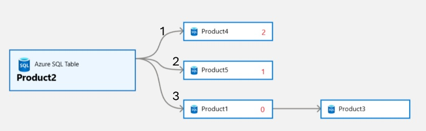
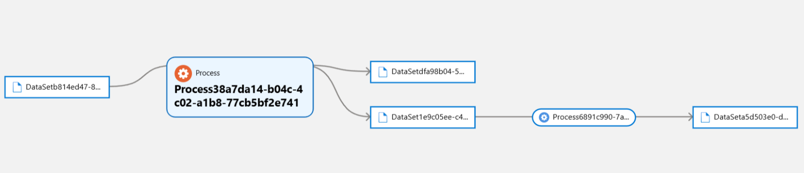

# getNextLevelLineage

This API is for getting the lineage in pagination

This API won't work for entities which have `Process` in its type or superType chain

## EndPoint
```
{{endpoint}}/api/lineage/:guid/next
```
## HTTP Method
GET

## PathParams

### GUID
Unique identifier of the entity

## QueryParams

## offset

| Type | default value |
|------|---------------|
| int  | 0             |

Start position (Default: 0)
This is numbering for entities having relationship edge with the main entity on which lineage is being fetched

## limit

| Type | default value |
|------|---------------|
| int  | 10            |

Number of max expanding width in lineage 

## excludeProcessTypes

| Type           | default value |
|----------------|---------------|
| List<String>   | null          |

If lineage chain as entity of type specified in this list, then the lineage chain will stop before that entity

### Note: Rest all queryParams are same as [GetEntityByGuid API](./GetEntityByGuid.md)


## Example 1 of limit and offset

### preparation 
Let's create the following lineage chain


1. Use following payload in bulk entityCreateOrUpdate API to create product 1, 2, 3,4 and 5
    <details>
    
    <summary>
    Payload to create all tables in image above
    </summary>
    
    ```json
    {
      "entities":
      [
        {
          "typeName": "azure_sql_table",
          "attributes":
          {
            "qualifiedName": "mssql://1234.database.windows.net/AdventureWorksLT/SalesLT/Product1",
            "name": "Product1"
          },
          "guid": "-9499"
        },
        {
          "typeName": "azure_sql_table",
          "attributes":
          {
            "qualifiedName": "mssql://1234.database.windows.net/AdventureWorksLT/SalesLT/Product2",
            "name": "Product2"
          },
          "guid": "-9959"
        },
        {
          "typeName": "azure_sql_table",
          "attributes":
          {
            "qualifiedName": "mssql://1234.database.windows.net/AdventureWorksLT/SalesLT/Product3",
            "name": "Product3"
          },
          "guid": "-9996"
        },
        {
          "typeName": "azure_sql_table",
          "attributes":
          {
            "qualifiedName": "mssql://1234.database.windows.net/AdventureWorksLT/SalesLT/Product4",
            "name": "Product4"
          },
          "guid": "-949439"
        },
        {
          "typeName": "azure_sql_table",
          "attributes":
          {
            "qualifiedName": "mssql://1234.database.windows.net/AdventureWorksLT/SalesLT/Product5",
            "name": "Product5"
          },
          "guid": "-99334359"
        }
      ]
    }
    ```
    
    </details>
2. Create relationship edges between tables as shown in image above. Call relationship API for each element (json) in array
    <details>

    <summary>
    Payload to create relationships b/w tables
    </summary>

   ```json
   [
    {
        "typeName": "direct_lineage_dataset_dataset",
        "end1":
        {
            "typeName": "azure_sql_table",
            "uniqueAttributes":
            {
                "qualifiedName": "mssql://1234.database.windows.net/AdventureWorksLT/SalesLT/Product2"
            }
        },
        "end2":
        {
            "typeName": "azure_sql_table",
            "uniqueAttributes":
            {
                "qualifiedName": "mssql://1234.database.windows.net/AdventureWorksLT/SalesLT/Product1"
            }
        }
    },
    {
        "typeName": "direct_lineage_dataset_dataset",
        "end1":
        {
            "typeName": "azure_sql_table",
            "uniqueAttributes":
            {
                "qualifiedName": "mssql://1234.database.windows.net/AdventureWorksLT/SalesLT/Product2"
            }
        },
        "end2":
        {
            "typeName": "azure_sql_table",
            "uniqueAttributes":
            {
                "qualifiedName": "mssql://1234.database.windows.net/AdventureWorksLT/SalesLT/Product5"
            }
        }
    },
    {
        "typeName": "direct_lineage_dataset_dataset",
        "end1":
        {
            "typeName": "azure_sql_table",
            "uniqueAttributes":
            {
                "qualifiedName": "mssql://1234.database.windows.net/AdventureWorksLT/SalesLT/Product2"
            }
        },
        "end2":
        {
            "typeName": "azure_sql_table",
            "uniqueAttributes":
            {
                "qualifiedName": "mssql://1234.database.windows.net/AdventureWorksLT/SalesLT/Product4"
            }
        }
    },
    {
        "typeName": "direct_lineage_dataset_dataset",
        "end1":
        {
            "typeName": "azure_sql_table",
            "uniqueAttributes":
            {
                "qualifiedName": "mssql://1234.database.windows.net/AdventureWorksLT/SalesLT/Product1"
            }
        },
        "end2":
        {
            "typeName": "azure_sql_table",
            "uniqueAttributes":
            {
                "qualifiedName": "mssql://1234.database.windows.net/AdventureWorksLT/SalesLT/Product3"
            }
        }
    }
   ]
   ```
    </details>

3. Details of entity created
   * Product1: guid: d96838ba-48b4-478f-b173-7ff6f6f60000
   * Product2: guid: dffd37bd-2add-406c-a0b9-e4f6f6f60000
   * Product3: guid: d522c3e2-7d90-406a-9b9e-47f6f6f60000
   * Product4: guid: e5e81dd8-e03f-4c8c-a5d3-c8f6f6f60000
   * Product5: guid: 5872c64c-fd1e-4b78-beaa-29f6f6f60000

### Examples of different limit and offset scenarios

The limits for product 2 are 1, 2, and 3 (number of edges in width), while the offsets are 0, 1, and 2. For instance, let us consider product 2 and the OUTPUT direction

| # | Offset | Limit | Result                          |
|---|--------|-------|---------------------------------|
| 1 | 0      | 1     | Product 1                       |
| 2 | 1      | 1     | Product 5                       |
| 3 | 2      | 1     | Product 4                       |
| 4 | 3      | 1     | No result                       |
| 5 | 0      | 2     | Product 1, Product 5            |
| 6 | 1      | 2     | Product 5, Product 4            |
| 7 | 2      | 2     | Product 4                       |
| 8 | 0      | 3     | Product 1, Product 5, Product 4 |

NOTE: The order of the products is determined by their IDs. Therefore, the sequence in which products appear (Product 4, Product 5, Product 1) can vary based on their respective IDs, meaning they might interchange their positions. 

<details>
<summary>
API response for offset 0 and limit 1, direction=OUTPUT
</summary>

```json
{
   "baseEntityGuid": "dffd37bd-2add-406c-a0b9-e4f6f6f60000",
   "lineageDirection": "OUTPUT",
   "lineageDepth": 1,
   "lineageWidth": 1,
   "childrenCount": -1,
   "guidEntityMap": {
      "d96838ba-48b4-478f-b173-7ff6f6f60000": {
         "typeName": "azure_sql_table",
         "attributes": {
            "modifiedTime": 0,
            "createTime": 0,
            "qualifiedName": "mssql://1234.database.windows.net/AdventureWorksLT/SalesLT/Product1",
            "name": "Product1",
            "principalId": 0
         },
         "lastModifiedTS": "1",
         "guid": "d96838ba-48b4-478f-b173-7ff6f6f60000",
         "status": "ACTIVE",
         "displayText": "Product1",
         "classificationNames": [],
         "meaningNames": [],
         "meanings": [],
         "isIncomplete": false,
         "labels": [],
         "isIndexed": true
      }
   },
   "includeParent": false,
   "relations": [
      {
         "fromEntityId": "dffd37bd-2add-406c-a0b9-e4f6f6f60000",
         "toEntityId": "d96838ba-48b4-478f-b173-7ff6f6f60000",
         "relationshipId": "4f49a463-d3ff-461d-9617-c32e34a2e561"
      }
   ],
   "widthCounts": {
      "OUTPUT": null
   }
}
```
</details>

<details>
<summary>
API response for offset 0 and limit 2, direction=OUTPUT
</summary>

```json
{
   "baseEntityGuid": "dffd37bd-2add-406c-a0b9-e4f6f6f60000",
   "lineageDirection": "OUTPUT",
   "lineageDepth": 1,
   "lineageWidth": 2,
   "childrenCount": -1,
   "guidEntityMap": {
      "d96838ba-48b4-478f-b173-7ff6f6f60000": {
         "typeName": "azure_sql_table",
         "attributes": {
            "modifiedTime": 0,
            "createTime": 0,
            "qualifiedName": "mssql://1234.database.windows.net/AdventureWorksLT/SalesLT/Product1",
            "name": "Product1",
            "principalId": 0
         },
         "lastModifiedTS": "1",
         "guid": "d96838ba-48b4-478f-b173-7ff6f6f60000",
         "status": "ACTIVE",
         "displayText": "Product1",
         "classificationNames": [],
         "meaningNames": [],
         "meanings": [],
         "isIncomplete": false,
         "labels": [],
         "isIndexed": true
      },
      "5872c64c-fd1e-4b78-beaa-29f6f6f60000": {
         "typeName": "azure_sql_table",
         "attributes": {
            "modifiedTime": 0,
            "createTime": 0,
            "qualifiedName": "mssql://1234.database.windows.net/AdventureWorksLT/SalesLT/Product5",
            "name": "Product5",
            "principalId": 0
         },
         "lastModifiedTS": "1",
         "guid": "5872c64c-fd1e-4b78-beaa-29f6f6f60000",
         "status": "ACTIVE",
         "displayText": "Product5",
         "classificationNames": [],
         "meaningNames": [],
         "meanings": [],
         "isIncomplete": false,
         "labels": [],
         "isIndexed": true
      }
   },
   "includeParent": false,
   "relations": [
      {
         "fromEntityId": "dffd37bd-2add-406c-a0b9-e4f6f6f60000",
         "toEntityId": "5872c64c-fd1e-4b78-beaa-29f6f6f60000",
         "relationshipId": "93bc7775-0fe3-4580-93bd-bb6983b06db3"
      },
      {
         "fromEntityId": "dffd37bd-2add-406c-a0b9-e4f6f6f60000",
         "toEntityId": "d96838ba-48b4-478f-b173-7ff6f6f60000",
         "relationshipId": "4f49a463-d3ff-461d-9617-c32e34a2e561"
      }
   ],
   "widthCounts": {
      "OUTPUT": null
   }
}
```
</details>

<details>
<summary>
API response for offset 0 and limit 3, direction=OUTPUT
</summary>

```json
{
   "baseEntityGuid": "dffd37bd-2add-406c-a0b9-e4f6f6f60000",
   "lineageDirection": "OUTPUT",
   "lineageDepth": 1,
   "lineageWidth": 3,
   "childrenCount": -1,
   "guidEntityMap": {
      "d96838ba-48b4-478f-b173-7ff6f6f60000": {
         "typeName": "azure_sql_table",
         "attributes": {
            "modifiedTime": 0,
            "createTime": 0,
            "qualifiedName": "mssql://1234.database.windows.net/AdventureWorksLT/SalesLT/Product1",
            "name": "Product1",
            "principalId": 0
         },
         "lastModifiedTS": "1",
         "guid": "d96838ba-48b4-478f-b173-7ff6f6f60000",
         "status": "ACTIVE",
         "displayText": "Product1",
         "classificationNames": [],
         "meaningNames": [],
         "meanings": [],
         "isIncomplete": false,
         "labels": [],
         "isIndexed": true
      },
      "e5e81dd8-e03f-4c8c-a5d3-c8f6f6f60000": {
         "typeName": "azure_sql_table",
         "attributes": {
            "modifiedTime": 0,
            "createTime": 0,
            "qualifiedName": "mssql://1234.database.windows.net/AdventureWorksLT/SalesLT/Product4",
            "name": "Product4",
            "principalId": 0
         },
         "lastModifiedTS": "1",
         "guid": "e5e81dd8-e03f-4c8c-a5d3-c8f6f6f60000",
         "status": "ACTIVE",
         "displayText": "Product4",
         "classificationNames": [],
         "meaningNames": [],
         "meanings": [],
         "isIncomplete": false,
         "labels": [],
         "isIndexed": true
      },
      "5872c64c-fd1e-4b78-beaa-29f6f6f60000": {
         "typeName": "azure_sql_table",
         "attributes": {
            "modifiedTime": 0,
            "createTime": 0,
            "qualifiedName": "mssql://1234.database.windows.net/AdventureWorksLT/SalesLT/Product5",
            "name": "Product5",
            "principalId": 0
         },
         "lastModifiedTS": "1",
         "guid": "5872c64c-fd1e-4b78-beaa-29f6f6f60000",
         "status": "ACTIVE",
         "displayText": "Product5",
         "classificationNames": [],
         "meaningNames": [],
         "meanings": [],
         "isIncomplete": false,
         "labels": [],
         "isIndexed": true
      }
   },
   "includeParent": false,
   "relations": [
      {
         "fromEntityId": "dffd37bd-2add-406c-a0b9-e4f6f6f60000",
         "toEntityId": "e5e81dd8-e03f-4c8c-a5d3-c8f6f6f60000",
         "relationshipId": "54c8fe2e-8f9a-41b3-af63-58ccc42c2b8f"
      },
      {
         "fromEntityId": "dffd37bd-2add-406c-a0b9-e4f6f6f60000",
         "toEntityId": "5872c64c-fd1e-4b78-beaa-29f6f6f60000",
         "relationshipId": "93bc7775-0fe3-4580-93bd-bb6983b06db3"
      },
      {
         "fromEntityId": "dffd37bd-2add-406c-a0b9-e4f6f6f60000",
         "toEntityId": "d96838ba-48b4-478f-b173-7ff6f6f60000",
         "relationshipId": "4f49a463-d3ff-461d-9617-c32e34a2e561"
      }
   ],
   "widthCounts": {
      "OUTPUT": null
   }
}
```
</details>

<details>
<summary>
API response for offset 1 and limit 3, direction=OUTPUT
</summary>

```json
{
   "baseEntityGuid": "dffd37bd-2add-406c-a0b9-e4f6f6f60000",
   "lineageDirection": "OUTPUT",
   "lineageDepth": 1,
   "lineageWidth": 3,
   "childrenCount": -1,
   "guidEntityMap": {
      "e5e81dd8-e03f-4c8c-a5d3-c8f6f6f60000": {
         "typeName": "azure_sql_table",
         "attributes": {
            "modifiedTime": 0,
            "createTime": 0,
            "qualifiedName": "mssql://1234.database.windows.net/AdventureWorksLT/SalesLT/Product4",
            "name": "Product4",
            "principalId": 0
         },
         "lastModifiedTS": "1",
         "guid": "e5e81dd8-e03f-4c8c-a5d3-c8f6f6f60000",
         "status": "ACTIVE",
         "displayText": "Product4",
         "classificationNames": [],
         "meaningNames": [],
         "meanings": [],
         "isIncomplete": false,
         "labels": [],
         "isIndexed": true
      },
      "5872c64c-fd1e-4b78-beaa-29f6f6f60000": {
         "typeName": "azure_sql_table",
         "attributes": {
            "modifiedTime": 0,
            "createTime": 0,
            "qualifiedName": "mssql://1234.database.windows.net/AdventureWorksLT/SalesLT/Product5",
            "name": "Product5",
            "principalId": 0
         },
         "lastModifiedTS": "1",
         "guid": "5872c64c-fd1e-4b78-beaa-29f6f6f60000",
         "status": "ACTIVE",
         "displayText": "Product5",
         "classificationNames": [],
         "meaningNames": [],
         "meanings": [],
         "isIncomplete": false,
         "labels": [],
         "isIndexed": true
      }
   },
   "includeParent": false,
   "relations": [
      {
         "fromEntityId": "dffd37bd-2add-406c-a0b9-e4f6f6f60000",
         "toEntityId": "e5e81dd8-e03f-4c8c-a5d3-c8f6f6f60000",
         "relationshipId": "54c8fe2e-8f9a-41b3-af63-58ccc42c2b8f"
      },
      {
         "fromEntityId": "dffd37bd-2add-406c-a0b9-e4f6f6f60000",
         "toEntityId": "5872c64c-fd1e-4b78-beaa-29f6f6f60000",
         "relationshipId": "93bc7775-0fe3-4580-93bd-bb6983b06db3"
      }
   ],
   "widthCounts": {
      "OUTPUT": null
   }
}
```
</details>

## Example 2 of limit and offset

### preparation
Let's create the following lineage chain



1. Use following payload in bulk entityCreateOrUpdate API to create product 1, 2, 3,4 and 5
    <details>
    
    <summary>
    Payload to create all DataSet and Process in image above
    </summary>
    
    ```json
   {
    "entities":
    [
        {
            "typeName": "DataSet",
            "attributes":
            {
                "name": "DataSetb814ed47-8f19-4675-9164-189cab0fd7fc",
                "qualifiedName": "DataSetb814ed47-8f19-4675-9164-189cab0fd7fc"
            },
            "guid": "-1"
        },
        {
            "typeName": "DataSet",
            "attributes":
            {
                "name": "DataSet1e9c05ee-c4f3-4613-8318-ae9b65ff429e",
                "qualifiedName": "DataSet1e9c05ee-c4f3-4613-8318-ae9b65ff429e"
            },
            "guid": "-2"
        },
        {
            "typeName": "Process",
            "attributes":
            {
                "qualifiedName": "Process38a7da14-b04c-4c02-a1b8-77cb5bf2e741",
                "name": "Process38a7da14-b04c-4c02-a1b8-77cb5bf2e741"
            },
            "guid": "-3"
        },
        {
            "typeName": "DataSet",
            "attributes":
            {
                "name": "DataSetdfa98b04-5a67-4717-b527-61b64407e1f7",
                "qualifiedName": "DataSetdfa98b04-5a67-4717-b527-61b64407e1f7"
            },
            "guid": "-4"
        },
        {
            "typeName": "Process",
            "attributes":
            {
                "name": "Process6891c990-7a1e-4b06-bf76-e78f9285ac2c",
                "qualifiedName": "Process6891c990-7a1e-4b06-bf76-e78f9285ac2c"
            },
            "guid": "-5"
        },
        {
            "typeName": "DataSet",
            "attributes":
            {
                "name": "DataSeta5d503e0-d8ec-4ef3-a48e-33b66bf65e51",
                "qualifiedName": "DataSeta5d503e0-d8ec-4ef3-a48e-33b66bf65e51"
            },
            "guid": "-6"
        }
    ]
   }
    ```
    </details>
   