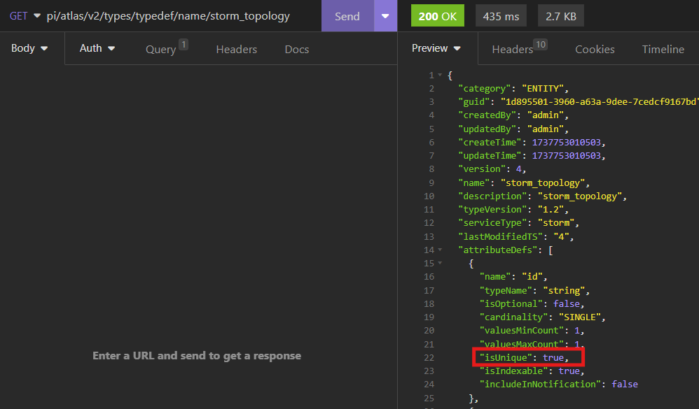
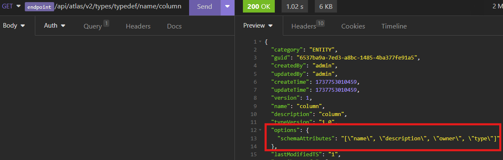
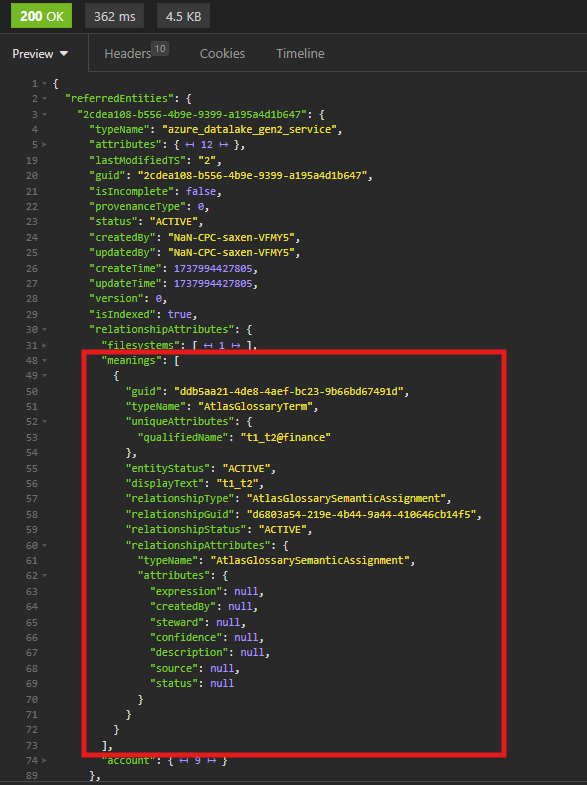
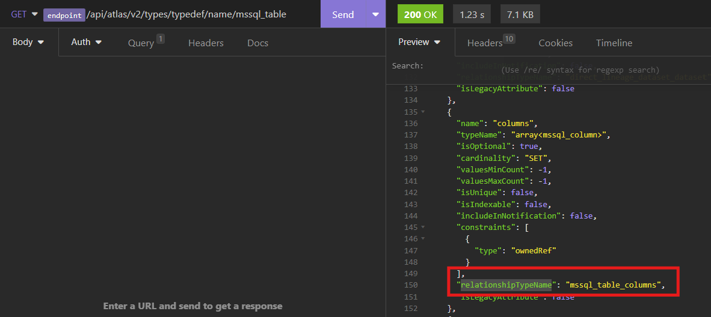
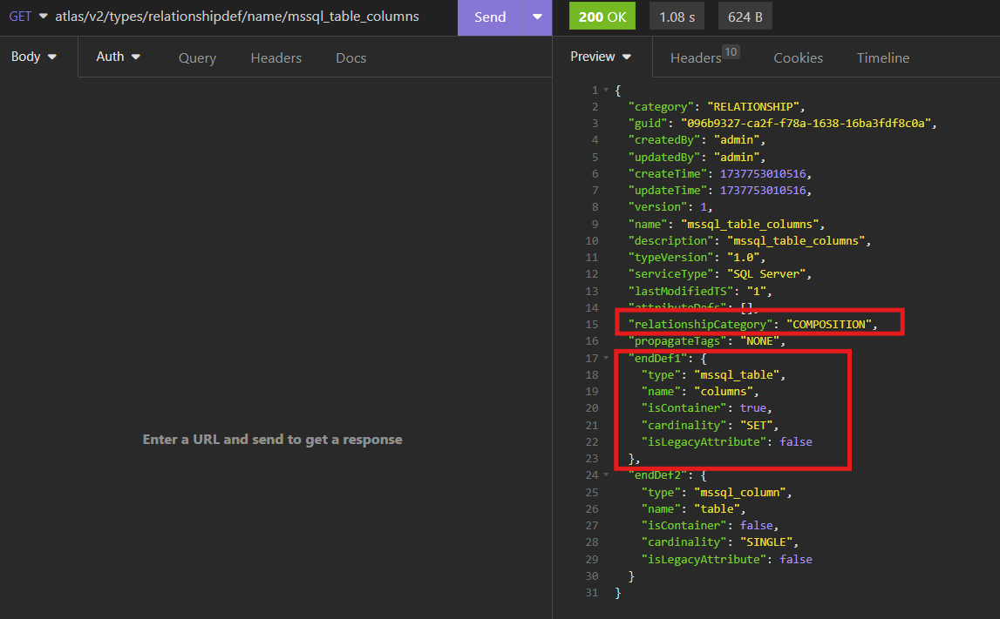

# GetEntityBYGuid

## EndPoint

{{endpoint}}/api/atlas/v2/entity/guid/{guid}

## HTTP Method
GET

## PathParams
### GUID
Unique identifier of the entity

## QueryParams
## minExtInfo
This is provided by Atlas Microsoft hadn't made any changes to its functionality


| Type         | default value |
|--------------|---------------|
| Boolean      | false         |

If true, we return only minimal information in referred entities. 

### what minimal means?
1. We won't return any relationshipAttribute inside referred entities
2. We will only return referred entities that are present in relationshipAttributes of the entity.
3. We won't return any referredEntity which is present only in relationshipAttributes of other referred entities and not present inside relationshipAttributes of entity
4. We will return only minInfoAttributes in referred entities

### what minInfoAttributes are?
minInfoAttributes include following if entity contains any of these attributes
1. This includes name, description, owner, createTime, userDescription and displayName
2. This contains all attributes which are unique and present in entityType or any of it's super types. A unique attribute is an attribute that has "isUnique" set to true in it's attributeDef. You can use [typeDef](https://learn.microsoft.com/en-us/rest/api/purview/datamapdataplane/type/get-by-name?view=rest-purview-datamapdataplane-2023-09-01&tabs=HTTP) get API to find this out

3. This contains all attributes which are present in schema-attributes inside options of entityType


### Example with minExtInfo = false

First let's create some entities
Request Json for bulk entity [createOrUpdate](https://learn.microsoft.com/en-us/rest/api/purview/datamapdataplane/entity/bulk-create-or-update?view=rest-purview-datamapdataplane-2023-09-01) request

<details>
  <summary>Request to createOrUpdate API for entity creation</summary>

```json
{
  "referredEntities": {
    "-1": {
      "typeName": "azure_datalake_gen2_service",
      "attributes": {
        "resourceGroupName": "rgName",
        "qualifiedName": "https://serviceName.dfs.core.windows.net",
        "name": "serviceName",
        "subscriptionId": "12345"
      },
      "guid": "-1",
      "relationshipAttributes": {
        "filesystems": [
          {
            "guid": "-2",
            "typeName": "azure_datalake_gen2_filesystem"
          }
        ],
        "account": {
          "guid": "-3",
          "typeName": "azure_storage_account"
        }
      }
    },
    "-2": {
      "typeName": "azure_datalake_gen2_filesystem",
      "attributes": {
        "name": "fileSystemName",
        "qualifiedName": "https://serviceName.dfs.core.windows.net/fileSystemName"
      },
      "guid": "-2",
      "relationshipAttributes": {
        "datalakeService": {
          "guid": "-1",
          "typeName": "azure_datalake_gen2_service"
        }
      }
    }
  },
  "entities": [
    {
      "typeName": "azure_storage_account",
      "attributes": {
        "qualifiedName": "https://serviceName.core.windows.net",
        "name": "serviceName"
      },
      "guid": "-3",
      "relationshipAttributes": {
        "services": [
          {
            "guid": "-1",
            "typeName": "azure_datalake_gen2_service"
          }
        ]
      }
    }
  ]
}
```
</details> 
        
Above request will give following response and creates three assets

<details>
  <summary>Response of createOrUpdate API</summary>

```json
{
	"referredEntities": {
		"2cdea108-b556-4b9e-9399-a195a4d1b647": {
			"typeName": "azure_datalake_gen2_service",
			"attributes": {
				"owner": null,
				"resourceGroupName": "rgName",
				"replicatedTo": null,
				"userDescription": null,
				"replicatedFrom": null,
				"createTime": 0,
				"qualifiedName": "https://serviceName.dfs.core.windows.net",
				"displayName": null,
				"name": "serviceName",
				"description": null,
				"location": null,
				"subscriptionId": "12345"
			},
			"lastModifiedTS": "1",
			"guid": "2cdea108-b556-4b9e-9399-a195a4d1b647",
			"isIncomplete": false,
			"provenanceType": 0,
			"status": "ACTIVE",
			"createdBy": "NaN-CPC-saxen-VFMY5",
			"updatedBy": "NaN-CPC-saxen-VFMY5",
			"createTime": 1737994427805,
			"updateTime": 1737994427805,
			"version": 0,
			"isIndexed": true,
			"relationshipAttributes": {
				"filesystems": [
					{
						"guid": "712c29b2-9d84-4210-9414-70bb74dded2a",
						"typeName": "azure_datalake_gen2_filesystem",
						"uniqueAttributes": {
							"qualifiedName": "https://serviceName.dfs.core.windows.net/fileSystemName"
						},
						"entityStatus": "ACTIVE",
						"displayText": "fileSystemName",
						"relationshipType": "datalake_gen2_service_filesystems",
						"relationshipGuid": "aff4c7f8-70f5-48cb-8270-b0aa7f763647",
						"relationshipStatus": "ACTIVE",
						"relationshipAttributes": {
							"typeName": "datalake_gen2_service_filesystems"
						}
					}
				],
				"meanings": [],
				"account": {
					"guid": "291367a6-a680-4e86-99b0-f562306e0ee4",
					"typeName": "azure_storage_account",
					"uniqueAttributes": {
						"qualifiedName": "https://serviceName.core.windows.net"
					},
					"entityStatus": "ACTIVE",
					"displayText": "serviceName",
					"relationshipType": "storage_account_services",
					"relationshipGuid": "7dc8c51d-5032-430c-8928-9abc55a1bb73",
					"relationshipStatus": "ACTIVE",
					"relationshipAttributes": {
						"typeName": "storage_account_services"
					}
				}
			},
			"labels": [],
			"displayText": "serviceName",
			"proxy": false
		},
		"712c29b2-9d84-4210-9414-70bb74dded2a": {
			"typeName": "azure_datalake_gen2_filesystem",
			"attributes": {
				"owner": null,
				"modifiedTime": 0,
				"replicatedTo": null,
				"userDescription": null,
				"replicatedFrom": null,
				"qualifiedName": "https://serviceName.dfs.core.windows.net/fileSystemName",
				"displayName": null,
				"name": "fileSystemName",
				"userProperties": null,
				"description": null
			},
			"lastModifiedTS": "1",
			"guid": "712c29b2-9d84-4210-9414-70bb74dded2a",
			"isIncomplete": false,
			"provenanceType": 0,
			"status": "ACTIVE",
			"createdBy": "NaN-CPC-saxen-VFMY5",
			"updatedBy": "NaN-CPC-saxen-VFMY5",
			"createTime": 1737994427805,
			"updateTime": 1737994427805,
			"version": 0,
			"isIndexed": true,
			"relationshipAttributes": {
				"inputToProcesses": [],
				"schema": [],
				"sources": [],
				"sinks": [],
				"datalakeService": {
					"guid": "2cdea108-b556-4b9e-9399-a195a4d1b647",
					"typeName": "azure_datalake_gen2_service",
					"uniqueAttributes": {
						"qualifiedName": "https://serviceName.dfs.core.windows.net"
					},
					"entityStatus": "ACTIVE",
					"displayText": "serviceName",
					"relationshipType": "datalake_gen2_service_filesystems",
					"relationshipGuid": "aff4c7f8-70f5-48cb-8270-b0aa7f763647",
					"relationshipStatus": "ACTIVE",
					"relationshipAttributes": {
						"typeName": "datalake_gen2_service_filesystems"
					}
				},
				"attachedSchema": [],
				"meanings": [],
				"outputFromProcesses": []
			},
			"labels": [],
			"displayText": "fileSystemName",
			"proxy": false
		}
	},
	"entity": {
		"typeName": "azure_storage_account",
		"attributes": {
			"owner": null,
			"resourceGroupName": null,
			"replicatedTo": null,
			"userDescription": null,
			"replicatedFrom": null,
			"qualifiedName": "https://serviceName.core.windows.net",
			"displayName": null,
			"kind": null,
			"accessTier": null,
			"description": null,
			"createTime": 0,
			"name": "serviceName",
			"location": null,
			"subscriptionId": null,
			"SKU": null
		},
		"lastModifiedTS": "1",
		"guid": "291367a6-a680-4e86-99b0-f562306e0ee4",
		"isIncomplete": false,
		"provenanceType": 0,
		"status": "ACTIVE",
		"createdBy": "NaN-CPC-saxen-VFMY5",
		"updatedBy": "NaN-CPC-saxen-VFMY5",
		"createTime": 1737994427805,
		"updateTime": 1737994427805,
		"version": 0,
		"isIndexed": true,
		"relationshipAttributes": {
			"services": [
				{
					"guid": "2cdea108-b556-4b9e-9399-a195a4d1b647",
					"typeName": "azure_datalake_gen2_service",
					"uniqueAttributes": {
						"qualifiedName": "https://serviceName.dfs.core.windows.net"
					},
					"entityStatus": "ACTIVE",
					"displayText": "serviceName",
					"relationshipType": "storage_account_services",
					"relationshipGuid": "7dc8c51d-5032-430c-8928-9abc55a1bb73",
					"relationshipStatus": "ACTIVE",
					"relationshipAttributes": {
						"typeName": "storage_account_services"
					}
				}
			],
			"meanings": []
		},
		"labels": [],
		"displayText": "serviceName",
		"proxy": false
	}
}
```
</details>

Now let's get entity by guid "291367a6-a680-4e86-99b0-f562306e0ee4" with minExtInfo = false

<details>
  <summary>Response of getEntityAPI</summary>

```json
{
	"referredEntities": {
		"2cdea108-b556-4b9e-9399-a195a4d1b647": {
			"typeName": "azure_datalake_gen2_service",
			"attributes": {
				"owner": null,
				"resourceGroupName": "rgName",
				"replicatedTo": null,
				"userDescription": null,
				"replicatedFrom": null,
				"createTime": 0,
				"qualifiedName": "https://serviceName.dfs.core.windows.net",
				"displayName": null,
				"name": "serviceName",
				"description": null,
				"location": null,
				"subscriptionId": "12345"
			},
			"lastModifiedTS": "1",
			"guid": "2cdea108-b556-4b9e-9399-a195a4d1b647",
			"isIncomplete": false,
			"provenanceType": 0,
			"status": "ACTIVE",
			"createdBy": "NaN-CPC-saxen-VFMY5",
			"updatedBy": "NaN-CPC-saxen-VFMY5",
			"createTime": 1737994427805,
			"updateTime": 1737994427805,
			"version": 0,
			"isIndexed": true,
			"relationshipAttributes": {
				"filesystems": [
					{
						"guid": "712c29b2-9d84-4210-9414-70bb74dded2a",
						"typeName": "azure_datalake_gen2_filesystem",
						"uniqueAttributes": {
							"qualifiedName": "https://serviceName.dfs.core.windows.net/fileSystemName"
						},
						"entityStatus": "ACTIVE",
						"displayText": "fileSystemName",
						"relationshipType": "datalake_gen2_service_filesystems",
						"relationshipGuid": "aff4c7f8-70f5-48cb-8270-b0aa7f763647",
						"relationshipStatus": "ACTIVE",
						"relationshipAttributes": {
							"typeName": "datalake_gen2_service_filesystems"
						}
					}
				],
				"meanings": [],
				"account": {
					"guid": "291367a6-a680-4e86-99b0-f562306e0ee4",
					"typeName": "azure_storage_account",
					"uniqueAttributes": {
						"qualifiedName": "https://serviceName.core.windows.net"
					},
					"entityStatus": "ACTIVE",
					"displayText": "serviceName",
					"relationshipType": "storage_account_services",
					"relationshipGuid": "7dc8c51d-5032-430c-8928-9abc55a1bb73",
					"relationshipStatus": "ACTIVE",
					"relationshipAttributes": {
						"typeName": "storage_account_services"
					}
				}
			},
			"labels": [],
			"displayText": "serviceName",
			"proxy": false
		},
		"712c29b2-9d84-4210-9414-70bb74dded2a": {
			"typeName": "azure_datalake_gen2_filesystem",
			"attributes": {
				"owner": null,
				"modifiedTime": 0,
				"replicatedTo": null,
				"userDescription": null,
				"replicatedFrom": null,
				"qualifiedName": "https://serviceName.dfs.core.windows.net/fileSystemName",
				"displayName": null,
				"name": "fileSystemName",
				"userProperties": null,
				"description": null
			},
			"lastModifiedTS": "1",
			"guid": "712c29b2-9d84-4210-9414-70bb74dded2a",
			"isIncomplete": false,
			"provenanceType": 0,
			"status": "ACTIVE",
			"createdBy": "NaN-CPC-saxen-VFMY5",
			"updatedBy": "NaN-CPC-saxen-VFMY5",
			"createTime": 1737994427805,
			"updateTime": 1737994427805,
			"version": 0,
			"isIndexed": true,
			"relationshipAttributes": {
				"inputToProcesses": [],
				"schema": [],
				"sources": [],
				"sinks": [],
				"datalakeService": {
					"guid": "2cdea108-b556-4b9e-9399-a195a4d1b647",
					"typeName": "azure_datalake_gen2_service",
					"uniqueAttributes": {
						"qualifiedName": "https://serviceName.dfs.core.windows.net"
					},
					"entityStatus": "ACTIVE",
					"displayText": "serviceName",
					"relationshipType": "datalake_gen2_service_filesystems",
					"relationshipGuid": "aff4c7f8-70f5-48cb-8270-b0aa7f763647",
					"relationshipStatus": "ACTIVE",
					"relationshipAttributes": {
						"typeName": "datalake_gen2_service_filesystems"
					}
				},
				"attachedSchema": [],
				"meanings": [],
				"outputFromProcesses": []
			},
			"labels": [],
			"displayText": "fileSystemName",
			"proxy": false
		}
	},
	"entity": {
		"typeName": "azure_storage_account",
		"attributes": {
			"owner": null,
			"resourceGroupName": null,
			"replicatedTo": null,
			"userDescription": null,
			"replicatedFrom": null,
			"qualifiedName": "https://serviceName.core.windows.net",
			"displayName": null,
			"kind": null,
			"accessTier": null,
			"description": null,
			"createTime": 0,
			"name": "serviceName",
			"location": null,
			"subscriptionId": null,
			"SKU": null
		},
		"lastModifiedTS": "1",
		"guid": "291367a6-a680-4e86-99b0-f562306e0ee4",
		"isIncomplete": false,
		"provenanceType": 0,
		"status": "ACTIVE",
		"createdBy": "NaN-CPC-saxen-VFMY5",
		"updatedBy": "NaN-CPC-saxen-VFMY5",
		"createTime": 1737994427805,
		"updateTime": 1737994427805,
		"version": 0,
		"isIndexed": true,
		"relationshipAttributes": {
			"services": [
				{
					"guid": "2cdea108-b556-4b9e-9399-a195a4d1b647",
					"typeName": "azure_datalake_gen2_service",
					"uniqueAttributes": {
						"qualifiedName": "https://serviceName.dfs.core.windows.net"
					},
					"entityStatus": "ACTIVE",
					"displayText": "serviceName",
					"relationshipType": "storage_account_services",
					"relationshipGuid": "7dc8c51d-5032-430c-8928-9abc55a1bb73",
					"relationshipStatus": "ACTIVE",
					"relationshipAttributes": {
						"typeName": "storage_account_services"
					}
				}
			],
			"meanings": []
		},
		"labels": [],
		"displayText": "serviceName",
		"proxy": false
	}
}
```
</details>

As you can see we got all attributes in referred entities and got referred entity with guid "712c29b2-9d84-4210-9414-70bb74dded2a" even though it wasn't present in relationshipAttributes of entity just present in relationshipAttributes of other referred entity with guid "2cdea108-b556-4b9e-9399-a195a4d1b647"

### Example with minExtInfo = true
Entity GUID: 291367a6-a680-4e86-99b0-f562306e0ee4
<details>
  <summary>Response of getEntityAPI with minExtInfo=true</summary>

```json
{
	"referredEntities": {
		"2cdea108-b556-4b9e-9399-a195a4d1b647": {
			"typeName": "azure_datalake_gen2_service",
			"attributes": {
				"createTime": 0,
				"qualifiedName": "https://serviceName.dfs.core.windows.net",
				"name": "serviceName"
			},
			"lastModifiedTS": "1",
			"guid": "2cdea108-b556-4b9e-9399-a195a4d1b647",
			"isIncomplete": false,
			"provenanceType": 0,
			"status": "ACTIVE",
			"createdBy": "NaN-CPC-saxen-VFMY5",
			"updatedBy": "NaN-CPC-saxen-VFMY5",
			"createTime": 1737994427805,
			"updateTime": 1737994427805,
			"version": 0,
			"isIndexed": true,
			"labels": [],
			"displayText": "serviceName",
			"proxy": false
		}
	},
	"entity": {
		"typeName": "azure_storage_account",
		"attributes": {
			"owner": null,
			"resourceGroupName": null,
			"replicatedTo": null,
			"userDescription": null,
			"replicatedFrom": null,
			"qualifiedName": "https://serviceName.core.windows.net",
			"displayName": null,
			"kind": null,
			"accessTier": null,
			"description": null,
			"createTime": 0,
			"name": "serviceName",
			"location": null,
			"subscriptionId": null,
			"SKU": null
		},
		"lastModifiedTS": "1",
		"guid": "291367a6-a680-4e86-99b0-f562306e0ee4",
		"isIncomplete": false,
		"provenanceType": 0,
		"status": "ACTIVE",
		"createdBy": "NaN-CPC-saxen-VFMY5",
		"updatedBy": "NaN-CPC-saxen-VFMY5",
		"createTime": 1737994427805,
		"updateTime": 1737994427805,
		"version": 0,
		"isIndexed": true,
		"relationshipAttributes": {
			"services": [
				{
					"guid": "2cdea108-b556-4b9e-9399-a195a4d1b647",
					"typeName": "azure_datalake_gen2_service",
					"uniqueAttributes": {
						"qualifiedName": "https://serviceName.dfs.core.windows.net"
					},
					"entityStatus": "ACTIVE",
					"displayText": "serviceName",
					"relationshipType": "storage_account_services",
					"relationshipGuid": "7dc8c51d-5032-430c-8928-9abc55a1bb73",
					"relationshipStatus": "ACTIVE",
					"relationshipAttributes": {
						"typeName": "storage_account_services"
					}
				}
			],
			"meanings": []
		},
		"labels": [],
		"displayText": "serviceName",
		"proxy": false
	}
}
```
</details>

Notice we have only one referred entity in response and it contains minimal attributes

## ignoreRelationships
This is provided by Atlas Microsoft hadn't made any changes to its functionality

| Type         | default value |
|--------------|---------------|
| Boolean      | false         |

If true, we won't return any referred entity and we won't return any relationship attribute inside entity

### Example with ignoreRelationships = true
Entity GUID: 291367a6-a680-4e86-99b0-f562306e0ee4

<details>
  <summary>Response of getEntityAPI with ignoreRelationships=true</summary>

```json
{
	"referredEntities": {},
	"entity": {
		"typeName": "azure_storage_account",
		"attributes": {
			"owner": null,
			"resourceGroupName": null,
			"replicatedTo": null,
			"userDescription": null,
			"replicatedFrom": null,
			"qualifiedName": "https://serviceName.core.windows.net",
			"displayName": null,
			"kind": null,
			"accessTier": null,
			"description": null,
			"createTime": 0,
			"name": "serviceName",
			"location": null,
			"subscriptionId": null,
			"SKU": null
		},
		"lastModifiedTS": "1",
		"guid": "291367a6-a680-4e86-99b0-f562306e0ee4",
		"isIncomplete": false,
		"provenanceType": 0,
		"status": "ACTIVE",
		"createdBy": "NaN-CPC-saxen-VFMY5",
		"updatedBy": "NaN-CPC-saxen-VFMY5",
		"createTime": 1737994427805,
		"updateTime": 1737994427805,
		"version": 0,
		"isIndexed": true,
		"labels": [],
		"displayText": "serviceName",
		"proxy": false
	}
}
```
</details>


## excludeRelationshipTypes
This is provided by Microsoft, and it's not present in Atlas

| Type         | default value |
|--------------|---------------|
| List<String> | null          |

If provided, we won't return provided relationships in relationship attribute of entity and referred entities

### Example with excludeRelationshipTypes = "datalake_gen2_service_filesystems"
Entity GUID: 291367a6-a680-4e86-99b0-f562306e0ee4

<details>
  <summary>Response of getEntityAPI with excludeRelationshipTypes="datalake_gen2_service_filesystems"</summary>

```json
{
	"referredEntities": {
		"2cdea108-b556-4b9e-9399-a195a4d1b647": {
			"typeName": "azure_datalake_gen2_service",
			"attributes": {
				"owner": null,
				"resourceGroupName": "rgName",
				"replicatedTo": null,
				"userDescription": null,
				"replicatedFrom": null,
				"createTime": 0,
				"qualifiedName": "https://serviceName.dfs.core.windows.net",
				"displayName": null,
				"name": "serviceName",
				"description": null,
				"location": null,
				"subscriptionId": "12345"
			},
			"lastModifiedTS": "3",
			"guid": "2cdea108-b556-4b9e-9399-a195a4d1b647",
			"isIncomplete": false,
			"provenanceType": 0,
			"status": "ACTIVE",
			"createdBy": "NaN-CPC-saxen-VFMY5",
			"updatedBy": "NaN-CPC-saxen-VFMY5",
			"createTime": 1737994427805,
			"updateTime": 1737994427805,
			"version": 0,
			"isIndexed": true,
			"relationshipAttributes": {
				"meanings": [],
				"account": {
					"guid": "291367a6-a680-4e86-99b0-f562306e0ee4",
					"typeName": "azure_storage_account",
					"uniqueAttributes": {
						"qualifiedName": "https://serviceName.core.windows.net"
					},
					"entityStatus": "ACTIVE",
					"displayText": "serviceName",
					"relationshipType": "storage_account_services",
					"relationshipGuid": "7dc8c51d-5032-430c-8928-9abc55a1bb73",
					"relationshipStatus": "ACTIVE",
					"relationshipAttributes": {
						"typeName": "storage_account_services"
					}
				}
			},
			"labels": [],
			"displayText": "serviceName",
			"proxy": false
		}
	},
	"entity": {
		"typeName": "azure_storage_account",
		"attributes": {
			"owner": null,
			"resourceGroupName": null,
			"replicatedTo": null,
			"userDescription": null,
			"replicatedFrom": null,
			"qualifiedName": "https://serviceName.core.windows.net",
			"displayName": null,
			"kind": null,
			"accessTier": null,
			"description": null,
			"createTime": 0,
			"name": "serviceName",
			"location": null,
			"subscriptionId": null,
			"SKU": null
		},
		"lastModifiedTS": "1",
		"guid": "291367a6-a680-4e86-99b0-f562306e0ee4",
		"isIncomplete": false,
		"provenanceType": 0,
		"status": "ACTIVE",
		"createdBy": "NaN-CPC-saxen-VFMY5",
		"updatedBy": "NaN-CPC-saxen-VFMY5",
		"createTime": 1737994427805,
		"updateTime": 1737994427805,
		"version": 0,
		"isIndexed": true,
		"relationshipAttributes": {
			"services": [
				{
					"guid": "2cdea108-b556-4b9e-9399-a195a4d1b647",
					"typeName": "azure_datalake_gen2_service",
					"uniqueAttributes": {
						"qualifiedName": "https://serviceName.dfs.core.windows.net"
					},
					"entityStatus": "ACTIVE",
					"displayText": "serviceName",
					"relationshipType": "storage_account_services",
					"relationshipGuid": "7dc8c51d-5032-430c-8928-9abc55a1bb73",
					"relationshipStatus": "ACTIVE",
					"relationshipAttributes": {
						"typeName": "storage_account_services"
					}
				}
			],
			"meanings": []
		},
		"labels": [],
		"displayText": "serviceName",
		"proxy": false
	}
}
```

</details>

Since our entity doesn't have any relationship of type "datalake_gen2_service_filesystems" it's relationship attributes are unchanged, but since referred entity with guid "2cdea108-b556-4b9e-9399-a195a4d1b647" has this relationship we don't get "filesystems" in it's relationshipAttributes

### Example with excludeRelationshipTypes = "storage_account_services"
Entity GUID: 291367a6-a680-4e86-99b0-f562306e0ee4

<details>
  <summary>Response of getEntityAPI with excludeRelationshipTypes="storage_account_services"</summary>

```json
```

</details>

Since our entity has relationship of type "storage_account_services" we don't get "services" in it's relationshipAttributes,

Note: Since we generate referred entity "2cdea108-b556-4b9e-9399-a195a4d1b647" out of relationship attributes of main entity we didn't get this referred entity in output, Also since "712c29b2-9d84-4210-9414-70bb74dded2a" is fetched based on relationship of referred entity "2cdea108-b556-4b9e-9399-a195a4d1b647" we didn't get this entity in output as well

## includeTermsInMinExtInfo
This is provided by Microsoft, and it's not present in Atlas

Controls whether to include terms in relationship attributes of referred entities or not
The terms are always present in relationship attributes of main entity irrespective of this query param

| Type    | default value |
|---------|---------------|
| boolean | false         |

When we use minExtInfo=true, we won't return any terms in relationshipAttributes of referred entities. If you want to include terms in response set includeTermsInMinExtInfo to true

Note: This query param is only applicable when minExtInfo=true else it is of no use

### Example with includeTermsInMinExtInfo = true

Let's attach some terms to referred entity "2cdea108-b556-4b9e-9399-a195a4d1b647"

Please refer [creteTerm](https://learn.microsoft.com/en-us/rest/api/purview/datamapdataplane/glossary/create-term?view=rest-purview-datamapdataplane-2023-09-01&tabs=HTTP) and [AssignTermToEntity](https://learn.microsoft.com/en-us/rest/api/purview/datamapdataplane/glossary/assign-term-to-entities?view=rest-purview-datamapdataplane-2023-09-01&tabs=HTTP) API to learn how to create and assign terms to entity

GET entity API after addition of terms and with includeTermsInMinExtInfo=false and minExtInfo=false

Entity GUID: 291367a6-a680-4e86-99b0-f562306e0ee4

<details>

<summary>Response of getEntityAPI after terms addition</summary>

```json
{
	"referredEntities": {
		"2cdea108-b556-4b9e-9399-a195a4d1b647": {
			"typeName": "azure_datalake_gen2_service",
			"attributes": {
				"owner": null,
				"resourceGroupName": "rgName",
				"replicatedTo": null,
				"userDescription": null,
				"replicatedFrom": null,
				"createTime": 0,
				"qualifiedName": "https://serviceName.dfs.core.windows.net",
				"displayName": null,
				"name": "serviceName",
				"description": null,
				"location": null,
				"subscriptionId": "12345"
			},
			"lastModifiedTS": "2",
			"guid": "2cdea108-b556-4b9e-9399-a195a4d1b647",
			"isIncomplete": false,
			"provenanceType": 0,
			"status": "ACTIVE",
			"createdBy": "NaN-CPC-saxen-VFMY5",
			"updatedBy": "NaN-CPC-saxen-VFMY5",
			"createTime": 1737994427805,
			"updateTime": 1737994427805,
			"version": 0,
			"isIndexed": true,
			"relationshipAttributes": {
				"filesystems": [
					{
						"guid": "712c29b2-9d84-4210-9414-70bb74dded2a",
						"typeName": "azure_datalake_gen2_filesystem",
						"uniqueAttributes": {
							"qualifiedName": "https://serviceName.dfs.core.windows.net/fileSystemName"
						},
						"entityStatus": "ACTIVE",
						"displayText": "fileSystemName",
						"relationshipType": "datalake_gen2_service_filesystems",
						"relationshipGuid": "aff4c7f8-70f5-48cb-8270-b0aa7f763647",
						"relationshipStatus": "ACTIVE",
						"relationshipAttributes": {
							"typeName": "datalake_gen2_service_filesystems"
						}
					}
				],
				"meanings": [
					{
						"guid": "ddb5aa21-4de8-4aef-bc23-9b66bd67491d",
						"typeName": "AtlasGlossaryTerm",
						"uniqueAttributes": {
							"qualifiedName": "t1_t2@finance"
						},
						"entityStatus": "ACTIVE",
						"displayText": "t1_t2",
						"relationshipType": "AtlasGlossarySemanticAssignment",
						"relationshipGuid": "d6803a54-219e-4b44-9a44-410646cb14f5",
						"relationshipStatus": "ACTIVE",
						"relationshipAttributes": {
							"typeName": "AtlasGlossarySemanticAssignment",
							"attributes": {
								"expression": null,
								"createdBy": null,
								"steward": null,
								"confidence": null,
								"description": null,
								"source": null,
								"status": null
							}
						}
					}
				],
				"account": {
					"guid": "291367a6-a680-4e86-99b0-f562306e0ee4",
					"typeName": "azure_storage_account",
					"uniqueAttributes": {
						"qualifiedName": "https://serviceName.core.windows.net"
					},
					"entityStatus": "ACTIVE",
					"displayText": "serviceName",
					"relationshipType": "storage_account_services",
					"relationshipGuid": "7dc8c51d-5032-430c-8928-9abc55a1bb73",
					"relationshipStatus": "ACTIVE",
					"relationshipAttributes": {
						"typeName": "storage_account_services"
					}
				}
			},
			"labels": [],
			"displayText": "serviceName",
			"proxy": false
		},
		"712c29b2-9d84-4210-9414-70bb74dded2a": {
			"typeName": "azure_datalake_gen2_filesystem",
			"attributes": {
				"owner": null,
				"modifiedTime": 0,
				"replicatedTo": null,
				"userDescription": null,
				"replicatedFrom": null,
				"qualifiedName": "https://serviceName.dfs.core.windows.net/fileSystemName",
				"displayName": null,
				"name": "fileSystemName",
				"userProperties": null,
				"description": null
			},
			"lastModifiedTS": "1",
			"guid": "712c29b2-9d84-4210-9414-70bb74dded2a",
			"isIncomplete": false,
			"provenanceType": 0,
			"status": "ACTIVE",
			"createdBy": "NaN-CPC-saxen-VFMY5",
			"updatedBy": "NaN-CPC-saxen-VFMY5",
			"createTime": 1737994427805,
			"updateTime": 1737994427805,
			"version": 0,
			"isIndexed": true,
			"relationshipAttributes": {
				"inputToProcesses": [],
				"schema": [],
				"sources": [],
				"sinks": [],
				"datalakeService": {
					"guid": "2cdea108-b556-4b9e-9399-a195a4d1b647",
					"typeName": "azure_datalake_gen2_service",
					"uniqueAttributes": {
						"qualifiedName": "https://serviceName.dfs.core.windows.net"
					},
					"entityStatus": "ACTIVE",
					"displayText": "serviceName",
					"relationshipType": "datalake_gen2_service_filesystems",
					"relationshipGuid": "aff4c7f8-70f5-48cb-8270-b0aa7f763647",
					"relationshipStatus": "ACTIVE",
					"relationshipAttributes": {
						"typeName": "datalake_gen2_service_filesystems"
					}
				},
				"attachedSchema": [],
				"meanings": [],
				"outputFromProcesses": []
			},
			"labels": [],
			"displayText": "fileSystemName",
			"proxy": false
		}
	},
	"entity": {
		"typeName": "azure_storage_account",
		"attributes": {
			"owner": null,
			"resourceGroupName": null,
			"replicatedTo": null,
			"userDescription": null,
			"replicatedFrom": null,
			"qualifiedName": "https://serviceName.core.windows.net",
			"displayName": null,
			"kind": null,
			"accessTier": null,
			"description": null,
			"createTime": 0,
			"name": "serviceName",
			"location": null,
			"subscriptionId": null,
			"SKU": null
		},
		"lastModifiedTS": "1",
		"guid": "291367a6-a680-4e86-99b0-f562306e0ee4",
		"isIncomplete": false,
		"provenanceType": 0,
		"status": "ACTIVE",
		"createdBy": "NaN-CPC-saxen-VFMY5",
		"updatedBy": "NaN-CPC-saxen-VFMY5",
		"createTime": 1737994427805,
		"updateTime": 1737994427805,
		"version": 0,
		"isIndexed": true,
		"relationshipAttributes": {
			"services": [
				{
					"guid": "2cdea108-b556-4b9e-9399-a195a4d1b647",
					"typeName": "azure_datalake_gen2_service",
					"uniqueAttributes": {
						"qualifiedName": "https://serviceName.dfs.core.windows.net"
					},
					"entityStatus": "ACTIVE",
					"displayText": "serviceName",
					"relationshipType": "storage_account_services",
					"relationshipGuid": "7dc8c51d-5032-430c-8928-9abc55a1bb73",
					"relationshipStatus": "ACTIVE",
					"relationshipAttributes": {
						"typeName": "storage_account_services"
					}
				}
			],
			"meanings": []
		},
		"labels": [],
		"displayText": "serviceName",
		"proxy": false
	}
}
```
</details>

NOTE: The assigned terms to referred entity with GUID "2cdea108-b556-4b9e-9399-a195a4d1b647" are present inside "meanings" in it's relationshipAttributes



Not let's get entity with includeTermsInMinExtInfo=true and minExtInfo=true

Entity GUID: 291367a6-a680-4e86-99b0-f562306e0ee4

<details>

<summary>Response of getEntityAPI with includeTermsInMinExtInfo=true and minExtInfo=true</summary>

```json
{
	"referredEntities": {
		"2cdea108-b556-4b9e-9399-a195a4d1b647": {
			"typeName": "azure_datalake_gen2_service",
			"attributes": {
				"createTime": 0,
				"qualifiedName": "https://serviceName.dfs.core.windows.net",
				"name": "serviceName"
			},
			"lastModifiedTS": "2",
			"guid": "2cdea108-b556-4b9e-9399-a195a4d1b647",
			"isIncomplete": false,
			"provenanceType": 0,
			"status": "ACTIVE",
			"createdBy": "NaN-CPC-saxen-VFMY5",
			"updatedBy": "NaN-CPC-saxen-VFMY5",
			"createTime": 1737994427805,
			"updateTime": 1737994427805,
			"version": 0,
			"isIndexed": true,
			"relationshipAttributes": {
				"meanings": [
					{
						"guid": "ddb5aa21-4de8-4aef-bc23-9b66bd67491d",
						"typeName": "AtlasGlossaryTerm",
						"uniqueAttributes": {
							"qualifiedName": "t1_t2@finance"
						},
						"entityStatus": "ACTIVE",
						"displayText": "t1_t2",
						"relationshipType": "AtlasGlossarySemanticAssignment",
						"relationshipGuid": "d6803a54-219e-4b44-9a44-410646cb14f5",
						"relationshipStatus": "ACTIVE",
						"relationshipAttributes": {
							"typeName": "AtlasGlossarySemanticAssignment",
							"attributes": {
								"expression": null,
								"createdBy": null,
								"steward": null,
								"confidence": null,
								"description": null,
								"source": null,
								"status": null
							}
						}
					}
				]
			},
			"labels": [],
			"displayText": "serviceName",
			"proxy": false
		}
	},
	"entity": {
		"typeName": "azure_storage_account",
		"attributes": {
			"owner": null,
			"resourceGroupName": null,
			"replicatedTo": null,
			"userDescription": null,
			"replicatedFrom": null,
			"qualifiedName": "https://serviceName.core.windows.net",
			"displayName": null,
			"kind": null,
			"accessTier": null,
			"description": null,
			"createTime": 0,
			"name": "serviceName",
			"location": null,
			"subscriptionId": null,
			"SKU": null
		},
		"lastModifiedTS": "1",
		"guid": "291367a6-a680-4e86-99b0-f562306e0ee4",
		"isIncomplete": false,
		"provenanceType": 0,
		"status": "ACTIVE",
		"createdBy": "NaN-CPC-saxen-VFMY5",
		"updatedBy": "NaN-CPC-saxen-VFMY5",
		"createTime": 1737994427805,
		"updateTime": 1737994427805,
		"version": 0,
		"isIndexed": true,
		"relationshipAttributes": {
			"services": [
				{
					"guid": "2cdea108-b556-4b9e-9399-a195a4d1b647",
					"typeName": "azure_datalake_gen2_service",
					"uniqueAttributes": {
						"qualifiedName": "https://serviceName.dfs.core.windows.net"
					},
					"entityStatus": "ACTIVE",
					"displayText": "serviceName",
					"relationshipType": "storage_account_services",
					"relationshipGuid": "7dc8c51d-5032-430c-8928-9abc55a1bb73",
					"relationshipStatus": "ACTIVE",
					"relationshipAttributes": {
						"typeName": "storage_account_services"
					}
				}
			],
			"meanings": []
		},
		"labels": [],
		"displayText": "serviceName",
		"proxy": false
	}
}
```
</details>

As you can see terms are present in referred entity above even though minExtInfo=true

## loadHierarchyInfo

This is provided by Microsoft, and it's not present in Atlas

| Type    | default value |
|---------|---------------|
| boolean | false         |

If true, we will return hierarchy information of entity in response (no change in referred entities)

### Example with loadHierarchyInfo = true
You can use following payload to in createOrUpdate APIs for creating entities with hierarchy

<details>
<summary>payload for createOrUpdate API request hierarchical entities</summary>

```json
{
  "entities": [
    {
      "typeName": "azure_storage_account",
      "attributes": {
        "qualifiedName": "https://adcabcdefghij.core.windows.net",
        "name": "adcabcdefghij",
        "resourceGroupName": "resourceGroupName",
        "subscriptionId": "a2477c20-f700-4eb8-876d-902b47e3ac56"
      }
    },
    {
      "typeName": "azure_blob_service",
      "attributes": {
        "qualifiedName": "https://adcabcdefghij.blob.core.windows.net",
        "name": "adcabcdefghij"
      }
    },
    {
      "typeName": "azure_blob_container",
      "attributes": {
        "path": "adcresource",
        "qualifiedName": "https://adcabcdefghij.blob.core.windows.net/adcresource",
        "name": "adcresource"
      }
    },
    {
      "typeName": "azure_blob_path",
      "attributes": {
        "modifiedTime": 1559097606000,
        "qualifiedName": "https://adcabcdefghij.blob.core.windows.net/adcresource/copyfile.csv",
        "isBlob": true,
        "accessTierInferred": true,
        "accessTier": "Hot",
        "committedBlockCount": 0,
        "path": "/adcresource/copyfile.csv",
        "size": 2098,
        "createTime": 1559097606000,
        "name": "copyfile.csv",
        "blobType": "BlockBlob",
        "serverEncrypted": true,
        "contentType": "application/octet-stream"
      },
      "classifications": [
        {
          "typeName": "MICROSOFT.PERSONAL.EMAIL"
        }
      ]
    },
    {
      "typeName": "azure_blob_path",
      "attributes": {
        "qualifiedName": "https://adcabcdefghij.blob.core.windows.net/adcresource/folder1",
        "isBlob": false,
        "name": "folder1"
      }
    },
    {
      "typeName": "azure_blob_path",
      "attributes": {
        "qualifiedName": "https://adcabcdefghij.blob.core.windows.net/adcresource/folder1/subfolder1",
        "isBlob": false,
        "name": "subfolder1"
      }
    },
    {
      "typeName": "azure_blob_path",
      "attributes": {
        "modifiedTime": 1559097606000,
        "qualifiedName": "https://adcabcdefghij.blob.core.windows.net/adcresource/folder1/subfolder1/copyfile2.csv",
        "isBlob": true,
        "accessTierInferred": true,
        "accessTier": "Hot",
        "committedBlockCount": 0,
        "path": "/folder1/subfolder1/copyfile2.csv",
        "size": 2098,
        "createTime": 1559097606000,
        "name": "copyfile2.csv",
        "blobType": "BlockBlob",
        "serverEncrypted": true,
        "contentType": "application/octet-stream"
      },
      "classifications": [
        {
          "typeName": "MICROSOFT.PERSONAL.EMAIL"
        }
      ]
    },
    {
      "typeName": "azure_blob_resource_set",
      "attributes": {
        "name": "copyfileRS.csv",
        "qualifiedName": 		"https://adcabcdefghij.blob.core.windows.net/adcresource/folder1/resource{N}/copyfileRS.csv"
      }
    },
    {
      "typeName": "azure_blob_resource_set",
      "attributes": {
        "name": "copyfileRS2.csv",
        "qualifiedName": "https://adcabcdefghij.blob.core.windows.net/adcresource/folder1/{N}/copyfileRS2.csv"
      }
    },
    {
      "typeName": "azure_blob_resource_set",
      "attributes": {
        "name": "copyfileRS3.csv",
        "qualifiedName": "https://adcabcdefghij.blob.core.windows.net/adcresource/folder1/subfolder1/{N}/copyfileRS3.csv"
      }
    },
    {
      "typeName": "azure_blob_resource_set",
      "attributes": {
        "name": "copyfileRS3.csv",
        "qualifiedName": "https://adcabcdefghij.blob.core.windows.net/adcresource/{N}/copyfileRS3.csv"
      }
    }
  ]
}
```

</details>

<details>
<summary>response of createOrUpdate API for hierarchical entities</summary>

```json
{
	"mutatedEntities": {
		"CREATE": [
			{
				"typeName": "azure_storage_account",
				"attributes": {
					"createTime": 0,
					"qualifiedName": "https://adcabcdefghij.core.windows.net",
					"name": "adcabcdefghij"
				},
				"lastModifiedTS": "1",
				"guid": "5ce3f02b-0fb2-44bf-b5ef-9db4f0ab2a8b",
				"status": "ACTIVE",
				"displayText": "adcabcdefghij",
				"classificationNames": [],
				"classifications": [],
				"meaningNames": [],
				"meanings": [],
				"isIncomplete": false,
				"labels": [],
				"isIndexed": true
			},
			{
				"typeName": "azure_blob_service",
				"attributes": {
					"createTime": 0,
					"qualifiedName": "https://adcabcdefghij.blob.core.windows.net",
					"name": "adcabcdefghij"
				},
				"lastModifiedTS": "1",
				"guid": "a8ce7d40-1168-4187-8fc8-e2efffb64ede",
				"status": "ACTIVE",
				"displayText": "adcabcdefghij",
				"classificationNames": [],
				"classifications": [],
				"meaningNames": [],
				"meanings": [],
				"isIncomplete": false,
				"labels": [],
				"isIndexed": true
			},
			{
				"typeName": "azure_blob_container",
				"attributes": {
					"qualifiedName": "https://adcabcdefghij.blob.core.windows.net/adcresource",
					"name": "adcresource"
				},
				"lastModifiedTS": "1",
				"guid": "d353d8f0-a8e8-419e-9262-cf3bb29d07ba",
				"status": "ACTIVE",
				"displayText": "adcresource",
				"classificationNames": [],
				"classifications": [],
				"meaningNames": [],
				"meanings": [],
				"isIncomplete": false,
				"labels": [],
				"isIndexed": true
			},
			{
				"typeName": "azure_blob_path",
				"attributes": {
					"createTime": 1559097606000,
					"qualifiedName": "https://adcabcdefghij.blob.core.windows.net/adcresource/copyfile.csv",
					"name": "copyfile.csv"
				},
				"lastModifiedTS": "1",
				"guid": "b9fecd0b-e0c1-4c14-85e4-b96103c2e9ee",
				"status": "ACTIVE",
				"displayText": "copyfile.csv",
				"classificationNames": [],
				"classifications": [],
				"meaningNames": [],
				"meanings": [],
				"isIncomplete": false,
				"labels": [],
				"isIndexed": true
			},
			{
				"typeName": "azure_blob_path",
				"attributes": {
					"createTime": 0,
					"qualifiedName": "https://adcabcdefghij.blob.core.windows.net/adcresource/folder1",
					"name": "folder1"
				},
				"lastModifiedTS": "1",
				"guid": "c462506f-dee5-4016-b1c1-1a69c930c658",
				"status": "ACTIVE",
				"displayText": "folder1",
				"classificationNames": [],
				"classifications": [],
				"meaningNames": [],
				"meanings": [],
				"isIncomplete": false,
				"labels": [],
				"isIndexed": true
			},
			{
				"typeName": "azure_blob_path",
				"attributes": {
					"createTime": 0,
					"qualifiedName": "https://adcabcdefghij.blob.core.windows.net/adcresource/folder1/subfolder1",
					"name": "subfolder1"
				},
				"lastModifiedTS": "1",
				"guid": "dbc18de8-1188-45df-86e4-d5d0a3b26c93",
				"status": "ACTIVE",
				"displayText": "subfolder1",
				"classificationNames": [],
				"classifications": [],
				"meaningNames": [],
				"meanings": [],
				"isIncomplete": false,
				"labels": [],
				"isIndexed": true
			},
			{
				"typeName": "azure_blob_path",
				"attributes": {
					"createTime": 1559097606000,
					"qualifiedName": "https://adcabcdefghij.blob.core.windows.net/adcresource/folder1/subfolder1/copyfile2.csv",
					"name": "copyfile2.csv"
				},
				"lastModifiedTS": "1",
				"guid": "1e091e30-4371-4110-8ac4-ec1e005c8621",
				"status": "ACTIVE",
				"displayText": "copyfile2.csv",
				"classificationNames": [],
				"classifications": [],
				"meaningNames": [],
				"meanings": [],
				"isIncomplete": false,
				"labels": [],
				"isIndexed": true
			},
			{
				"typeName": "azure_blob_resource_set",
				"attributes": {
					"qualifiedName": "https://adcabcdefghij.blob.core.windows.net/adcresource/folder1/resource{N}/copyfileRS.csv",
					"name": "copyfileRS.csv"
				},
				"lastModifiedTS": "1",
				"guid": "5b6d42e3-9284-4718-a785-d12ecf32805b",
				"status": "ACTIVE",
				"displayText": "copyfileRS.csv",
				"classificationNames": [],
				"classifications": [],
				"meaningNames": [],
				"meanings": [],
				"isIncomplete": false,
				"labels": [],
				"isIndexed": true
			},
			{
				"typeName": "azure_blob_resource_set",
				"attributes": {
					"qualifiedName": "https://adcabcdefghij.blob.core.windows.net/adcresource/folder1/{N}/copyfileRS2.csv",
					"name": "copyfileRS2.csv"
				},
				"lastModifiedTS": "1",
				"guid": "9268a13d-99bf-4cf2-9c3e-8fc29b8db848",
				"status": "ACTIVE",
				"displayText": "copyfileRS2.csv",
				"classificationNames": [],
				"classifications": [],
				"meaningNames": [],
				"meanings": [],
				"isIncomplete": false,
				"labels": [],
				"isIndexed": true
			},
			{
				"typeName": "azure_blob_resource_set",
				"attributes": {
					"qualifiedName": "https://adcabcdefghij.blob.core.windows.net/adcresource/folder1/subfolder1/{N}/copyfileRS3.csv",
					"name": "copyfileRS3.csv"
				},
				"lastModifiedTS": "1",
				"guid": "52c69fb8-378a-45b8-9d12-214bbc5fff65",
				"status": "ACTIVE",
				"displayText": "copyfileRS3.csv",
				"classificationNames": [],
				"classifications": [],
				"meaningNames": [],
				"meanings": [],
				"isIncomplete": false,
				"labels": [],
				"isIndexed": true
			},
			{
				"typeName": "azure_blob_resource_set",
				"attributes": {
					"qualifiedName": "https://adcabcdefghij.blob.core.windows.net/adcresource/{N}/copyfileRS3.csv",
					"name": "copyfileRS3.csv"
				},
				"lastModifiedTS": "1",
				"guid": "8480d566-28b7-4cf5-a4a2-bca6c8e03dfa",
				"status": "ACTIVE",
				"displayText": "copyfileRS3.csv",
				"classificationNames": [],
				"classifications": [],
				"meaningNames": [],
				"meanings": [],
				"isIncomplete": false,
				"labels": [],
				"isIndexed": true
			}
		]
	},
	"guidAssignments": {
		"-319772673278753": "b9fecd0b-e0c1-4c14-85e4-b96103c2e9ee",
		"-319772673278754": "c462506f-dee5-4016-b1c1-1a69c930c658",
		"-319772673278755": "dbc18de8-1188-45df-86e4-d5d0a3b26c93",
		"-319772673278756": "1e091e30-4371-4110-8ac4-ec1e005c8621",
		"-319772673278757": "5b6d42e3-9284-4718-a785-d12ecf32805b",
		"-319772673278758": "9268a13d-99bf-4cf2-9c3e-8fc29b8db848",
		"-319772673278759": "52c69fb8-378a-45b8-9d12-214bbc5fff65",
		"-319772673278760": "8480d566-28b7-4cf5-a4a2-bca6c8e03dfa",
		"-319772673278750": "5ce3f02b-0fb2-44bf-b5ef-9db4f0ab2a8b",
		"-319772673278751": "a8ce7d40-1168-4187-8fc8-e2efffb64ede",
		"-319772673278752": "d353d8f0-a8e8-419e-9262-cf3bb29d07ba"
	}
}
```

</details>

Now let's get entity with loadHierarchyInfo=true
GUID: b9fecd0b-e0c1-4c14-85e4-b96103c2e9ee

<details>
<summary>response of createOrUpdate API for hierarchical entities</summary>

```json
{
  "referredEntities": {},
  "entity": {
    "typeName": "azure_blob_path",
    "attributes": {
      "owner": null,
      "modifiedTime": 1559097606000,
      "metadata": null,
      "replicatedTo": null,
      "userDescription": null,
      "replicatedFrom": null,
      "qualifiedName": "https://adcabcdefghij.blob.core.windows.net/adcresource/copyfile.csv",
      "displayName": null,
      "isBlob": true,
      "accessTierInferred": true,
      "accessTier": "Hot",
      "description": null,
      "committedBlockCount": 0,
      "path": "/adcresource/copyfile.csv",
      "size": 2098,
      "createTime": 1559097606000,
      "softDeletedState": null,
      "isDelta": false,
      "name": "copyfile.csv",
      "blobType": "BlockBlob",
      "serverEncrypted": true,
      "contentType": "application/octet-stream"
    },
    "lastModifiedTS": "1",
    "guid": "b9fecd0b-e0c1-4c14-85e4-b96103c2e9ee",
    "isIncomplete": false,
    "provenanceType": 0,
    "status": "ACTIVE",
    "createdBy": "NaN-CPC-saxen-VFMY5",
    "updatedBy": "NaN-CPC-saxen-VFMY5",
    "createTime": 1738042153090,
    "updateTime": 1738042153090,
    "version": 0,
    "isIndexed": true,
    "hierarchyInfo": [
      {
        "guid": "5ce3f02b-0fb2-44bf-b5ef-9db4f0ab2a8b",
        "typeName": "azure_storage_account",
        "uniqueAttributes": {
          "qualifiedName": "https://adcabcdefghij.core.windows.net"
        },
        "name": "adcabcdefghij",
        "displayText": "adcabcdefghij",
        "resourceId": "/subscriptions/a2477c20-f700-4eb8-876d-902b47e3ac56/resourceGroups/resourceGroupName/providers/Microsoft.Storage/storageAccounts/adcabcdefghij",
        "properties": {
          "resourceGroup": "resourceGroupName",
          "subscriptionId": "a2477c20-f700-4eb8-876d-902b47e3ac56"
        }
      },
      {
        "guid": "a8ce7d40-1168-4187-8fc8-e2efffb64ede",
        "typeName": "azure_blob_service",
        "uniqueAttributes": {
          "qualifiedName": "https://adcabcdefghij.blob.core.windows.net"
        },
        "name": "adcabcdefghij",
        "displayText": "adcabcdefghij",
        "resourceId": "/subscriptions/a2477c20-f700-4eb8-876d-902b47e3ac56/resourceGroups/resourceGroupName/providers/Microsoft.Storage/storageAccounts/adcabcdefghij/blobServices/default"
      },
      {
        "guid": "d353d8f0-a8e8-419e-9262-cf3bb29d07ba",
        "typeName": "azure_blob_container",
        "uniqueAttributes": {
          "qualifiedName": "https://adcabcdefghij.blob.core.windows.net/adcresource"
        },
        "name": "adcresource",
        "displayText": "adcresource",
        "resourceId": "/subscriptions/a2477c20-f700-4eb8-876d-902b47e3ac56/resourceGroups/resourceGroupName/providers/Microsoft.Storage/storageAccounts/adcabcdefghij/blobServices/default/containers/adcresource"
      },
      {
        "typeName": "azure_blob_path",
        "uniqueAttributes": {
          "qualifiedName": null
        },
        "name": "copyfile.csv",
        "displayText": "copyfile.csv"
      }
    ],
    "relationshipAttributes": {
      "inputToProcesses": [],
      "schema": [],
      "sources": [],
      "sinks": [],
      "attachedSchema": [],
      "meanings": [],
      "outputFromProcesses": []
    },
    "classifications": [
      {
        "typeName": "MICROSOFT.PERSONAL.EMAIL",
        "attributes": {
          "confidence": null
        },
        "lastModifiedTS": "1",
        "entityGuid": "b9fecd0b-e0c1-4c14-85e4-b96103c2e9ee",
        "entityStatus": "ACTIVE",
        "createdBy": "NaN-CPC-saxen-VFMY5",
        "updatedBy": "NaN-CPC-saxen-VFMY5",
        "createTime": 1738042153090,
        "updateTime": 1738042153090
      }
    ],
    "labels": [],
    "displayText": "copyfile.csv",
    "proxy": false
  }
}
```

</details>

As you can see hierarchyInfo is present in response showing full hierarchy of this blob path

## loadChildrenBehavior
This is provided by Microsoft, and it's not present in Atlas

| Type | default value |
|------|---------------|
| Enum | ChildrenAttributes         |

This Enum can have following values:
1. ChildrenAttributes
2. NoChildren

This query parameter controls whether the entities in relationship attribute will be returned as a referred entity or not

This parameter only works If your relationship attribute in entity is container and that relationshipCategory is COMPOSITION

If above condition is met and loadChildrenBehavior=NoChildren then the entities in that particular relationship attribute will not be returned as referred entities

### Example with loadChildrenBehavior=NoChildren

Let's first create table, columns, server and database entities


<details>
<summary>payload of createOrUpdate API</summary>

```json
{
  "entities": [{
    "typeName": "mssql_table",
    "attributes": {
      "qualifiedName": "mssql://testtableattribute.redmond.corp.microsoft.com/MSSQLSERVER/SDET_Data/financial/UserInfo",
      "name": "UserInfo"
    },
    "relationshipAttributes": {
      "dbSchema": {
        "guid": "-3",
        "typeName": "mssql_schema"
      },
      "columns": [
        {
          "guid": "-5",
          "typeName": "mssql_column"
        },
        {
          "guid": "-6",
          "typeName": "mssql_column"
        }
      ]
    },
    "guid": "-4"
  }],
  "referredEntities": {
    "-3": {
      "typeName": "mssql_schema",
      "attributes": {
        "qualifiedName": "mssql://testtableattribute.redmond.corp.microsoft.com/MSSQLSERVER/SDET_Data/financial",
        "name": "financial"
      },
      "relationshipAttributes": {
        "db": {
          "guid": "-2",
          "typeName": "mssql_db"
        }
      },
      "guid": "-3"
    },
    "-2": {
      "typeName": "mssql_db",
      "attributes": {
        "qualifiedName": "mssql://settableattribute.redmond.corp.microsoft.com/MSSQLSERVER/SDET_Data",
        "name": "SDET_Data"
      },
      "relationshipAttributes": {
        "instance": {
          "guid": "-1",
          "typeName": "mssql_instance"
        }
      },
      "guid": "-2"
    },
    "-1": {
      "typeName": "mssql_instance",
      "attributes": {
        "qualifiedName": "mssql://testtableattribute.redmond.corp.microsoft.com/MSSQLSERVER",
        "name": "MSSQLSERVER",
        "hostname": "testtableattribute.redmond.corp.microsoft.com"
      },
      "guid": "-1"
    },
    "-5": {
      "typeName": "mssql_column",
      "attributes": {
        "qualifiedName": "mssql://testtableattribute.redmond.corp.microsoft.com/MSSQLSERVER/SDET_Data/financial/UserInfo#ProviderName",
        "name": "ProviderName",
        "data_type": "string"
      },
      "guid": "-5"
    },
    "-6": {
      "typeName": "mssql_column",
      "attributes": {
        "qualifiedName": "mssql://testtableattribute.redmond.corp.microsoft.com/MSSQLSERVER/SDET_Data/financial/UserInfo#Date",
        "name": "Date",
        "data_type": "object"
      },
      "guid": "-6"
    }
  }
}
```

</details>


<details>
<summary>response of createOrUpdate API</summary>

```json
{
	"mutatedEntities": {
		"CREATE": [
			{
				"typeName": "mssql_table",
				"attributes": {
					"createTime": 0,
					"qualifiedName": "mssql://testtableattribute.redmond.corp.microsoft.com/MSSQLSERVER/SDET_Data/financial/UserInfo",
					"name": "UserInfo"
				},
				"lastModifiedTS": "1",
				"guid": "40005928-3e82-4b95-bf01-11f6f6f60000",
				"status": "ACTIVE",
				"displayText": "UserInfo",
				"classificationNames": [],
				"classifications": [],
				"meaningNames": [],
				"meanings": [],
				"isIncomplete": false,
				"labels": [],
				"isIndexed": true
			},
			{
				"typeName": "mssql_column",
				"attributes": {
					"qualifiedName": "mssql://testtableattribute.redmond.corp.microsoft.com/MSSQLSERVER/SDET_Data/financial/UserInfo#ProviderName",
					"name": "ProviderName"
				},
				"guid": "40005928-3e82-4b95-bf01-11f6f6f60001",
				"status": "ACTIVE",
				"displayText": "ProviderName",
				"classificationNames": [],
				"classifications": [],
				"meaningNames": [],
				"meanings": [],
				"isIncomplete": false,
				"labels": [],
				"isIndexed": true
			},
			{
				"typeName": "mssql_column",
				"attributes": {
					"qualifiedName": "mssql://testtableattribute.redmond.corp.microsoft.com/MSSQLSERVER/SDET_Data/financial/UserInfo#Date",
					"name": "Date"
				},
				"guid": "40005928-3e82-4b95-bf01-11f6f6f60002",
				"status": "ACTIVE",
				"displayText": "Date",
				"classificationNames": [],
				"classifications": [],
				"meaningNames": [],
				"meanings": [],
				"isIncomplete": false,
				"labels": [],
				"isIndexed": true
			},
			{
				"typeName": "mssql_schema",
				"attributes": {
					"qualifiedName": "mssql://testtableattribute.redmond.corp.microsoft.com/MSSQLSERVER/SDET_Data/financial",
					"name": "financial"
				},
				"lastModifiedTS": "1",
				"guid": "13c990bb-e763-47a8-a14e-15dd09fced92",
				"status": "ACTIVE",
				"displayText": "financial",
				"classificationNames": [],
				"classifications": [],
				"meaningNames": [],
				"meanings": [],
				"isIncomplete": false,
				"labels": [],
				"isIndexed": true
			},
			{
				"typeName": "mssql_db",
				"attributes": {
					"qualifiedName": "mssql://settableattribute.redmond.corp.microsoft.com/MSSQLSERVER/SDET_Data",
					"name": "SDET_Data"
				},
				"lastModifiedTS": "1",
				"guid": "b3871ad9-018a-4fe2-9420-46082430685e",
				"status": "ACTIVE",
				"displayText": "SDET_Data",
				"classificationNames": [],
				"classifications": [],
				"meaningNames": [],
				"meanings": [],
				"isIncomplete": false,
				"labels": [],
				"isIndexed": true
			},
			{
				"typeName": "mssql_instance",
				"attributes": {
					"qualifiedName": "mssql://testtableattribute.redmond.corp.microsoft.com/MSSQLSERVER",
					"name": "MSSQLSERVER"
				},
				"lastModifiedTS": "1",
				"guid": "6b06dd7c-8358-4207-981e-2b1501584f35",
				"status": "ACTIVE",
				"displayText": "MSSQLSERVER",
				"classificationNames": [],
				"classifications": [],
				"meaningNames": [],
				"meanings": [],
				"isIncomplete": false,
				"labels": [],
				"isIndexed": true
			}
		]
	},
	"guidAssignments": {
		"-1": "6b06dd7c-8358-4207-981e-2b1501584f35",
		"-2": "b3871ad9-018a-4fe2-9420-46082430685e",
		"-3": "13c990bb-e763-47a8-a14e-15dd09fced92",
		"-4": "40005928-3e82-4b95-bf01-11f6f6f60000",
		"-5": "40005928-3e82-4b95-bf01-11f6f6f60001",
		"-6": "40005928-3e82-4b95-bf01-11f6f6f60002"
	}
}
```

</details>

Now let's get entity mysql_table with loadChildrenBehavior=ChildrenAttributes (default behavior)
GUID: 40005928-3e82-4b95-bf01-11f6f6f60000

<details>
<summary>Response of getEntityAPI</summary>

```json
{
	"referredEntities": {
		"40005928-3e82-4b95-bf01-11f6f6f60001": {
			"typeName": "mssql_column",
			"attributes": {
				"owner": null,
				"userTypeId": 0,
				"columnEncryptionKeyDatabaseName": null,
				"replicatedTo": null,
				"userDescription": null,
				"replicatedFrom": null,
				"qualifiedName": "mssql://testtableattribute.redmond.corp.microsoft.com/MSSQLSERVER/SDET_Data/financial/UserInfo#ProviderName",
				"displayName": null,
				"sqlDescription": null,
				"precision": 0,
				"length": 0,
				"encryptionType": 0,
				"columnEncryptionKeyId": 0,
				"description": null,
				"scale": 0,
				"isXmlDocument": null,
				"isMasked": null,
				"encryptionTypeDesc": null,
				"xmlCollectionId": 0,
				"isHidden": null,
				"name": "ProviderName",
				"data_type": "string",
				"encryptionAlgorithmName": null,
				"systemTypeId": 0
			},
			"guid": "40005928-3e82-4b95-bf01-11f6f6f60001",
			"isIncomplete": false,
			"provenanceType": 0,
			"status": "ACTIVE",
			"createdBy": "NaN-CPC-saxen-VFMY5",
			"updatedBy": "NaN-CPC-saxen-VFMY5",
			"createTime": 1738044641798,
			"updateTime": 1738044641798,
			"version": 0,
			"isIndexed": true,
			"relationshipAttributes": {
				"inputToProcesses": [],
				"schema": [],
				"sources": [],
				"sinks": [],
				"attachedSchema": [],
				"meanings": [],
				"table": {
					"guid": "40005928-3e82-4b95-bf01-11f6f6f60000",
					"typeName": "mssql_table",
					"uniqueAttributes": {
						"qualifiedName": "mssql://testtableattribute.redmond.corp.microsoft.com/MSSQLSERVER/SDET_Data/financial/UserInfo"
					},
					"entityStatus": "ACTIVE",
					"displayText": "UserInfo",
					"relationshipType": "mssql_table_columns",
					"relationshipGuid": "9b5a234c-5a6d-40f3-89c5-d24004122566",
					"relationshipStatus": "ACTIVE",
					"relationshipAttributes": {
						"typeName": "mssql_table_columns"
					}
				},
				"outputFromProcesses": []
			},
			"labels": [],
			"displayText": "ProviderName",
			"proxy": false
		},
		"40005928-3e82-4b95-bf01-11f6f6f60002": {
			"typeName": "mssql_column",
			"attributes": {
				"owner": null,
				"userTypeId": 0,
				"columnEncryptionKeyDatabaseName": null,
				"replicatedTo": null,
				"userDescription": null,
				"replicatedFrom": null,
				"qualifiedName": "mssql://testtableattribute.redmond.corp.microsoft.com/MSSQLSERVER/SDET_Data/financial/UserInfo#Date",
				"displayName": null,
				"sqlDescription": null,
				"precision": 0,
				"length": 0,
				"encryptionType": 0,
				"columnEncryptionKeyId": 0,
				"description": null,
				"scale": 0,
				"isXmlDocument": null,
				"isMasked": null,
				"encryptionTypeDesc": null,
				"xmlCollectionId": 0,
				"isHidden": null,
				"name": "Date",
				"data_type": "object",
				"encryptionAlgorithmName": null,
				"systemTypeId": 0
			},
			"guid": "40005928-3e82-4b95-bf01-11f6f6f60002",
			"isIncomplete": false,
			"provenanceType": 0,
			"status": "ACTIVE",
			"createdBy": "NaN-CPC-saxen-VFMY5",
			"updatedBy": "NaN-CPC-saxen-VFMY5",
			"createTime": 1738044641798,
			"updateTime": 1738044641798,
			"version": 0,
			"isIndexed": true,
			"relationshipAttributes": {
				"inputToProcesses": [],
				"schema": [],
				"sources": [],
				"sinks": [],
				"attachedSchema": [],
				"meanings": [],
				"table": {
					"guid": "40005928-3e82-4b95-bf01-11f6f6f60000",
					"typeName": "mssql_table",
					"uniqueAttributes": {
						"qualifiedName": "mssql://testtableattribute.redmond.corp.microsoft.com/MSSQLSERVER/SDET_Data/financial/UserInfo"
					},
					"entityStatus": "ACTIVE",
					"displayText": "UserInfo",
					"relationshipType": "mssql_table_columns",
					"relationshipGuid": "7be98ff2-d974-48b2-a6f2-b1f949290d75",
					"relationshipStatus": "ACTIVE",
					"relationshipAttributes": {
						"typeName": "mssql_table_columns"
					}
				},
				"outputFromProcesses": []
			},
			"labels": [],
			"displayText": "Date",
			"proxy": false
		}
	},
	"entity": {
		"typeName": "mssql_table",
		"attributes": {
			"owner": null,
			"modifiedTime": 0,
			"replicatedTo": null,
			"userDescription": null,
			"replicatedFrom": null,
			"createTime": 0,
			"qualifiedName": "mssql://testtableattribute.redmond.corp.microsoft.com/MSSQLSERVER/SDET_Data/financial/UserInfo",
			"displayName": null,
			"name": "UserInfo",
			"description": null,
			"principalId": 0,
			"objectType": null
		},
		"lastModifiedTS": "1",
		"guid": "40005928-3e82-4b95-bf01-11f6f6f60000",
		"isIncomplete": false,
		"provenanceType": 0,
		"status": "ACTIVE",
		"createdBy": "NaN-CPC-saxen-VFMY5",
		"updatedBy": "NaN-CPC-saxen-VFMY5",
		"createTime": 1738044641798,
		"updateTime": 1738044641798,
		"version": 0,
		"isIndexed": true,
		"sourceDetails": {
			"__schemaModifiedBy": "NaN-CPC-saxen-VFMY5",
			"__schemaModifiedTime": 1738044641798
		},
		"relationshipAttributes": {
			"inputToProcesses": [],
			"schema": [],
			"dbSchema": {
				"guid": "13c990bb-e763-47a8-a14e-15dd09fced92",
				"typeName": "mssql_schema",
				"uniqueAttributes": {
					"qualifiedName": "mssql://testtableattribute.redmond.corp.microsoft.com/MSSQLSERVER/SDET_Data/financial"
				},
				"entityStatus": "ACTIVE",
				"displayText": "financial",
				"relationshipType": "mssql_schema_tables",
				"relationshipGuid": "739255c6-d9a0-4eb4-a393-7bc148b5bbaf",
				"relationshipStatus": "ACTIVE",
				"relationshipAttributes": {
					"typeName": "mssql_schema_tables"
				}
			},
			"sources": [],
			"sinks": [],
			"columns": [
				{
					"guid": "40005928-3e82-4b95-bf01-11f6f6f60001",
					"typeName": "mssql_column",
					"uniqueAttributes": {
						"qualifiedName": "mssql://testtableattribute.redmond.corp.microsoft.com/MSSQLSERVER/SDET_Data/financial/UserInfo#ProviderName"
					},
					"entityStatus": "ACTIVE",
					"displayText": "ProviderName",
					"relationshipType": "mssql_table_columns",
					"relationshipGuid": "9b5a234c-5a6d-40f3-89c5-d24004122566",
					"relationshipStatus": "ACTIVE",
					"relationshipAttributes": {
						"typeName": "mssql_table_columns"
					}
				},
				{
					"guid": "40005928-3e82-4b95-bf01-11f6f6f60002",
					"typeName": "mssql_column",
					"uniqueAttributes": {
						"qualifiedName": "mssql://testtableattribute.redmond.corp.microsoft.com/MSSQLSERVER/SDET_Data/financial/UserInfo#Date"
					},
					"entityStatus": "ACTIVE",
					"displayText": "Date",
					"relationshipType": "mssql_table_columns",
					"relationshipGuid": "7be98ff2-d974-48b2-a6f2-b1f949290d75",
					"relationshipStatus": "ACTIVE",
					"relationshipAttributes": {
						"typeName": "mssql_table_columns"
					}
				}
			],
			"attachedSchema": [],
			"meanings": [],
			"outputFromProcesses": []
		},
		"labels": [],
		"displayText": "UserInfo",
		"proxy": false
	}
}
```

</details>

As you can see columns are returned as referred entities in above response

Now let's say you want to ignore columns in referred entities
1. first check what is relationshipTypeName from table to column using [typeDef](https://learn.microsoft.com/en-us/rest/api/purview/datamapdataplane/type/get-by-name?view=rest-purview-datamapdataplane-2023-09-01&tabs=HTTP) API

2. Use [relationshipTypeDef](https://learn.microsoft.com/en-us/rest/api/purview/datamapdataplane/type/get-relationship-def-by-name?view=rest-purview-datamapdataplane-2023-09-01&tabs=HTTP) API to get whether information for this relationshipTypeName

3. We can see both conditions are met "relationshipCategory": "COMPOSITION" and "isContainer": true
4. Now we can use loadChildrenBehavior=NoChildren to ignore columns in referred entities


<details>
<summary>response of getEntityAPI with loadChildrenBehavior=NoChildren</summary>

```json
{
	"referredEntities": {},
	"entity": {
		"typeName": "mssql_table",
		"attributes": {
			"owner": null,
			"modifiedTime": 0,
			"replicatedTo": null,
			"userDescription": null,
			"replicatedFrom": null,
			"createTime": 0,
			"qualifiedName": "mssql://testtableattribute.redmond.corp.microsoft.com/MSSQLSERVER/SDET_Data/financial/UserInfo",
			"displayName": null,
			"name": "UserInfo",
			"description": null,
			"principalId": 0,
			"objectType": null
		},
		"lastModifiedTS": "1",
		"guid": "40005928-3e82-4b95-bf01-11f6f6f60000",
		"isIncomplete": false,
		"provenanceType": 0,
		"status": "ACTIVE",
		"createdBy": "NaN-CPC-saxen-VFMY5",
		"updatedBy": "NaN-CPC-saxen-VFMY5",
		"createTime": 1738044641798,
		"updateTime": 1738044641798,
		"version": 0,
		"isIndexed": true,
		"sourceDetails": {
			"__schemaModifiedBy": "NaN-CPC-saxen-VFMY5",
			"__schemaModifiedTime": 1738044641798
		},
		"relationshipAttributes": {
			"inputToProcesses": [],
			"schema": [],
			"dbSchema": {
				"guid": "13c990bb-e763-47a8-a14e-15dd09fced92",
				"typeName": "mssql_schema",
				"uniqueAttributes": {
					"qualifiedName": "mssql://testtableattribute.redmond.corp.microsoft.com/MSSQLSERVER/SDET_Data/financial"
				},
				"entityStatus": "ACTIVE",
				"displayText": "financial",
				"relationshipType": "mssql_schema_tables",
				"relationshipGuid": "739255c6-d9a0-4eb4-a393-7bc148b5bbaf",
				"relationshipStatus": "ACTIVE",
				"relationshipAttributes": {
					"typeName": "mssql_schema_tables"
				}
			},
			"sources": [],
			"sinks": [],
			"columns": [
				{
					"guid": "40005928-3e82-4b95-bf01-11f6f6f60001",
					"typeName": "mssql_column",
					"uniqueAttributes": {
						"qualifiedName": "mssql://testtableattribute.redmond.corp.microsoft.com/MSSQLSERVER/SDET_Data/financial/UserInfo#ProviderName"
					},
					"entityStatus": "ACTIVE",
					"displayText": "ProviderName",
					"relationshipType": "mssql_table_columns",
					"relationshipGuid": "9b5a234c-5a6d-40f3-89c5-d24004122566",
					"relationshipStatus": "ACTIVE",
					"relationshipAttributes": {
						"typeName": "mssql_table_columns"
					}
				},
				{
					"guid": "40005928-3e82-4b95-bf01-11f6f6f60002",
					"typeName": "mssql_column",
					"uniqueAttributes": {
						"qualifiedName": "mssql://testtableattribute.redmond.corp.microsoft.com/MSSQLSERVER/SDET_Data/financial/UserInfo#Date"
					},
					"entityStatus": "ACTIVE",
					"displayText": "Date",
					"relationshipType": "mssql_table_columns",
					"relationshipGuid": "7be98ff2-d974-48b2-a6f2-b1f949290d75",
					"relationshipStatus": "ACTIVE",
					"relationshipAttributes": {
						"typeName": "mssql_table_columns"
					}
				}
			],
			"attachedSchema": [],
			"meanings": [],
			"outputFromProcesses": []
		},
		"labels": [],
		"displayText": "UserInfo",
		"proxy": false
	}
}
```

</details>