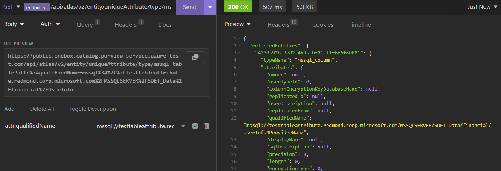
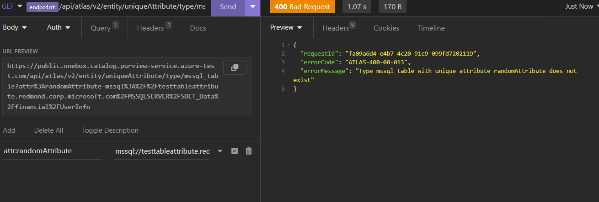
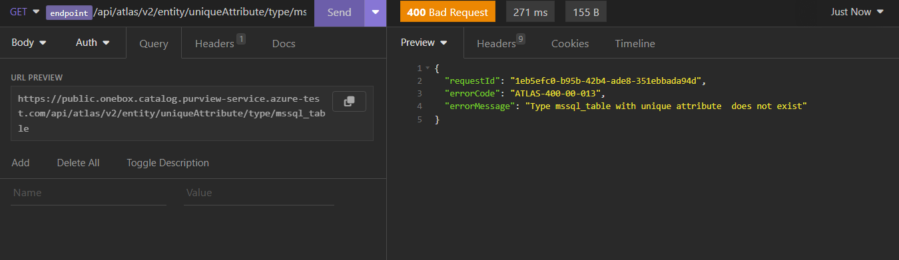
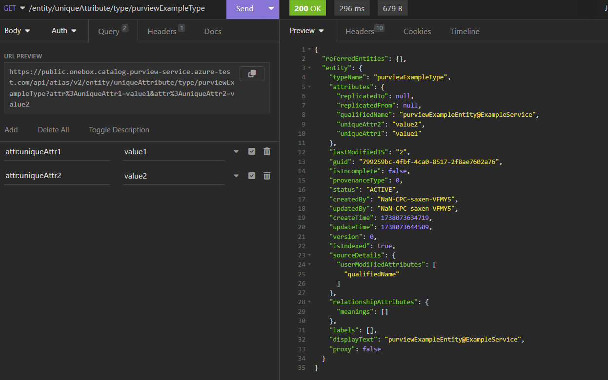

# GetEntityBYGuid

## EndPoint

{{endpoint}}/api/atlas/v2/entity/uniqueAttribute/type/{typeName}

## HTTP Method
GET

## PathParams
### typeName

| Type   | Required | Description |
|--------|----------|------|
| String | true     | The name of the type     |

## QueryParam

## attr:<attrName>
Here <attrName> is the name of the unique attribute of the entity type

The value of this queryParam is the value of the unique attribute of the entity

Example attr:qualifiedName=abc

You can also pass multiple unique attributes in request URL query param like below.

```
{{endpoint}}/api/atlas/v2/entity/uniqueAttribute/type/{typeName}?attr:qualifiedName=abc&attr:someAttributeName=xyz
```

Note: It's recommended to use qualified name as unique attribute for entity type while using this API

### Example of getEntityByUniqueAttribute API with qualifiedName as uniqueAttribute


### Example of getEntityByUniqueAttribute API with invalid uniqueAttribute name


### Example of getEntityByUniqueAttribute API with no uniqueAttribute name


### Example of getEntityByUniqueAttribute API with multiple uniqueAttributes



### Note: Rest all queryParams are same as [GetEntityByGuid API](./GetEntityByGuid.md)


